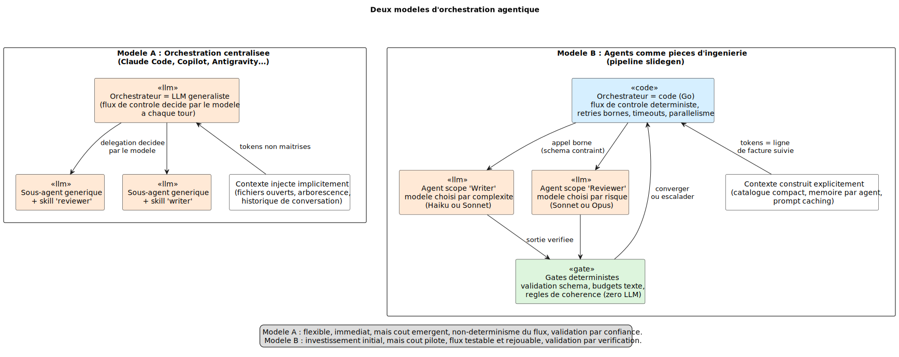
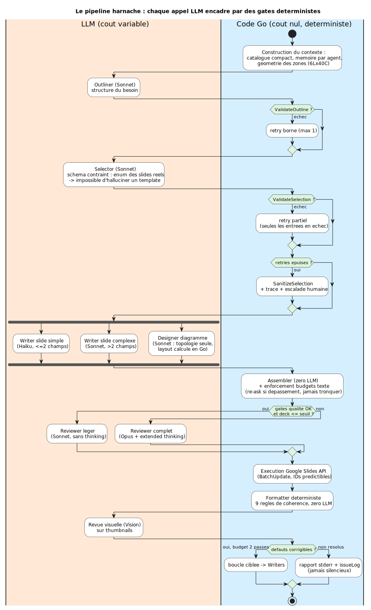
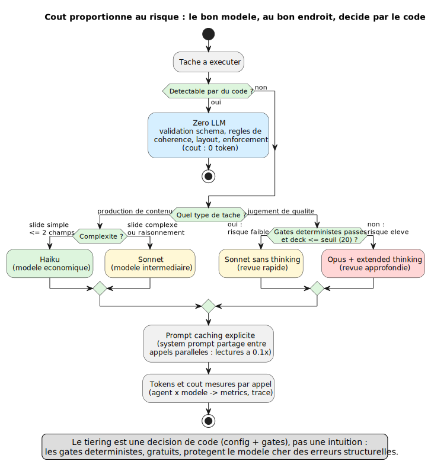
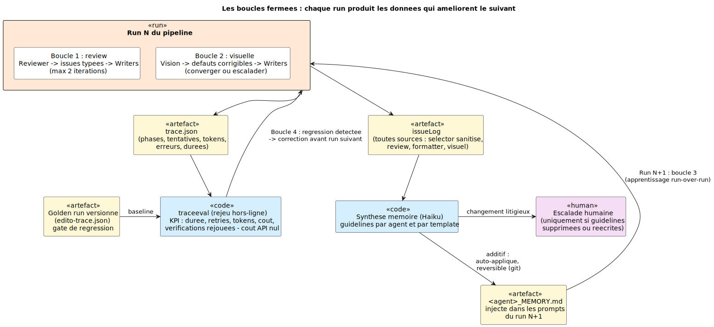

# Principes agentiques — un état de l'art par la pratique

> Les agents doivent être des **pièces d'ingénierie logicielle** : des composants au
> périmètre étroit, orchestrés par du code, encadrés par des validations déterministes,
> dont le coût est une donnée pilotée et dont l'apprentissage passe par des boucles de
> mémoire gouvernées — et non des assistants génériques auxquels on fait confiance.

Ce document synthétise les principes dégagés par la construction d'un système agentique
de production (le pipeline de génération de présentations de ce dépôt), documentée dans
[26 ADRs](adr/), un [glossaire](glossary.md) et un [édito stratégique](../edito.md).
Il est écrit pour être lisible hors du projet : chaque principe est énoncé de façon
générale, puis illustré par la preuve terrain correspondante.

---

## 1. La thèse : l'agent est une pièce d'ingénierie logicielle

Notre métier n'a pas changé : c'est de l'ingénierie logicielle. Ce qui a changé, c'est
qu'un nouveau type de composant est entré dans nos systèmes — un composant **probabiliste,
facturé au token, et incapable de garantir lui-même qu'il a respecté le cadre**.

Face à ce composant, deux postures sont possibles :

- **La confiance** : on donne au modèle un objectif, des outils, un maximum de contexte,
  et on le laisse décider du flux de contrôle. C'est le modèle des assistants de code
  généralistes.
- **La vérification** : on traite chaque appel au modèle comme on traite un appel à un
  service externe non fiable — entrée construite explicitement, sortie contrainte par un
  schéma, validée par du code, retries bornés, coût mesuré.

La seconde posture est la thèse de ce document. Elle découle d'un constat économique
autant que technique : depuis juin 2026, le token a un prix affiché et la facturation à
l'usage est généralisée ([édito](../edito.md)). *La frugalité n'est plus une vertu, c'est
une ligne de facture.* Or un système dont le flux de contrôle, le contexte et les
validations sont décidés par le modèle lui-même est un système dont ni le coût, ni le
comportement, ni la régression ne sont pilotables.

---

## 2. Deux modèles d'orchestration

Le fil rouge de ce document est l'opposition entre deux architectures.

### Modèle A — l'orchestration centralisée

C'est le modèle de Claude Code, Copilot ou Antigravity : un **LLM généraliste
orchestrateur** qui décide à chaque tour quoi faire, et qui délègue à des sous-agents
qui sont le *même modèle généraliste*, spécialisé par des **skills** (instructions,
conventions, prompts injectés). Le runtime est monolithique : agent, orchestration et
inférence sont soudés.

Ses forces sont réelles : flexibilité maximale, time-to-first-result imbattable, zéro
code à écrire, capacité à traiter l'imprévu. C'est l'outil idéal de l'exploration.

Ses limites sont structurelles, pas accidentelles :

- **Le flux de contrôle est non déterministe** : deux exécutions du même besoin peuvent
  emprunter des chemins différents. Impossible à tester, difficile à rejouer.
- **Le coût est émergent** : le contexte est injecté implicitement (fichiers ouverts,
  arborescence, historique). Le « bill shock » ×22 documenté vient de là, pas du prix du
  modèle.
- **La spécialisation par skills est compensatoire** : elle pallie ce que le modèle ne
  sait pas encore faire, et se périme à chaque génération de modèles. C'est de la dette
  transitoire.
- **La validation repose sur la confiance** : rien ne vérifie mécaniquement que l'agent
  a respecté le cadre.

### Modèle B — les agents comme pièces d'ingénierie

C'est le modèle de ce dépôt : un **orchestrateur en code pur**
([`internal/agent/orchestrator/`](../internal/agent/orchestrator/orchestrator.go)) qui
appelle des agents au périmètre étroit (Outliner, Selector, Writers, Reviewer…), chacun
réduit à *un* appel LLM contraint par un schéma JSON fermé, encadré de validations
déterministes, avec un modèle choisi par configuration selon la complexité et le risque.

L'investissement initial est plus élevé : il faut décomposer le problème, écrire
l'orchestrateur, les validateurs, les schémas. En retour, le système devient un logiciel
ordinaire : testable, traçable, rejouable, budgétable — les huit principes qui suivent
décrivent comment.

---

## 3. Les huit principes

Vue d'ensemble du pipeline harnaché — chaque appel LLM (zone orange, coût variable) est
précédé et suivi de code déterministe (zone bleue, coût nul) :

### P1 — Le flux de contrôle appartient au code, pas au modèle

Séquencement, parallélisme, retries, timeouts, conditions d'arrêt : tout cela est du
ressort d'un programme, pas d'un LLM. Le modèle produit du *contenu* ; le code décide
*quoi appeler, quand, et combien de fois*.

**Preuve terrain.** L'orchestrateur est du Go pur : goroutines et sémaphore pour les
Writers parallèles, compteurs de retries, timeouts par phase
([ADR 001](adr/001-agentic-architecture.md),
[ADR 011](adr/011-agentic-edit-orchestrator.md),
[ADR 019](adr/019-phase-observability-time-budgets.md)). Le contre-exemple a été
explicitement étudié et écarté : un routage des slides par LLM
([ADR 014](adr/014-agent-pipeline-registry.md)) introduisait du non-déterminisme et de la
latence là où un dispatch en code suffisait.

### P2 — Contraindre plutôt que corriger (shift-left déterministe)

Toute erreur qu'un schéma peut rendre *impossible* ne doit jamais avoir à être détectée.
Un LLM ne peut pas halluciner une valeur qui n'existe pas dans un enum ; il ne peut pas
inventer un nom de champ si le schéma de sortie est généré dynamiquement à partir des
champs réels.

**Preuve terrain.** Le Selector ne peut référencer que des slides existants : le champ
`sourceSlide` de son schéma est un enum construit à partir du catalogue réel
([ADR 020](adr/020-selector-constrained-by-catalog.md)). Le schéma du Writer est généré
champ par champ depuis le template ([ADR 003](adr/003-usage-tracking-and-quality.md)).
Les budgets de texte sont calibrés sur la géométrie réelle des zones (`6Lx40C`, facteur
de word-wrap 0,78) et un dépassement déclenche un *re-ask* de reformulation — jamais une
troncature silencieuse ([ADR 021](adr/021-geometry-aware-text-budgets.md)).

### P3 — Le coût est proportionné au risque

Quand chaque token se paie, le choix du modèle est une décision d'architecture, codée et
configurable — pas une intuition. Le modèle économique traite les tâches simples, le
modèle intermédiaire le raisonnement, le modèle cher est réservé aux jugements à fort
enjeu — et seulement quand les vérifications gratuites ne suffisent pas.

**Preuve terrain.** Le tiering est dans la configuration
([`internal/agent/config.go`](../internal/agent/config.go)) : Haiku pour les slides
simples (≤ 2 champs), Sonnet pour les complexes, Opus + extended thinking pour la revue —
sauf si les gates déterministes passent et que le deck est petit, auquel cas Sonnet sans
thinking suffit ([ADR 022](adr/022-multi-speed-review.md)). Le prompt caching explicite
partage le system prompt entre Writers parallèles (lectures à 0,1×,
[ADR 002](adr/002-prompt-caching.md)). Chaque appel est mesuré — agent, modèle, tokens,
cache, durée — et agrégé en coût estimé ([metrics.md](metrics.md),
[ADR 003](adr/003-usage-tracking-and-quality.md)).

### P4 — On ne fait pas confiance, on vérifie (gates déterministes)

Le harnais d'un agent se construit en deux temps ([édito](../edito.md)) : les *skills*
(spécialiser le modèle par des directives — nécessaire mais périssable) puis les *gates*
(vérifier par du code que le cadre a été respecté — pérenne). Chaque accès supplémentaire
donné à un agent exige un investissement proportionnel en vérification. Et tout ce qui
est vérifiable par du code doit l'être par du code : un gate coûte zéro token.

**Preuve terrain.** `ValidateOutline`, `ValidateSelection`, `ValidateSelectionGlobal`
([`internal/agent/validate.go`](../internal/agent/validate.go)) vérifient structure,
capacités et cohérence avant toute exécution. Le Formatter applique 9 règles de
cohérence typographique sans aucun appel LLM, là où l'approche naïve aurait envoyé la
présentation à un modèle Vision ([ADR 016](adr/016-format-agent.md)). Les corrections
structurelles identifiées par l'analyse de traces sont résolues en amont, en code, plutôt
que rattrapées en aval par des itérations LLM
([ADR 018](adr/018-pipeline-improvements-trace-analysis.md)).

### P5 — Les boucles convergent ou escaladent, jamais en silence

Une boucle de correction sans budget est une facture sans plafond. Chaque boucle a un
nombre maximal d'itérations ; à épuisement, le système n'abandonne pas silencieusement :
il répare au mieux, **trace l'événement, et le rend visible**.

**Preuve terrain.** La boucle de revue est bornée (2 itérations), la boucle visuelle
aussi (2 passes), et les défauts non résolus sont rapportés sur stderr et dans
l'`issueLog` — le principe explicite de l'[ADR 023](adr/023-visual-loop-converge-or-escalate.md)
est « converger ou escalader ». Côté Selector, l'épuisement des retries déclenche une
sanitisation *visible* : tracée, apprise, escaladable
([ADR 020](adr/020-selector-constrained-by-catalog.md)). Les retries sont en outre
*partiels* : seules les entrées en échec sont rejouées, pas le plan entier.

### P6 — La mémoire est une boucle fermée, gouvernée

Un système agentique qui répète les mêmes erreurs à chaque run gaspille les tokens de
leur correction. La mémoire transforme les défauts d'un run en consignes pour le suivant.
Mais une mémoire qui se réécrit elle-même sans contrôle est un risque : les mises à jour
**additives** sont auto-appliquées (et réversibles via git) ; les mises à jour
**litigieuses** — suppression ou réécriture de consignes existantes — exigent un arbitrage
humain.

**Preuve terrain.** L'`issueLog` collecte les défauts de toutes les sources (selector
sanitisé, revue, formatter, revue visuelle) ; un modèle économique (Haiku) en synthétise
des guidelines par agent et par template, injectées dans les prompts du run suivant
([ADR 015](adr/015-agent-memory-learning.md),
[ADR 024](adr/024-auto-memory-synthesis.md),
[`internal/agent/memory.go`](../internal/agent/memory.go)). La gouvernance est codée :
`IsAdditiveUpdate` décide si la synthèse s'applique seule ou passe par l'humain.

### P7 — Tout est observable, tout est rejouable

On ne pilote que ce qu'on mesure. Chaque run produit une trace structurée complète —
phases, tentatives, tokens, erreurs, durées — exploitable hors-ligne. Et parce que les
validations sont déterministes (P4), elles peuvent être **rejouées sur les sorties LLM
enregistrées** : on obtient un harnais d'évaluation et un gate de régression à coût API
nul.

**Preuve terrain.** Le flag `--trace` capture l'intégralité du pipeline
([ADR 017](adr/017-pipeline-debug-trace.md)) ; chaque phase a une durée attribuée et un
budget temps, avec un objectif d'attribution ≥ 95 % du temps total
([ADR 019](adr/019-phase-observability-time-budgets.md)). L'outil
[`cmd/traceeval`](../cmd/traceeval/) extrait les KPI d'une trace, les compare à un
*golden run* versionné dans le dépôt, et rejoue les vérifications déterministes
([ADR 025](adr/025-trace-replay-eval-harness.md)). L'analyse de traces a déjà produit une
série de corrections structurelles ([ADR 018](adr/018-pipeline-improvements-trace-analysis.md)) :
la boucle observation → correction fonctionne.

### P8 — L'humain est un arbitre, pas un opérateur

L'humain n'est ni dans la boucle de chaque décision (le système serait inutilisable en
CI), ni absent (le système dériverait). Il intervient sur une **liste fermée d'événements
litigieux**, via un mécanisme unique, **jamais bloquant** : sans terminal interactif ou à
expiration d'un timeout, un défaut codé s'applique — et l'événement reste tracé.

**Preuve terrain.** Le package [`internal/escalation`](../internal/escalation/) implémente
ce contrat ([ADR 026](adr/026-human-escalation-policy.md)) : quatre événements seulement
(sélection sanitisée, issues de revue persistantes, défauts visuels non résolus, mémoire
litigieuse), avec des défauts asymétriques — *procéder* pour un artefact dégradé (le mal
est réparable), *refuser* pour une modification du comportement futur (la mémoire). En
amont, le mode chat place l'humain là où il a le plus de levier : la validation de la
structure avant génération, pas la retouche après
([ADR 005](adr/005-interactive-chat-mode.md),
[ADR 006](adr/006-default-agent-chat-mode.md)).

---

## 4. Grille de décision : quel modèle pour quel contexte

La thèse est assumée, mais elle n'invalide pas le modèle centralisé partout. Les deux
modèles répondent à des situations différentes, et le critère de bascule est précis.

| Critère | Modèle A suffit (orchestration centralisée + skills) | Modèle B s'impose (agents en pièces d'ingénierie) |
|---|---|---|
| **Fréquence** | Tâche one-shot, exploratoire | Tâche répétée en production |
| **Coût** | Coût absorbé, non refacturé par tâche | Coût par tâche = donnée économique du produit |
| **Variabilité du besoin** | Imprévisible, chaque tâche est différente | Domaine stable, décomposable en étapes connues |
| **Validation** | Un humain relit chaque sortie | La sortie part en aval sans relecture systématique |
| **Auditabilité** | Pas d'exigence de traçabilité | Régressions à détecter, comportement à expliquer |
| **Autonomie** | Session interactive, humain présent | Runs non surveillés (CI, batch, service) |
| **Amélioration** | Le modèle suivant fera mieux, attendre suffit | Le système doit apprendre de ses propres runs |

Deux remarques d'honnêteté intellectuelle :

1. **Le modèle A est le bon point de départ.** Ce dépôt lui-même a été largement
   construit *avec* un assistant centralisé. L'exploration, le prototypage, la
   découverte du domaine relèvent du modèle A. C'est lorsqu'un flux se répète, se paie
   et s'audite qu'il doit être promu en modèle B — exactement comme un script shell
   devient un programme quand il entre en production.
2. **Le modèle B a un coût d'entrée réel.** Décomposer le domaine, écrire les schémas,
   les validateurs, l'orchestrateur : c'est un investissement qui ne se justifie que si
   les critères de droite sont remplis. Le sur-engineering d'un besoin exploratoire est
   aussi une erreur d'ingénierie.

La frontière n'est pas figée : la trajectoire probable du marché est le **découplage du
stack agentique** ([édito](../edito.md)) — des sous-agents spécialisés invocables « en
mode service », dont on maîtrise les entrées, les modèles et le coût. C'est précisément
ce que prépare l'architecture A2A du projet
([ADR 007](adr/007-a2a-architecture.md)) : chaque agent est déjà exposable comme un
service autonome, sans céder l'orchestration à un LLM.

---

## 5. Conclusion : ce qui se périme, ce qui reste

Dans le harnais en deux temps, les deux couches ne vieillissent pas pareil :

- **Les skills et les prompts se périment.** Chaque génération de modèles absorbe une
  partie de ce qu'on compensait par des instructions. C'est de la dette transitoire,
  qu'il faut accepter de jeter.
- **Les gates, les schémas, les boucles et les mesures restent.** Un validateur de
  capacité, un enum de catalogue, un budget de texte géométrique, une trace rejouable,
  une politique d'escalade : tout cela survit au changement de modèle — et c'est même ce
  qui permet d'en changer sereinement, puisque le golden run mesure objectivement si le
  nouveau modèle fait mieux ou moins bien ([ADR 025](adr/025-trace-replay-eval-harness.md)).

C'est le test décisif de la thèse : **dans un système agentique bien conçu, la valeur
durable est dans le code qui entoure les modèles, pas dans les modèles eux-mêmes.** Les
agents sont des pièces d'ingénierie logicielle ; le reste — le choix du modèle du moment,
le prompt du moment — est un paramètre.

---

## Références

- [Index des ADRs](adr/) — en particulier les fondations
  ([001](adr/001-agentic-architecture.md)) et la série « industrialisation »
  ([019](adr/019-phase-observability-time-budgets.md)–[026](adr/026-human-escalation-policy.md))
- [Glossaire du domaine](glossary.md) — langage omniprésent du projet
- [Architecture détaillée](architecture.md) — les cinq phases du pipeline
- [Métriques et attribution des coûts](metrics.md)
- [Édito stratégique](../edito.md) — le contexte économique (fin des forfaits, juin 2026)

*Diagrammes : sources PlantUML versionnées (`principes-*.puml`), rendus régénérables via
`make -C docs`.*
