# ADR 007 : Architecture A2A (Agent-to-Agent) pour agentigslide

- **Date** : 2026-05-09
- **Statut** : RFC
- **Decideurs** : Olivier Wulveryck

## Contexte et motivation

### L'architecture actuelle : un pipeline Go linéaire

Aujourd'hui, agentigslide est un **pipeline monolithique orchestré par du code Go pur**. Les agents (Outliner, Selector, Writers, Reviewer) sont des fonctions Go appelées séquentiellement par un orchestrateur central. La communication inter-agents est un passage de structures Go en mémoire, dans un processus unique.

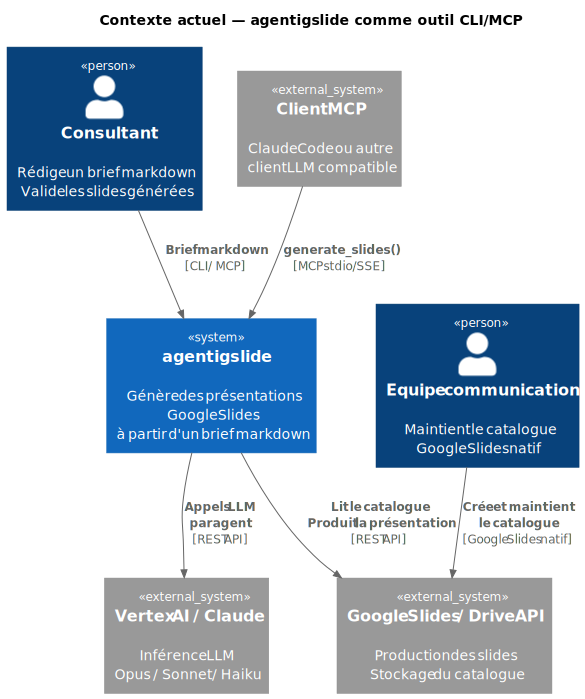

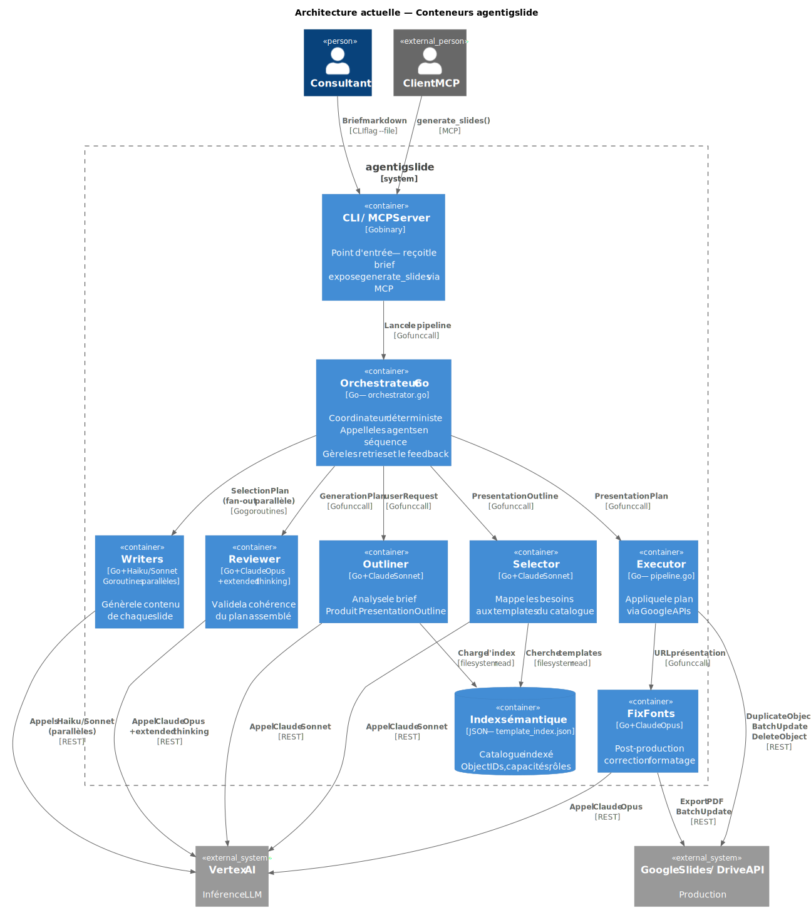

### Les limites structurelles du pipeline Go

Le pipeline Go actuel a trois limites fondamentales qui ne peuvent pas être résolues sans changer le paradigme architectural :

**Limite 1 — Les agents ne peuvent pas orchestrer d'autres agents.**
Le Selector ne peut pas décider dynamiquement d'appeler un agent de layout puis un agent de design. Il peut seulement retourner un résultat à l'orchestrateur, qui décide ensuite. Toute logique de branchement doit être codée dans l'orchestrateur — ce qui couple l'orchestrateur à la logique métier de chaque agent.

**Limite 2 — Le pipeline est fermé à l'extension externe.**
Ajouter un nouvel agent (agent de recherche pour le Writer, agent de validation visuelle pour le Selector) requiert de modifier le binaire Go, de recompiler, de redéployer. Il n'y a pas de mécanisme de découverte ou de composition dynamique.

**Limite 3 — L'unité de déploiement est le binaire entier.**
Si le Reviewer doit être mis à jour (nouveau modèle, nouveau prompt, nouveau comportement), c'est tout le binaire qui est recompilé et redéployé. Il n'y a pas de cycle de vie indépendant par agent.

---

## Le changement de paradigme : de pipeline à réseau d'agents

### Ce qu'est A2A

Le protocole **Agent-to-Agent (A2A)** est un standard émergent (Google, mai 2025) qui définit comment des agents LLM s'exposent, se découvrent, et se composent. Chaque agent expose une **Agent Card** (capacités, schémas d'entrée/sortie, endpoint) et accepte des **Tasks** via une API REST standardisée.

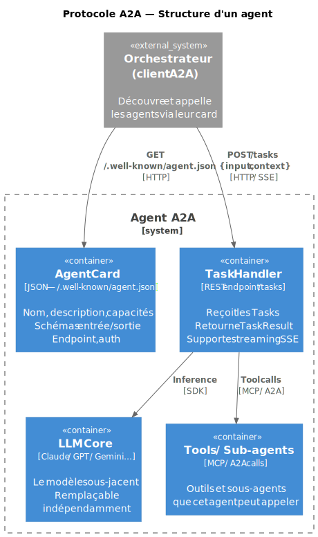

### La nouvelle topologie : deux niveaux d'orchestration

Avec A2A, agentigslide adopte une **architecture hiérarchique** :

- **Niveau 1** : l'orchestrateur Go reste — déterministe, prévisible — mais il appelle des agents via A2A plutôt que des fonctions Go.
- **Niveau 2** : chaque agent principal peut lui-même orchestrer des sous-agents A2A pour accomplir sa tâche.

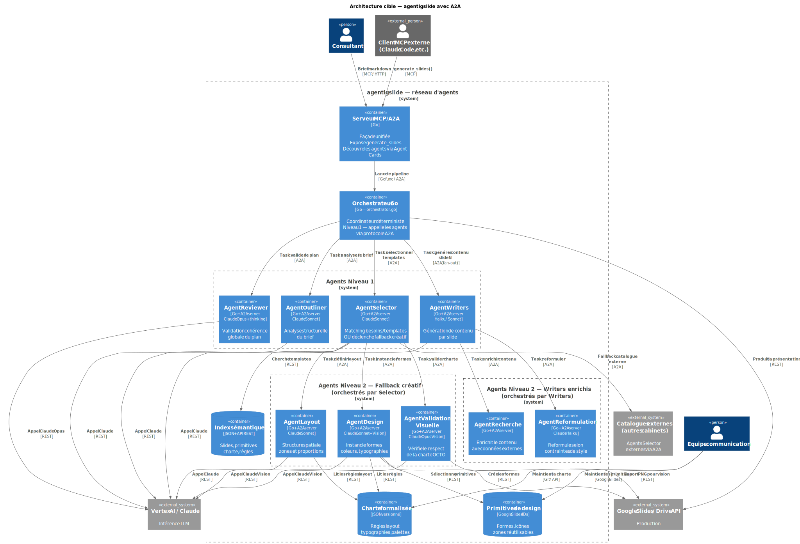

---

## Le cas déclencheur : le fallback créatif du Selector

### Aujourd'hui : le Selector est borné par le catalogue

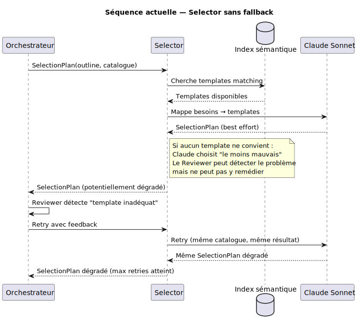

### Avec A2A : le Selector orchestre un fallback créatif

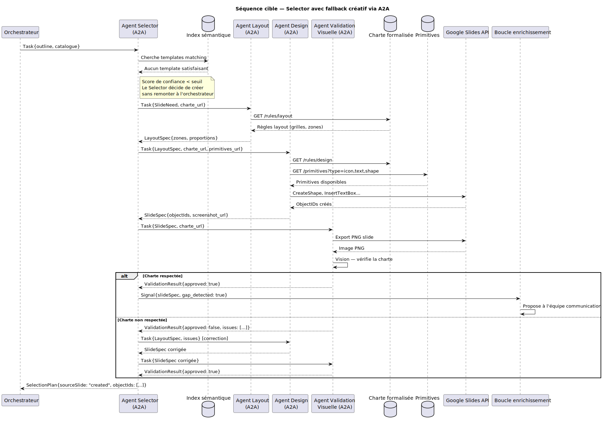

---

## Impact sur les composants existants

### L'index sémantique doit évoluer

Aujourd'hui l'index référence uniquement des slides complètes. Avec A2A et le fallback créatif, il doit référencer trois types d'actifs :

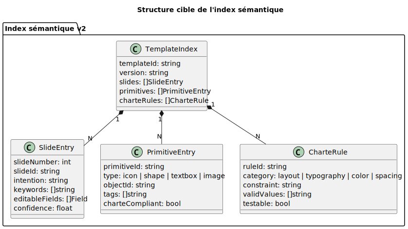

### La charte doit devenir explicite

C'est le chantier le plus critique — et le plus sous-estimé. Aujourd'hui la charte OCTO est implicite dans les slides produites par l'équipe communication. Pour que l'Agent Design puisse la respecter, elle doit être formalisée :

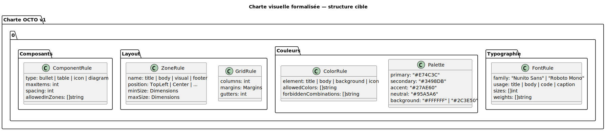

---

## Les évolutions potentielles rendues possibles par A2A

### Evolution 1 : Selector multi-catalogue (12 mois)

Avec A2A, le Selector peut interroger des catalogues externes — d'autres cabinets, d'autres domaines — via leur Agent Card. C'est la manœuvre two-sided-market à l'échelle de l'industrie.

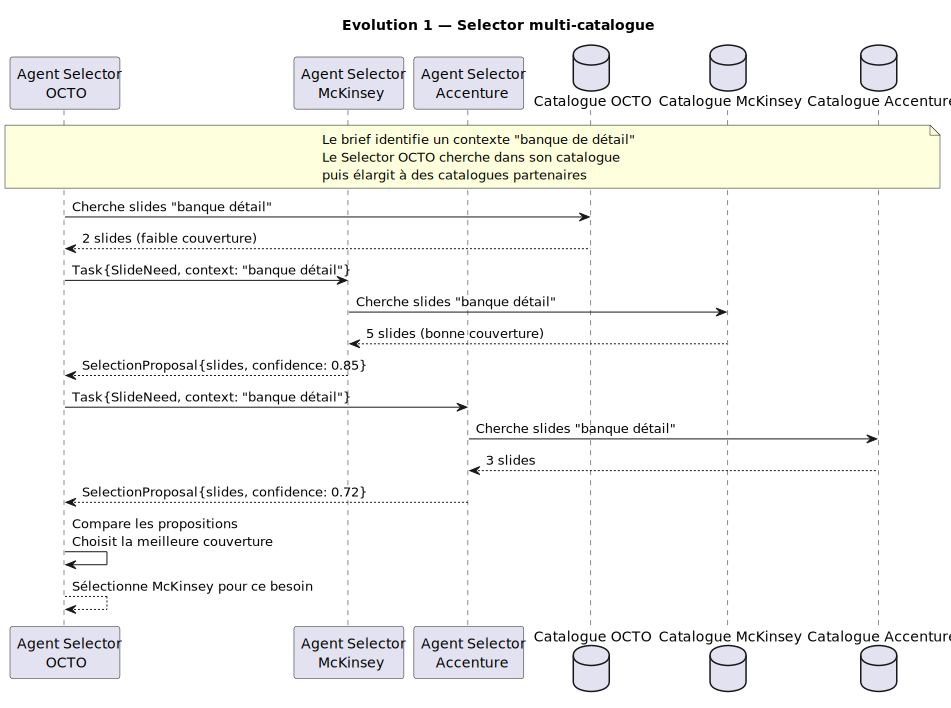

### Evolution 2 : Writer comme chef d'orchestre (6-12 mois)

Le Writer peut appeler un agent de recherche pour enrichir le contenu avec des données réelles, un agent de reformulation pour respecter les contraintes de style.

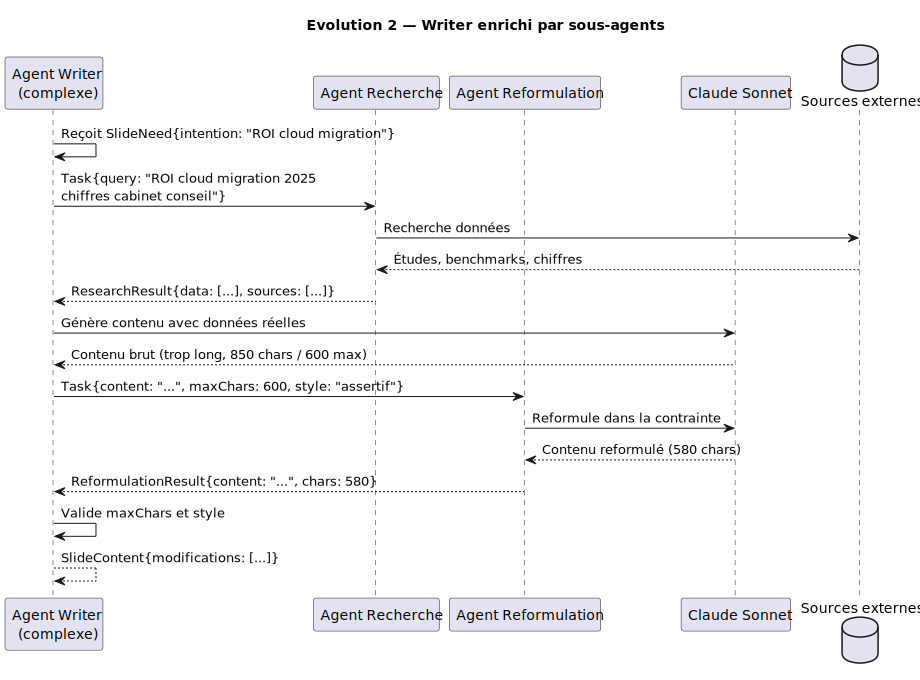

### Evolution 3 : Reviewer comme service transverse (18 mois)

Le Reviewer (Opus + extended thinking) est coûteux à construire et générique dans sa nature. En A2A, il peut être mutualisé entre plusieurs pipelines.

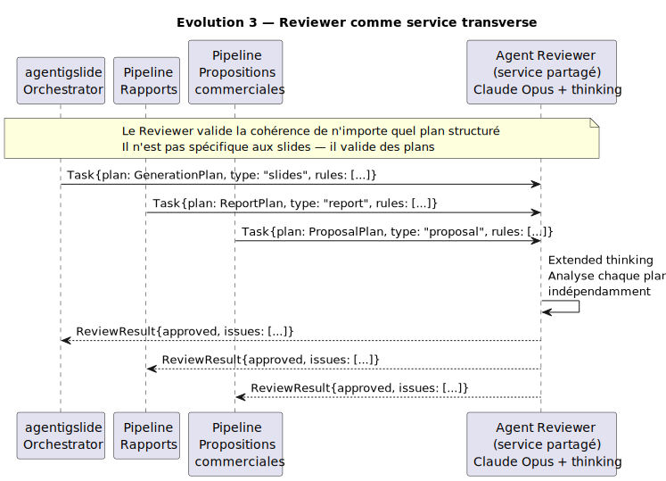

### Evolution 4 : boucle d'enrichissement automatique du catalogue (18-24 mois)

Chaque slide créée ex nihilo et validée génère un signal vers l'équipe communication. Avec A2A, cette boucle devient un agent autonome.

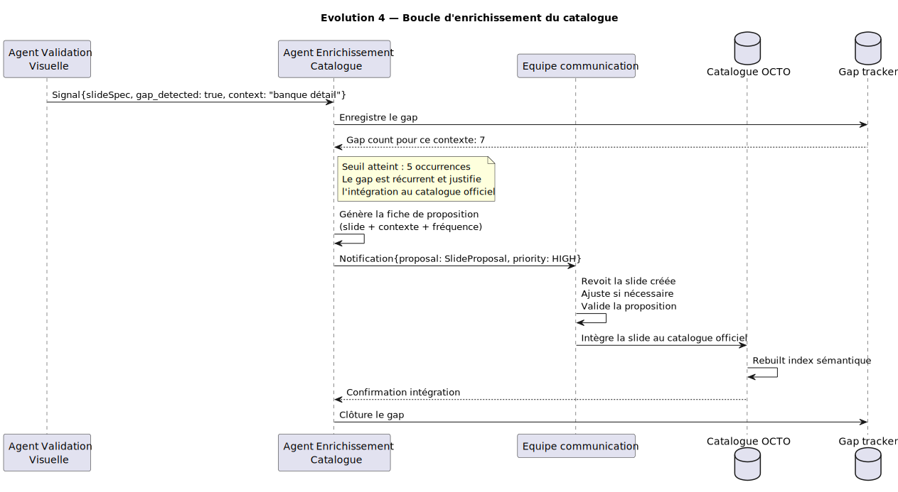

---

## Decision

### Ce qui est décidé

Implémenter A2A de façon **progressive et séquentielle**, en trois phases :

**Phase 1 — Exposition (0-6 mois) :** Chaque agent existant (Outliner, Selector, Writers, Reviewer) expose une Agent Card et un endpoint `/tasks`. L'orchestrateur Go appelle les agents via A2A plutôt que via des fonctions Go. L'interface externe ne change pas. C'est un refactoring architectural, pas une évolution fonctionnelle.

**Phase 2 — Fallback créatif (6-12 mois) :** Le Selector implémente le fallback créatif — il orchestre Agent Layout, Agent Design, Agent Validation Visuelle via A2A quand aucun template ne convient. La charte formalisée et les primitives de design sont préconditions de cette phase.

**Phase 3 — Écosystème (12-24 mois) :** Writers enrichis (Agent Recherche, Agent Reformulation), Reviewer comme service transverse, Selector multi-catalogue, boucle d'enrichissement automatique.

### Ce qui n'est pas décidé

- L'abandon de l'orchestrateur Go pur — il reste le coordinateur de Niveau 1.
- Le fournisseur A2A — le protocole Google est le candidat naturel mais il est encore en Genesis. Une abstraction d'interface est nécessaire pour ne pas dépendre d'une implémentation unique.
- Le modèle économique d'un catalogue multi-tenant.

---

## Conséquences

### Positives

- **Composabilité** : les agents peuvent orchestrer des sous-agents sans modifier l'orchestrateur central.
- **Cycles de vie indépendants** : chaque agent peut être mis à jour, remplacé, ou redéployé sans impact sur les autres.
- **Substitution de modèles** : le modèle LLM sous-jacent de chaque agent est remplaçable indépendamment.
- **Couverture totale** : le fallback créatif élimine les zones blanches du catalogue.
- **Écosystème** : agentigslide devient un nœud dans un réseau d'agents, pas un outil isolé.
- **Mutualisation** : le Reviewer peut devenir un service transverse, partagé entre plusieurs pipelines.

### Négatives

- **Complexité opérationnelle** : un réseau d'agents distribués est plus complexe à déployer, monitorer et déboguer qu'un binaire Go monolithique.
- **Latence** : les appels A2A via réseau ajoutent de la latence par rapport aux appels de fonctions Go en mémoire.
- **Dépendance sur un protocole instable** : A2A est encore en Genesis — construire dessus avant stabilisation introduit un risque de breaking changes.
- **Charte implicite** : le fallback créatif ne peut pas fonctionner sans une charte formalisée explicite — c'est un chantier préalable non trivial pour l'équipe communication.
- **Indéterminisme** : deux niveaux d'orchestration introduisent des comportements émergents plus difficiles à tester et à auditer.

### Risques et mitigations

| Risque | Probabilité | Impact | Mitigation |
|--------|-------------|--------|------------|
| A2A breaking changes | Haute | Moyen | Abstraire derrière une interface Go — changer l'implémentation sans changer les agents |
| Charte non formalisée | Haute | Haut | Bloquer la Phase 2 jusqu'à formalisation complète — ne pas tenter le fallback créatif sans charte explicite |
| Latence réseau | Moyenne | Moyen | Mode local (in-process) pour le développement, A2A pour la production — l'interface est la même |
| Complexité opérationnelle | Haute | Moyen | Observabilité dès Phase 1 — traces distribuées, métriques par agent, logs corrélés |
| Indéterminisme niveau 2 | Moyenne | Haut | Tests de bout en bout avec snapshots des plans générés — détecter les régressions avant production |
