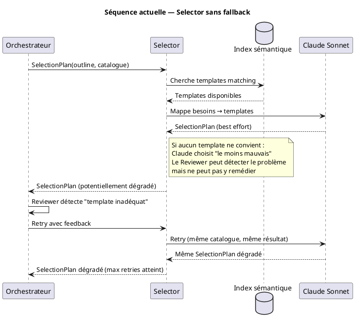
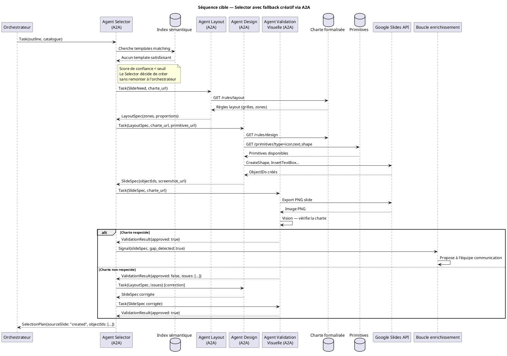
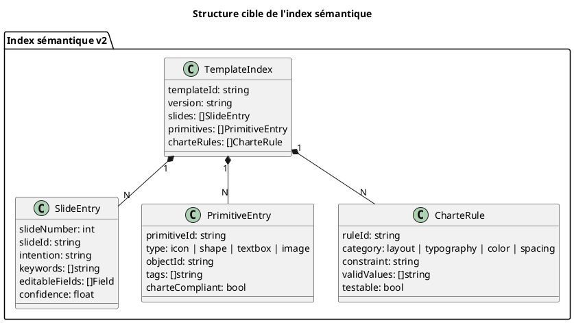
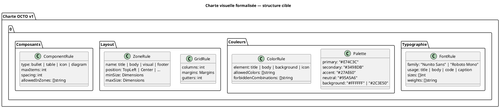
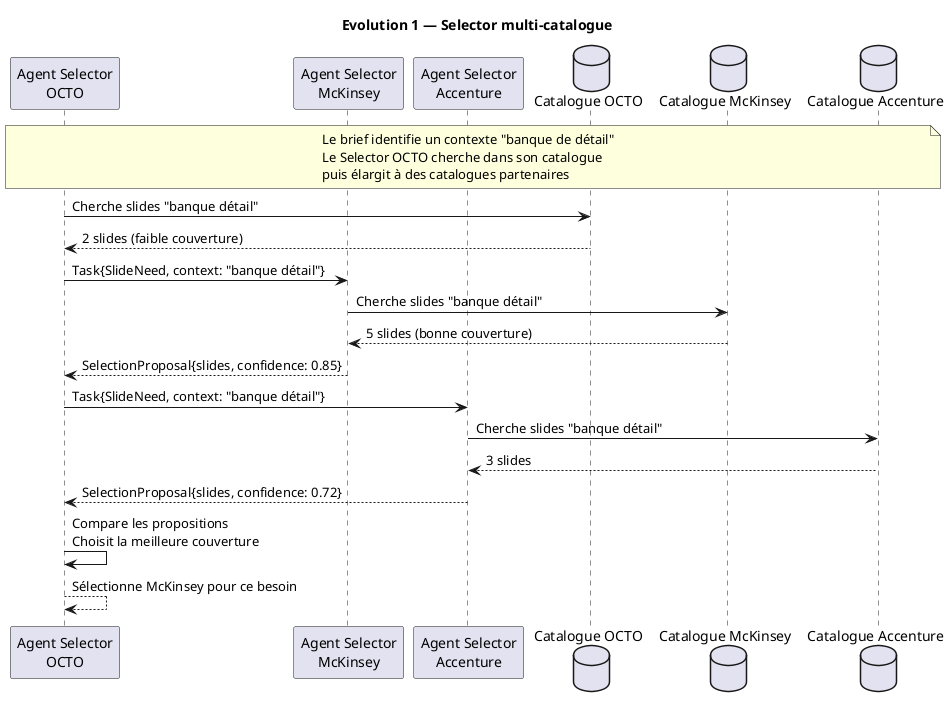
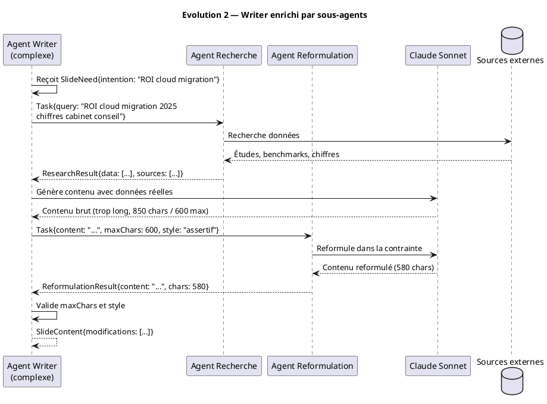
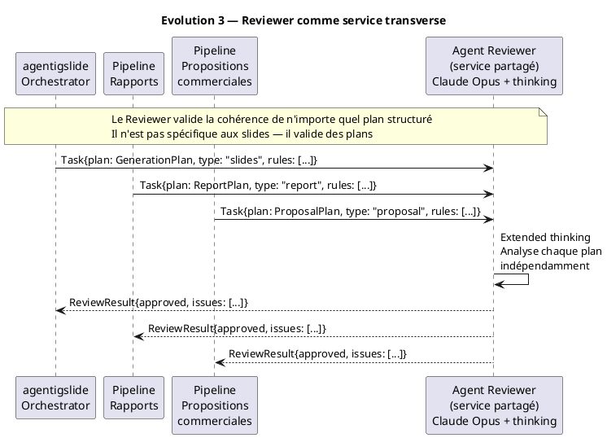
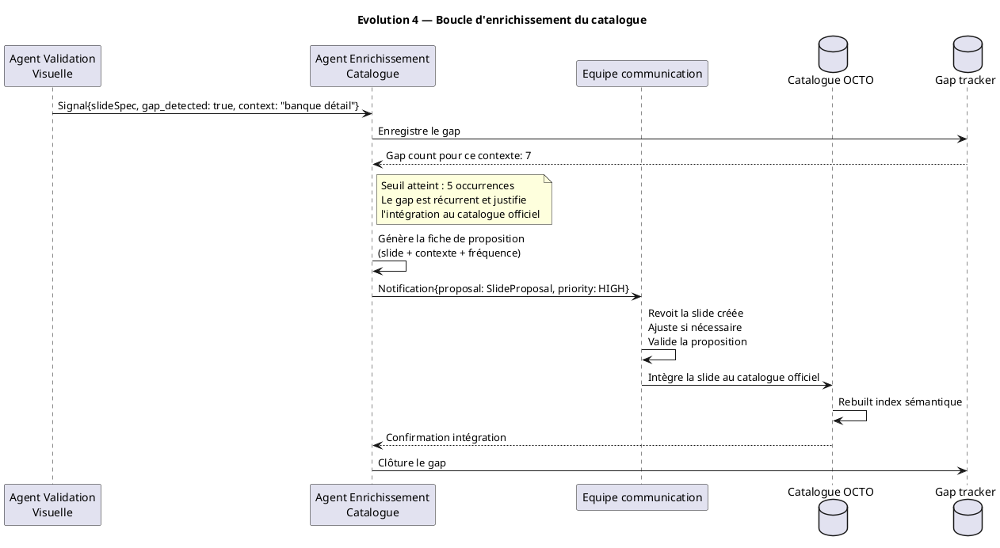

# ADR 007 : Architecture A2A (Agent-to-Agent) pour agentigslide

- **Date** : 2026-05-09
- **Statut** : RFC
- **Decideurs** : Olivier Wulveryck

## Contexte et motivation

### L'architecture actuelle : un pipeline Go linéaire

Aujourd'hui, agentigslide est un **pipeline monolithique orchestré par du code Go pur**. Les agents (Outliner, Selector, Writers, Reviewer) sont des fonctions Go appelées séquentiellement par un orchestrateur central. La communication inter-agents est un passage de structures Go en mémoire, dans un processus unique.

```plantuml
@startuml
!include https://raw.githubusercontent.com/plantuml-stdlib/C4-PlantUML/master/C4_Context.puml

title Contexte actuel — agentigslide comme outil CLI/MCP

Person(consultant, "Consultant", "Rédige un brief markdown\nValide les slides générées")
Person(commteam, "Equipe communication", "Maintient le catalogue\nGoogle Slides natif")

System(agentigslide, "agentigslide", "Génère des présentations Google Slides\nà partir d'un brief markdown")
System_Ext(googleslides, "Google Slides / Drive API", "Production des slides\nStockage du catalogue")
System_Ext(vertexai, "Vertex AI / Claude", "Inférence LLM\nOpus / Sonnet / Haiku")
System_Ext(mcpclient, "Client MCP", "Claude Code ou autre\nclient LLM compatible")

Rel(consultant, agentigslide, "Brief markdown", "CLI / MCP")
Rel(mcpclient, agentigslide, "generate_slides()", "MCP stdio/SSE")
Rel(commteam, googleslides, "Crée et maintient\nle catalogue", "Google Slides natif")
Rel(agentigslide, googleslides, "Lit le catalogue\nProduit la présentation", "REST API")
Rel(agentigslide, vertexai, "Appels LLM\npar agent", "REST API")

@enduml
```

```plantuml
@startuml
!include https://raw.githubusercontent.com/plantuml-stdlib/C4-PlantUML/master/C4_Container.puml

title Architecture actuelle — Conteneurs agentigslide

Person(consultant, "Consultant")
Person_Ext(mcpclient, "Client MCP")

System_Boundary(agentigslide, "agentigslide") {
  Container(cli, "CLI / MCP Server", "Go binary", "Point d'entrée — reçoit le brief\nexpose generate_slides via MCP")
  Container(orchestrator, "Orchestrateur Go", "Go — orchestrator.go", "Coordinateur déterministe\nAppelle les agents en séquence\nGère les retries et le feedback")
  Container(outliner, "Outliner", "Go + Claude Sonnet", "Analyse le brief\nProduit PresentationOutline")
  Container(selector, "Selector", "Go + Claude Sonnet", "Mappe les besoins\naux templates du catalogue")
  Container(writers, "Writers", "Go + Haiku/Sonnet\nGoroutines parallèles", "Génère le contenu\nde chaque slide")
  Container(reviewer, "Reviewer", "Go + Claude Opus\n+ extended thinking", "Valide la cohérence\ndu plan assemblé")
  Container(executor, "Executor", "Go — pipeline.go", "Applique le plan\nvia Google APIs")
  Container(fixfonts, "FixFonts", "Go + Claude Opus", "Post-production\ncorrection formatage")
  ContainerDb(templateindex, "Index sémantique", "JSON — template_index.json", "Catalogue indexé\nObjectIDs, capacités, rôles")
}

System_Ext(googleapi, "Google Slides / Drive API", "Production")
System_Ext(vertexai, "Vertex AI", "Inférence LLM")

Rel(consultant, cli, "Brief markdown", "CLI flag --file")
Rel(mcpclient, cli, "generate_slides()", "MCP")
Rel(cli, orchestrator, "Lance le pipeline", "Go func call")
Rel(orchestrator, outliner, "userRequest", "Go func call")
Rel(orchestrator, selector, "PresentationOutline", "Go func call")
Rel(orchestrator, writers, "SelectionPlan\n(fan-out parallèle)", "Go goroutines")
Rel(orchestrator, reviewer, "GenerationPlan", "Go func call")
Rel(orchestrator, executor, "PresentationPlan", "Go func call")
Rel(executor, fixfonts, "URL présentation", "Go func call")
Rel(outliner, templateindex, "Charge l'index", "filesystem read")
Rel(selector, templateindex, "Cherche templates", "filesystem read")
Rel(outliner, vertexai, "Appel Claude Sonnet", "REST")
Rel(selector, vertexai, "Appel Claude Sonnet", "REST")
Rel(writers, vertexai, "Appels Haiku/Sonnet\n(parallèles)", "REST")
Rel(reviewer, vertexai, "Appel Claude Opus\n+ extended thinking", "REST")
Rel(fixfonts, vertexai, "Appel Claude Opus", "REST")
Rel(executor, googleapi, "DuplicateObject\nBatchUpdate\nDeleteObject", "REST")
Rel(fixfonts, googleapi, "Export PDF\nBatchUpdate", "REST")

@enduml
```

### Les limites structurelles du pipeline Go

Le pipeline Go actuel a trois limites fondamentales qui ne peuvent pas être résolues sans changer le paradigme architectural :

**Limite 1 — Les agents ne peuvent pas orchestrer d'autres agents.**
Le Selector ne peut pas décider dynamiquement d'appeler un agent de layout puis un agent de design. Il peut seulement retourner un résultat à l'orchestrateur, qui décide ensuite. Toute logique de branchement doit être codée dans l'orchestrateur — ce qui couple l'orchestrateur à la logique métier de chaque agent.

**Limite 2 — Le pipeline est fermé à l'extension externe.**
Ajouter un nouvel agent (agent de recherche pour le Writer, agent de validation visuelle pour le Selector) requiert de modifier le binaire Go, de recompiler, de redéployer. Il n'y a pas de mécanisme de découverte ou de composition dynamique.

**Limite 3 — L'unité de déploiement est le binaire entier.**
Si le Reviewer doit être mis à jour (nouveau modèle, nouveau prompt, nouveau comportement), c'est tout le binaire qui est recompilé et redéployé. Il n'y a pas de cycle de vie indépendant par agent.

---

## Le changement de paradigme : de pipeline à réseau d'agents

### Ce qu'est A2A

Le protocole **Agent-to-Agent (A2A)** est un standard émergent (Google, mai 2025) qui définit comment des agents LLM s'exposent, se découvrent, et se composent. Chaque agent expose une **Agent Card** (capacités, schémas d'entrée/sortie, endpoint) et accepte des **Tasks** via une API REST standardisée.

```plantuml
@startuml
!include https://raw.githubusercontent.com/plantuml-stdlib/C4-PlantUML/master/C4_Container.puml

title Protocole A2A — Structure d'un agent

System_Boundary(agent, "Agent A2A") {
  Container(agentcard, "Agent Card", "JSON — /.well-known/agent.json", "Nom, description, capacités\nSchémas entrée/sortie\nEndpoint, auth")
  Container(taskhandler, "Task Handler", "REST endpoint /tasks", "Reçoit les Tasks\nRetourne TaskResult\nSupporte streaming SSE")
  Container(llm, "LLM Core", "Claude / GPT / Gemini...", "Le modèle sous-jacent\nRemplaçable indépendamment")
  Container(tools, "Tools / Sub-agents", "MCP / A2A calls", "Outils et sous-agents\nque cet agent peut appeler")
}

System_Ext(orchestrator, "Orchestrateur\n(client A2A)", "Découvre et appelle\nles agents via leur card")

Rel(orchestrator, agentcard, "GET /.well-known/agent.json", "HTTP")
Rel(orchestrator, taskhandler, "POST /tasks\n{input, context}", "HTTP / SSE")
Rel(taskhandler, llm, "Inference", "SDK")
Rel(taskhandler, tools, "Tool calls", "MCP / A2A")

@enduml
```

### La nouvelle topologie : deux niveaux d'orchestration

Avec A2A, agentigslide adopte une **architecture hiérarchique** :

- **Niveau 1** : l'orchestrateur Go reste — déterministe, prévisible — mais il appelle des agents via A2A plutôt que des fonctions Go.
- **Niveau 2** : chaque agent principal peut lui-même orchestrer des sous-agents A2A pour accomplir sa tâche.

```plantuml
@startuml
!include https://raw.githubusercontent.com/plantuml-stdlib/C4-PlantUML/master/C4_Container.puml

title Architecture cible — agentigslide avec A2A

Person(consultant, "Consultant")
Person_Ext(mcpclient, "Client MCP externe\n(Claude Code, etc.)")
Person(commteam, "Equipe communication")

System_Boundary(agentigslide, "agentigslide — réseau d'agents") {

  Container(orchestrator, "Orchestrateur Go", "Go — orchestrator.go", "Coordinateur déterministe\nNiveau 1 — appelle les agents\nvia protocole A2A")

  Container(mcpserver, "Serveur MCP/A2A", "Go", "Façade unifiée\nExpose generate_slides\nDécouvre les agents via Agent Cards")

  System_Boundary(agents_n1, "Agents Niveau 1") {
    Container(outliner, "Agent Outliner", "Go + A2A server\nClaude Sonnet", "Analyse structurelle\ndu brief")
    Container(selector, "Agent Selector", "Go + A2A server\nClaude Sonnet", "Matching besoins/templates\nOU déclenche fallback créatif")
    Container(writers, "Agent Writers", "Go + A2A server\nHaiku / Sonnet", "Génération de contenu\npar slide")
    Container(reviewer, "Agent Reviewer", "Go + A2A server\nClaude Opus + thinking", "Validation cohérence\nglobale du plan")
  }

  System_Boundary(agents_n2_fallback, "Agents Niveau 2 — Fallback créatif\n(orchestrés par Selector)") {
    Container(layoutagent, "Agent Layout", "Go + A2A server\nClaude Sonnet", "Structure spatiale\nzones et proportions")
    Container(designagent, "Agent Design", "Go + A2A server\nClaude Sonnet + Vision", "Instancie formes\ncoleurs, typographies")
    Container(visualvalidator, "Agent Validation\nVisuelle", "Go + A2A server\nClaude Opus Vision", "Vérifie le respect\nde la charte OCTO")
  }

  System_Boundary(agents_n2_writers, "Agents Niveau 2 — Writers enrichis\n(orchestrés par Writers)") {
    Container(researchagent, "Agent Recherche", "Go + A2A server", "Enrichit le contenu\navec données externes")
    Container(reformulagent, "Agent Reformulation", "Go + A2A server\nClaude Haiku", "Reformule selon\ncontraintes de style")
  }

  ContainerDb(templateindex, "Index sémantique", "JSON + API REST", "Slides, primitives\ncharte, règles")
  ContainerDb(charterepo, "Charte formalisée", "JSON versionné", "Règles layout\ntypographies, palettes")
  ContainerDb(primitives, "Primitives de design", "Google Slides IDs", "Formes, icônes\nzones réutilisables")
}

System_Ext(googleapi, "Google Slides / Drive API", "Production")
System_Ext(vertexai, "Vertex AI / Claude", "Inférence LLM")
System_Ext(extcatalogue, "Catalogues externes\n(autres cabinets)", "Agents Selector\nexternes via A2A")

Rel(consultant, mcpserver, "Brief markdown", "MCP / HTTP")
Rel(mcpclient, mcpserver, "generate_slides()", "MCP")
Rel(mcpserver, orchestrator, "Lance le pipeline", "Go func / A2A")
Rel(commteam, charterepo, "Maintient la charte", "Git / API")
Rel(commteam, primitives, "Maintient les primitives", "Google Slides")

Rel(orchestrator, outliner, "Task: analyser le brief", "A2A")
Rel(orchestrator, selector, "Task: sélectionner templates", "A2A")
Rel(orchestrator, writers, "Task: générer contenu slide N", "A2A (fan-out)")
Rel(orchestrator, reviewer, "Task: valider le plan", "A2A")

Rel(selector, templateindex, "Cherche templates", "REST")
Rel(selector, layoutagent, "Task: définir layout", "A2A")
Rel(selector, designagent, "Task: instancier formes", "A2A")
Rel(selector, visualvalidator, "Task: valider charte", "A2A")

Rel(writers, researchagent, "Task: enrichir contenu", "A2A")
Rel(writers, reformulagent, "Task: reformuler", "A2A")

Rel(designagent, charterepo, "Lit les règles", "REST")
Rel(designagent, primitives, "Sélectionne primitives", "REST")
Rel(designagent, googleapi, "Crée les formes", "REST")
Rel(layoutagent, charterepo, "Lit les règles layout", "REST")
Rel(visualvalidator, googleapi, "Export PNG pour vision", "REST")

Rel(outliner, vertexai, "Appel Claude", "REST")
Rel(selector, vertexai, "Appel Claude", "REST")
Rel(writers, vertexai, "Appel Claude", "REST")
Rel(reviewer, vertexai, "Appel Claude Opus", "REST")
Rel(layoutagent, vertexai, "Appel Claude", "REST")
Rel(designagent, vertexai, "Appel Claude Vision", "REST")
Rel(visualvalidator, vertexai, "Appel Claude Vision", "REST")

Rel(orchestrator, googleapi, "Produit la présentation", "REST")
Rel(selector, extcatalogue, "Fallback: catalogue externe", "A2A")

@enduml
```

---

## Le cas déclencheur : le fallback créatif du Selector

### Aujourd'hui : le Selector est borné par le catalogue



### Avec A2A : le Selector orchestre un fallback créatif



---

## Impact sur les composants existants

### L'index sémantique doit évoluer

Aujourd'hui l'index référence uniquement des slides complètes. Avec A2A et le fallback créatif, il doit référencer trois types d'actifs :



### La charte doit devenir explicite

C'est le chantier le plus critique — et le plus sous-estimé. Aujourd'hui la charte OCTO est implicite dans les slides produites par l'équipe communication. Pour que l'Agent Design puisse la respecter, elle doit être formalisée :



---

## Les évolutions potentielles rendues possibles par A2A

### Evolution 1 : Selector multi-catalogue (12 mois)

Avec A2A, le Selector peut interroger des catalogues externes — d'autres cabinets, d'autres domaines — via leur Agent Card. C'est la manœuvre two-sided-market à l'échelle de l'industrie.



### Evolution 2 : Writer comme chef d'orchestre (6-12 mois)

Le Writer peut appeler un agent de recherche pour enrichir le contenu avec des données réelles, un agent de reformulation pour respecter les contraintes de style.



### Evolution 3 : Reviewer comme service transverse (18 mois)

Le Reviewer (Opus + extended thinking) est coûteux à construire et générique dans sa nature. En A2A, il peut être mutualisé entre plusieurs pipelines.



### Evolution 4 : boucle d'enrichissement automatique du catalogue (18-24 mois)

Chaque slide créée ex nihilo et validée génère un signal vers l'équipe communication. Avec A2A, cette boucle devient un agent autonome.



---

## Decision

### Ce qui est décidé

Implémenter A2A de façon **progressive et séquentielle**, en trois phases :

**Phase 1 — Exposition (0-6 mois) :** Chaque agent existant (Outliner, Selector, Writers, Reviewer) expose une Agent Card et un endpoint `/tasks`. L'orchestrateur Go appelle les agents via A2A plutôt que via des fonctions Go. L'interface externe ne change pas. C'est un refactoring architectural, pas une évolution fonctionnelle.

**Phase 2 — Fallback créatif (6-12 mois) :** Le Selector implémente le fallback créatif — il orchestre Agent Layout, Agent Design, Agent Validation Visuelle via A2A quand aucun template ne convient. La charte formalisée et les primitives de design sont préconditions de cette phase.

**Phase 3 — Écosystème (12-24 mois) :** Writers enrichis (Agent Recherche, Agent Reformulation), Reviewer comme service transverse, Selector multi-catalogue, boucle d'enrichissement automatique.

### Ce qui n'est pas décidé

- L'abandon de l'orchestrateur Go pur — il reste le coordinateur de Niveau 1.
- Le fournisseur A2A — le protocole Google est le candidat naturel mais il est encore en Genesis. Une abstraction d'interface est nécessaire pour ne pas dépendre d'une implémentation unique.
- Le modèle économique d'un catalogue multi-tenant.

---

## Conséquences

### Positives

- **Composabilité** : les agents peuvent orchestrer des sous-agents sans modifier l'orchestrateur central.
- **Cycles de vie indépendants** : chaque agent peut être mis à jour, remplacé, ou redéployé sans impact sur les autres.
- **Substitution de modèles** : le modèle LLM sous-jacent de chaque agent est remplaçable indépendamment.
- **Couverture totale** : le fallback créatif élimine les zones blanches du catalogue.
- **Écosystème** : agentigslide devient un nœud dans un réseau d'agents, pas un outil isolé.
- **Mutualisation** : le Reviewer peut devenir un service transverse, partagé entre plusieurs pipelines.

### Négatives

- **Complexité opérationnelle** : un réseau d'agents distribués est plus complexe à déployer, monitorer et déboguer qu'un binaire Go monolithique.
- **Latence** : les appels A2A via réseau ajoutent de la latence par rapport aux appels de fonctions Go en mémoire.
- **Dépendance sur un protocole instable** : A2A est encore en Genesis — construire dessus avant stabilisation introduit un risque de breaking changes.
- **Charte implicite** : le fallback créatif ne peut pas fonctionner sans une charte formalisée explicite — c'est un chantier préalable non trivial pour l'équipe communication.
- **Indéterminisme** : deux niveaux d'orchestration introduisent des comportements émergents plus difficiles à tester et à auditer.

### Risques et mitigations

| Risque | Probabilité | Impact | Mitigation |
|--------|-------------|--------|------------|
| A2A breaking changes | Haute | Moyen | Abstraire derrière une interface Go — changer l'implémentation sans changer les agents |
| Charte non formalisée | Haute | Haut | Bloquer la Phase 2 jusqu'à formalisation complète — ne pas tenter le fallback créatif sans charte explicite |
| Latence réseau | Moyenne | Moyen | Mode local (in-process) pour le développement, A2A pour la production — l'interface est la même |
| Complexité opérationnelle | Haute | Moyen | Observabilité dès Phase 1 — traces distribuées, métriques par agent, logs corrélés |
| Indéterminisme niveau 2 | Moyenne | Haut | Tests de bout en bout avec snapshots des plans générés — détecter les régressions avant production |
