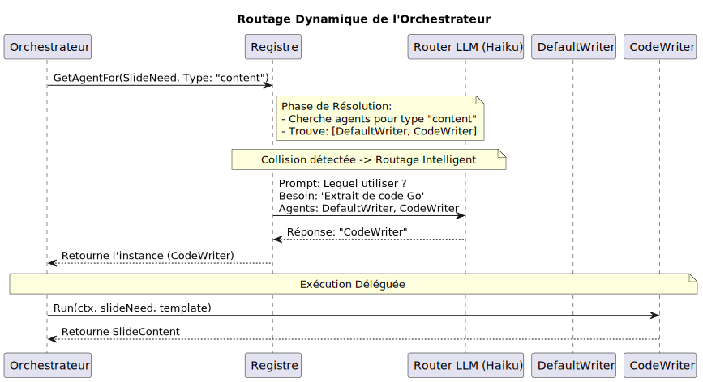

# ADR 014 : Configuration du pipeline d'agents via un pattern de registre (Plugin)

- **Date** : 2026-05-27
- **Statut** : Proposé
- **Décideurs** : Olivier Wulveryck

## Contexte

Actuellement, le pipeline multi-agent (`internal/agent/orchestrator`) est fortement couplé aux implémentations spécifiques des agents. Les étapes du pipeline (Outliner -> Selector -> Writers/Designer -> Reviewer) sont codées en dur, et la logique de fallback/dispatch (par exemple, le routage entre le Writer classique et le Designer pour les diagrammes) nécessite des modifications directes dans l'orchestrateur.

Au fur et à mesure de l'évolution du projet, il y a un besoin grandissant d'ajouter de nouveaux agents spécialisés (par exemple, un `DataWriter` pour les graphiques, ou un `CodeWriter` pour le formatage de snippets). Modifier `orchestrator.go` à chaque ajout nuit à la maintenabilité et contredit le principe Ouvert/Fermé (Open/Closed Principle).

## Décision

Nous proposons d'implémenter un pattern **Agent Registry (Registre d'agents)**.
Plutôt que d'instancier les agents statiquement dans l'orchestrateur, le système :
1. Définira une interface standard étendant `a2asrv.AgentExecutor` incluant des métadonnées sur les "capacités" de l'agent (ex: `SupportsSlideType(t string) bool`).
2. Introduira un registre central (ex: `internal/agent/registry`) où chaque agent s'enregistre (potentiellement via une fonction `init()` ou au démarrage).
3. Permettra à l'orchestrateur de résoudre dynamiquement l'agent approprié pour une tâche donnée basé sur le type de slide ou la phase du pipeline.

## Choix Technologiques

### 1. Interface et Capacités
L'interface `Agent` s'étendra pour déclarer ses capacités.
```go
type AgentCapability struct {
    Phase      string   // ex: "writer", "reviewer"
    SlideTypes []string // ex: ["content", "diagram", "data"]
}

type PipelineAgent interface {
    a2asrv.AgentExecutor
    Capabilities() AgentCapability
}
```

### 2. Le Registre
Le registre agit comme un routeur d'agents.
```go
package registry

var agents = make(map[string]PipelineAgent)

func Register(name string, agent PipelineAgent) {
    agents[name] = agent
}

func GetWriterForType(slideType string) PipelineAgent {
    // Logique de résolution dynamique
}
```

### 3. Résolution Dynamique par Description (LLM Routing)
Pour éviter le problème des priorités statiques arbitraires, le registre ne s'appuiera pas sur des scores numériques. À la place, chaque agent déclarera une **Description** textuelle de son expertise et de ses conditions d'utilisation.

```go
type AgentCapability struct {
    Phase       string   
    SlideTypes  []string 
    Description string   // ex: "Spécialisé dans le formatage de code source et la coloration syntaxique"
}
```

**Comportement de l'Orchestrateur :**
1. S'il n'y a qu'un seul agent enregistré pour un `SlideType` donné, l'orchestrateur l'utilise directement (Go pur, zéro surcoût).
2. S'il y a une **collision** (plusieurs agents pour un même type), l'orchestrateur effectue un appel LLM très léger et rapide (ex: Claude Haiku) avec le `SlideNeed` de l'utilisateur et les `Descriptions` des agents candidats. L'LLM agit comme un routeur et sélectionne l'agent le plus pertinent.

### Flux d'Exécution (Routage Dynamique)



*Source : [01-dynamic-routing.puml](diagrams/014/01-dynamic-routing.puml)*

### 4. Orchestrateur Dynamique
Dans `orchestrator.go`, le hardcoding actuel sera remplacé par une résolution intelligente :
```go
writer, err := registry.ResolveAgent(ctx, slide.Type, slideNeed, llmClient)
if err != nil {
    // Gestion de l'absence d'agent ou d'erreur de routage
}
writer.Run(ctx, ...)
```

## Conséquences

### Positives
- **Extensibilité** : L'ajout d'un nouvel agent (ex: `DataWriter`) ne requiert aucune modification de l'orchestrateur.
- **Découplage** : L'orchestrateur ne connaît plus les implémentations spécifiques (Designer, Writer).
- **Testabilité** : Il est plus facile d'injecter des agents "mock" dans le registre pour tester l'orchestrateur.

### Négatives
- **Complexité initiale** : Nécessite un refactoring de l'orchestrateur et des agents existants pour s'adapter au registre.
- **Résolution à l'exécution** : Une erreur de configuration (aucun agent pour un type de slide donné) ne sera détectée qu'au runtime, à moins d'ajouter une validation stricte au démarrage.

## Fichiers Concernés (Prévisionnel)

| Fichier | Modification |
|---------|-------------|
| `internal/agent/registry/registry.go` | **[NEW]** Création du registre et des interfaces. |
| `internal/agent/orchestrator/orchestrator.go` | **[MODIFY]** Remplacement des appels statiques par des résolutions dynamiques via le registre. |
| `internal/agent/writer/agent.go` | **[MODIFY]** Ajout de l'enregistrement et de l'interface `Capabilities`. |
| `internal/agent/designer/agent.go` | **[MODIFY]** Ajout de l'enregistrement et de l'interface `Capabilities`. |

## Retour de revue

*Date : 2026-05-28*

### 1. Dimensionnement : le problème est réel mais localisé

Le couplage identifié dans le Contexte est factuel : l'orchestrateur importe directement les 5 packages d'agents et les instancie via leurs constructeurs `New()`. Cependant, le point de dispatch dynamique se réduit aujourd'hui à **un seul `if/else`** dans `writeSlides()` (ligne 341 de `orchestrator.go`) :

```go
if need.SlideType == "diagram" {
    // → designer.New(...)
} else {
    // → writer.New(...)
}
```

Outliner, Selector et Reviewer sont des **singletons de phase** — il n'y a pas de scénario de collision pour eux. Un registre universel couvrant toutes les phases ajoute de la cérémonie sans valeur pour ces agents qui n'ont qu'une seule implémentation.

**Question ouverte** : quels agents spécialisés (DataWriter, CodeWriter, etc.) sont réellement prévus à court terme ? Si la réponse est « aucun dans les 3 prochains mois », la complexité du registre complet est prématurée.

### 2. Routage LLM : créatif mais à risques

L'idée d'un routeur LLM léger (Haiku) pour résoudre les collisions est originale. Cependant, elle introduit plusieurs risques sur le chemin critique :

- **Non-déterminisme** : deux exécutions identiques peuvent emprunter des chemins différents, rendant le debug et la reproductibilité plus difficiles.
- **Latence** : un appel réseau supplémentaire par slide en collision (même rapide, il s'accumule sur un deck de 30 slides).
- **Point de défaillance** : si l'appel LLM échoue ou retourne un nom d'agent invalide, il faut un fallback — qui ramène au dispatch statique que l'on cherche à éliminer.
- **Testabilité** : les tests d'intégration de l'orchestrateur deviennent dépendants d'un appel LLM non-déterministe.

**Alternative suggérée** : un mécanisme déterministe en Go pur (par exemple `CanHandle(need SlideNeed) bool` avec priorité explicite) couvrirait le besoin actuel sans ces risques. Le routage LLM pourrait être introduit ultérieurement, quand la complexité des collisions le justifiera réellement (3+ agents sur un même type de slide avec des critères de sélection subtils).

### 3. Interface `PipelineAgent` : convergence difficile

L'interface proposée étend `a2asrv.AgentExecutor`, mais :

- **Designer n'implémente pas A2A** aujourd'hui (c'est le seul agent du pipeline sans implémentation A2A).
- **Les signatures des agents divergent fortement** :
  - `outliner.Run(ctx, userRequest, templateInstructions)` → `*PresentationOutline`
  - `writer.WriteSlide(ctx, sourceSlide, slideNeed, fields, templateInstructions, feedback...)` → `*SlideContent`
  - `designer.DesignDiagram(ctx, slideNeed, templateInstructions, feedback...)` → `*DiagramSpec`
  - `selector.Run(ctx, outline, catalog, templateInstructions, errors...)` → `*SelectionPlan`

Forcer ces signatures dans un `Run(ctx, ...)` générique nécessiterait un objet contexte fourre-tout (`AgentInput`) qui masquerait les vrais contrats de chaque agent et réduirait la sécurité de typage offerte par Go.

### 4. Scope à clarifier

L'ADR gagnerait à répondre explicitement à ces questions :

- Le **pipeline** (la séquence Outliner → Selector → Writers → Reviewer) reste-t-il fixe, ou le registre pourrait-il aussi modifier l'ordre ou insérer de nouvelles phases ?
- Le **pipeline d'édition** (`EditorOrchestrator`, avec EditPlanner → EditWriter → EditReviewer) est-il concerné par le même registre ?
- Le registre couvre-t-il **toutes les phases** ou uniquement la phase writer (seule phase avec dispatch multiple) ?

### 5. Alternative à considérer : Strategy pattern ciblé

Un pattern Strategy limité à la phase writer résoudrait le problème immédiat sans sur-dimensionner la solution :

```go
type SlideWriter interface {
    CanHandle(need SlideNeed) bool
    Write(ctx context.Context, ...) (*SlideContent, vertex.Usage, error)
}
```

L'orchestrateur itère sur les writers enregistrés, prend le premier qui retourne `CanHandle() == true`, et l'exécute. Cette approche est :
- **Déterministe** et testable
- **Extensible** : ajouter un DataWriter = implémenter l'interface + l'enregistrer
- **Non-bloquante** : n'empêche pas d'évoluer vers un registre complet ou du routage LLM plus tard si le besoin se confirme
