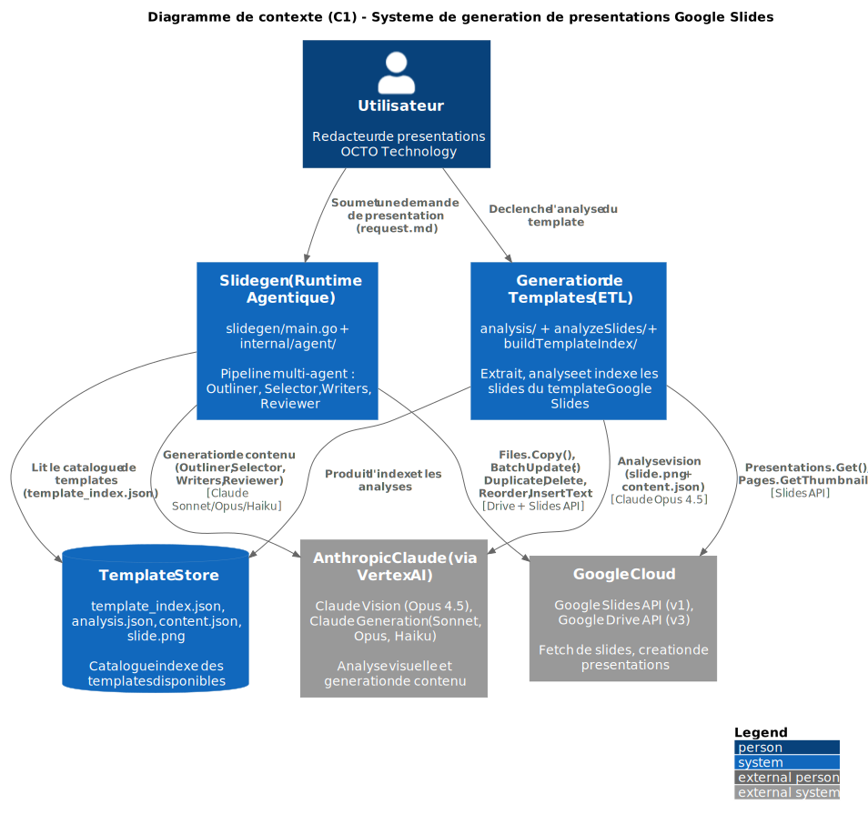
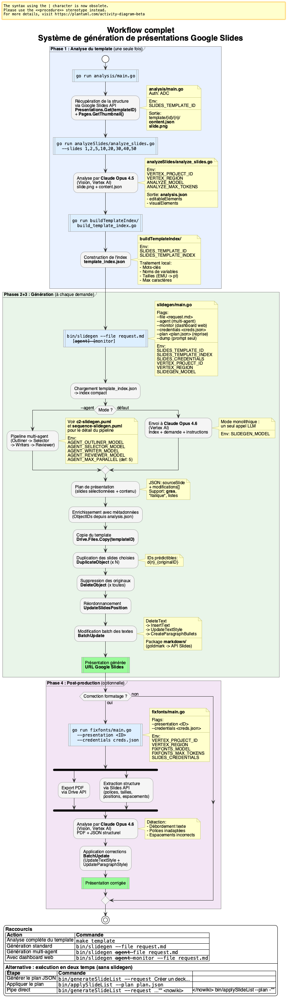
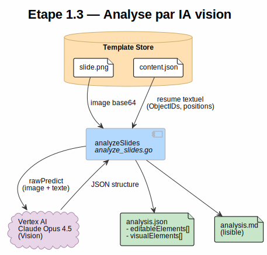
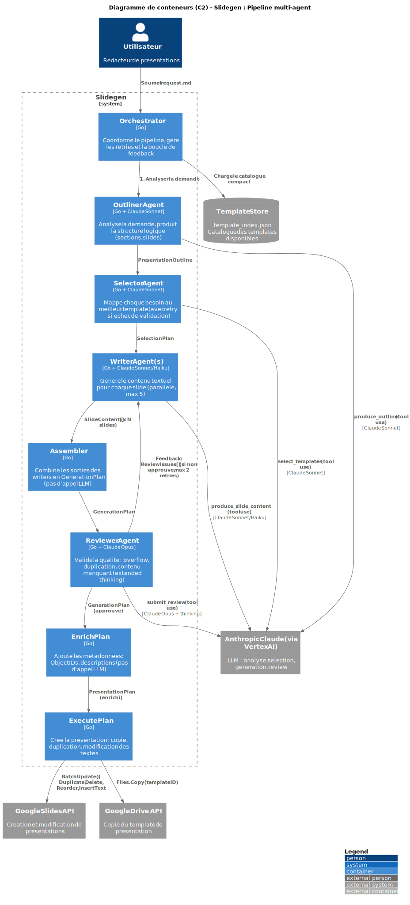
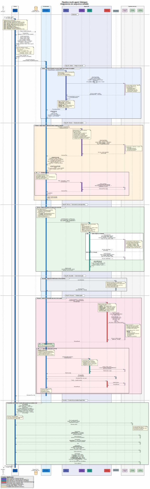
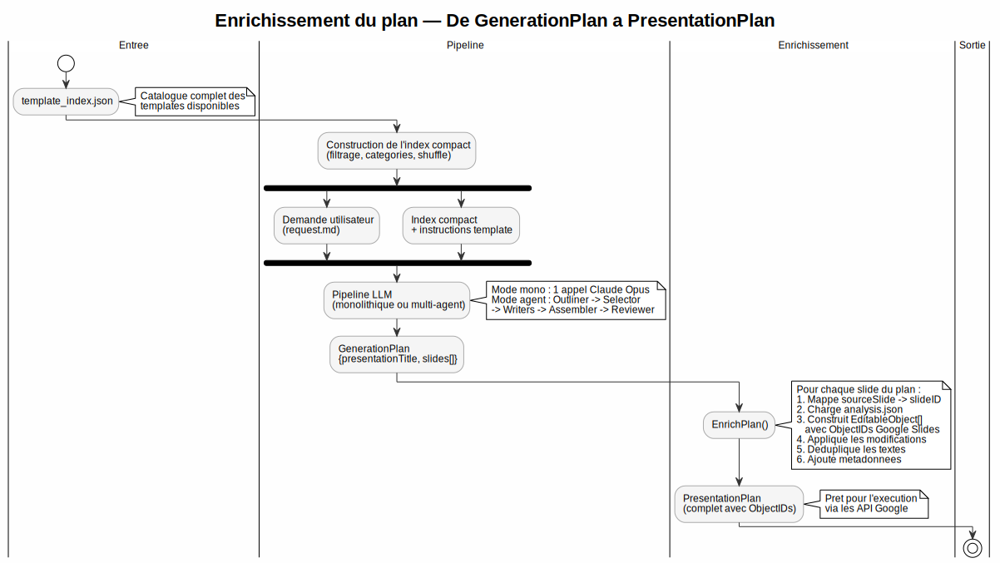
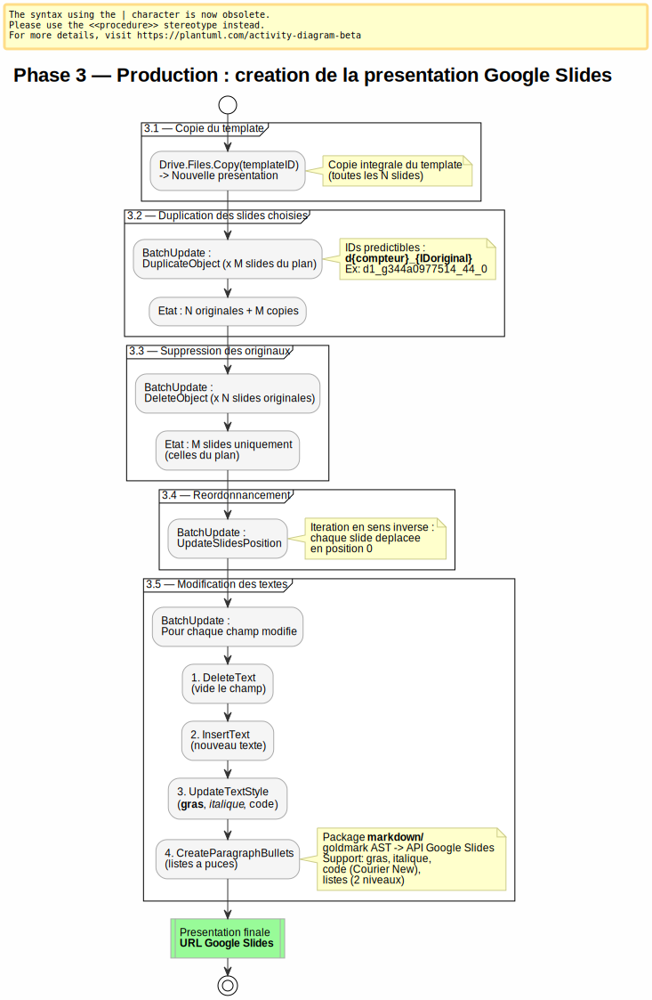
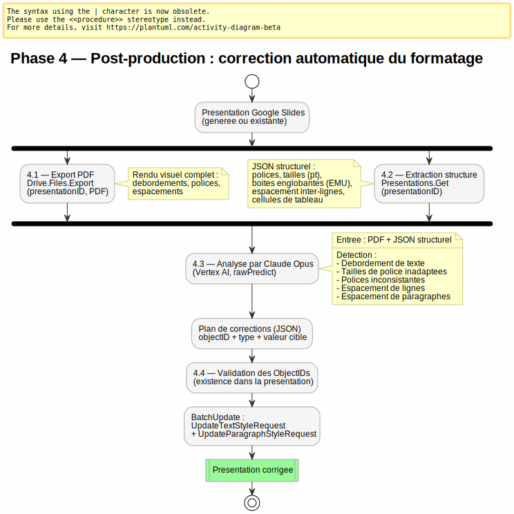

# Systeme de generation automatique de presentations Google Slides

Ce systeme permet de creer des presentations Google Slides completes a partir d'une simple demande textuelle (ou markdown). Il s'appuie sur un template de slides preformatees OCTO qu'il analyse une fois avec une IA de vision, puis qu'il reutilise a la demande pour assembler et personnaliser des presentations.

Le processus se decompose en trois phases principales, suivies d'une phase optionnelle de post-production :

1. **Analyse** -- extraction et comprehension du template (executee une seule fois)
2. **Planification** -- choix des slides et du contenu par une IA generative (a chaque demande)
3. **Production** -- duplication du template et application des modifications via les API Google (a chaque demande)
4. **Post-production** *(optionnelle)* -- correction automatique du formatage par IA (polices, tailles, espacements)

## Vue d'ensemble

### Diagramme de contexte (C1)



*Source : [c1-context.puml](c1-context.puml)*

### Workflow complet



*Source : [workflow.puml](workflow.puml)*

---

## Phase 1 : Analyse du template

Cette phase est executee **une seule fois** pour un template donne. Elle produit un index cherchable (`template_index.json`) qui sera utilise par toutes les generations futures.

### Etape 1.1 -- Extraction des donnees brutes depuis Google Slides API

Le programme `analysis/main.go` se connecte a l'API Google Slides en lecture seule et recupere la structure complete de la presentation template via `Presentations.Get(presentationID)`.

Pour chaque slide, il sauvegarde la reponse brute de l'API dans un fichier :

```
template/{presentationID}/{numeroSlide}/content.json
```

Ce fichier contient toute la structure de la slide telle que Google la voit :
- **ObjectIDs** : identifiants uniques de chaque element (formes, images, groupes)
- **Positions et tailles** : en EMU (English Metric Units, 1 EMU = 1/914400 pouce)
- **Contenu textuel** : texte de chaque forme, avec styles
- **Type de placeholder** : TITLE, BODY, SUBTITLE, etc.

### Etape 1.2 -- Extraction des images

Chaque slide est egalement exportee en image :

```
template/{presentationID}/{numeroSlide}/slide.png
```

Ces images servent d'entree visuelle pour l'etape d'analyse par IA.

### Etape 1.3 -- Analyse par IA vision (Claude Opus via Vertex AI)

Le programme `analyzeSlides/analyze_slides.go` envoie, pour chaque slide, deux elements a Claude Opus 4.5 via l'API Vertex AI :

1. L'image de la slide (`slide.png`, encodee en base64)
2. Un resume textuel extrait de `content.json` listant tous les objets avec leurs ObjectIDs et positions



*Source : [vision-analysis.puml](vision-analysis.puml)*

Claude identifie deux types d'elements :

- **editableElements** : les champs de texte modifiables (titre, sous-titre, corps de texte, annee...), chacun associe a son ObjectID issu de `content.json`
- **visualElements** : les elements visuels reutilisables (icones, images, logos) avec leurs ObjectIDs quand ils sont de type IMAGE ou GROUP

La sortie `analysis.json` est structuree ainsi :

```json
{
  "slideNumber": 1,
  "slideId": "g344a0977514_44_0",
  "intention": "Slide de couverture",
  "description": "Page de titre avec photo de fond et formes geometriques...",
  "editableElements": [
    {
      "objectId": "g3b4521dbf06_4_0",
      "type": "text",
      "placeholder": null,
      "content": "Slides preformatees",
      "description": "Titre principal de la slide",
      "location": "Centre-gauche, dans une forme capsule"
    }
  ],
  "visualElements": [
    {
      "objectId": "g3bb7b487657_9_4",
      "type": "icon",
      "description": "Icone decorative",
      "purpose": "Element visuel de la charte OCTO",
      "reusable": true
    }
  ]
}
```

### Etape 1.4 -- Construction de la representation intermediaire descriptive

Le programme `buildTemplateIndex/build_template_index.go` (logique metier dans `internal/templateindex/`) agrege tous les fichiers `analysis.json` en un unique `template_index.json`.

Pour chaque slide, il :
- **Extrait des mots-cles** (tokenisation + filtrage des mots vides francais)
- **Infere un role semantique** pour chaque element editable (ex: "titre principal" -> `titre_principal`, "annee" -> `annee`)
- **Genere des noms de variables** semantiques : role + suffixe de position si necessaire + "Shape" (ex: `titleMainShape`, `yearBottomLeftShape`)
- **Charge les positions** depuis `content.json` pour desambiguiser les elements de meme role
- **Calcule la capacite en caracteres** de chaque champ a partir des dimensions (EMU -> points)
- **Mappe les cellules de tableau** par indices ligne/colonne

Le resultat est le **catalogue cherchable complet du template** :

```json
{
  "templateId": "YOUR_TEMPLATE_PRESENTATION_ID",
  "slides": [
    {
      "slideNumber": 1,
      "slideId": "g344a0977514_44_0",
      "intention": "Slide de couverture",
      "keywords": ["couverture", "digital", "octo", "titre"],
      "editableFields": [
        {
          "objectId": "g3b4521dbf06_4_0",
          "role": "titre_principal",
          "content": "Slides preformatees",
          "variableName": "titlemainShape",
          "updateFunction": "updateTitlemainShape"
        }
      ],
      "visualElements": [...]
    }
  ]
}
```

C'est cette representation intermediaire qui fait le pont entre la structure brute des objets Google Slides et une description semantique comprehensible par une IA generative.

---

## Phase 2 : Planification -- choix des slides et du contenu

Cette phase est executee **a chaque demande** de generation de presentation. Deux modes sont disponibles : **monolithique** (un seul appel Claude) et **multi-agent** (pipeline a 5 etapes).

### Mode monolithique (defaut)

Le programme `slidegen/main.go` envoie en un seul appel a Claude (Opus 4.6 par defaut) :
- L'**index compact** du template
- La **demande utilisateur** (fichier markdown)
- Les **instructions du template** (`PROMPT.md`)

Le prompt est externalise sous forme de template Go (`internal/pipeline/prompt_pipeline.txt.tmpl`) avec des placeholders nommes (`{{.TemplateIndex}}`, `{{.UserRequest}}`, etc.) -- voir [ADR 004](adr/004-prompt-externalization.md).

Claude retourne directement un JSON avec les slides selectionnees et leur contenu.

### Mode multi-agent (`--agent`)

Le pipeline multi-agent decompose la planification en 5 etapes orchestrees par un coordinateur Go pur (`internal/agent/orchestrator.go`). Chaque agent utilise le mecanisme `tool_use` de Claude pour produire une sortie JSON structuree.



*Source : [c2-slidegen.puml](c2-slidegen.puml)*



*Source : [sequence-slidegen.puml](sequence-slidegen.puml)*

#### Etape 2.1 -- Outliner (Claude Sonnet 4.6)

Analyse la demande utilisateur **sans connaitre les templates disponibles**. Produit une `PresentationOutline` structuree en sections, chacune contenant des `SlideNeed` avec le type de slide, le contenu attendu, et le nombre d'items.

- **Outil** : `produce_outline`
- **Prompt systeme** : `internal/agent/prompt_outliner.txt`
- **Types de slides** : `cover`, `section_divider`, `content`, `data`, `conclusion`
- **Regle cle** : ne jamais inventer de contenu absent de la demande

#### Etape 2.2 -- Selector (Claude Sonnet 4.6)

Mappe chaque `SlideNeed` au meilleur template disponible en fonction de la capacite (nombre de champs, `maxChars`), du type, et de la coherence visuelle.

- **Outil** : `select_templates`
- **Prompt systeme** : `internal/agent/prompt_selector.txt`
- **Contrainte globale** : tous les `section_divider` doivent utiliser le meme template (validee dans `validateSelectionGlobal()`)
- **Retries** : jusqu'a `AGENT_MAX_SELECTOR_RETRIES` (defaut: 2) en cas d'echec de validation, avec feedback des erreurs

#### Etape 2.3 -- Writers (Claude Sonnet 4.6 / Haiku 4.5, paralleles)

Generent le contenu textuel de chaque slide individuellement, en parallele (`AGENT_MAX_PARALLEL`, defaut: 5 workers).

- **Outil** : `produce_slide_content` avec schema dynamique adapte aux champs de chaque slide
- **Prompt systeme** : `internal/agent/prompt_writer.txt`
- **Selection de modele** :
  - Slides complexes (>2 champs) : Claude Sonnet 4.6
  - Slides simples (<=2 champs) : Claude Haiku 4.5 (optimisation cout)
- **Support markdown** : `**gras**`, `*italique*`, `` `code` `` (rendu en Courier New), listes a puces
- **Enforcement** : `enforceMaxChars()` applique apres generation pour respecter les limites de taille (troncature intelligente : limites de phrase, equilibrage markdown)

#### Etape 2.4 -- Assembler (Go pur, pas d'appel LLM)

Combine les `SlideContent` de tous les writers en un `GenerationPlan` unifie. Aucun appel a un LLM.

#### Etape 2.5 -- Reviewer (Claude Opus 4.6, extended thinking)

Valide la qualite du plan assemble en verifiant :
- **Debordement** : contenu depassant la capacite du template
- **Duplication** : contenu repete entre slides
- **Contenu manquant** : elements de la demande utilisateur absents
- **Template inadequat** : slide mal adaptee au contenu
- **Incoherence** : contradictions entre slides
- **Contenu invente** : information absente de la demande originale

- **Outil** : `submit_review`
- **Prompt systeme** : `internal/agent/prompt_reviewer.txt`
- **Extended thinking** : budget configurable (`AGENT_REVIEWER_THINKING_BUDGET`, defaut: 5120 tokens)
- **Boucle de feedback** : si non approuve, les issues sont renvoyees aux Writers concernes (max `AGENT_MAX_REVIEW_RETRIES`, defaut: 2). Les corrections sont re-validees en sous-ensemble.

### Optimisation : prompt caching

Les prompts systeme utilisent le mecanisme de cache Vertex AI (`cache_control: {"type": "ephemeral"}`) pour reutiliser le prefixe entre appels paralleles des Writers -- voir [ADR 002](adr/002-prompt-caching.md).

### Enrichissement du plan

Le plan brut retourne par Claude (ou le pipeline) est enrichi avec les metadonnees completes issues des fichiers `analysis.json` de chaque slide selectionnee : ObjectIDs, descriptions, localisations, valeurs actuelles vs. nouvelles.



*Source : [enrichment.puml](enrichment.puml)*

---

## Phase 3 : Application du plan -- mise en production

Cette phase transforme le `PresentationPlan` en une vraie presentation Google Slides via les API Google Drive et Slides. Le flux complet est detaille dans le diagramme suivant.

### Etape 3.1 -- Duplication du template via Google Drive API

Le programme `applySlideList/apply_slide_list.go` (ou `slidegen/main.go`) appelle `Drive.Files.Copy(templateID)` pour creer une **copie complete** de la presentation template. Cette copie recoit le titre choisi par Claude et un nouvel ID de presentation.

### Etape 3.2 -- Duplication in-situ des slides choisies

Pour chaque slide du plan, le programme appelle l'API `DuplicateObject` sur la copie. Cet appel duplique une slide **a l'interieur de la meme presentation**, a cote de son original.

Le point critique : Google Slides genere de **nouveaux ObjectIDs** lors de toute duplication. Pour garder le controle, le programme utilise un mapping personnalise d'IDs :

```
Original : g344a0977514_44_0         ->  Copie : d1_g344a0977514_44_0
Element  : g3b4521dbf06_4_0          ->  Copie : d1_g3b4521dbf06_4_0
```

Le pattern `d{compteur}_{IDoriginal}` rend les IDs des copies **predictibles**. Le mapping est suivi dans une structure `slideRef` qui associe chaque ObjectID du template a son equivalent dans la copie.

### Etape 3.3 -- Suppression des slides originaux

Une fois toutes les slides du plan dupliquees, le programme supprime **tous les slides originaux** du template (ceux presents avant duplication). Ne restent que les copies correspondant au plan.



*Source : [production.puml](production.puml)*

### Etape 3.4 -- Reordonnancement

L'API `DuplicateObject` place les copies a cote de leur source, pas dans l'ordre du plan. Le programme utilise `UpdateSlidesPosition` pour remettre les slides dans le bon ordre. L'astuce : il itere en sens inverse, deplacant chaque slide en position 0, ce qui produit l'ordre final correct.

### Etape 3.5 -- Modification batch des contenus textuels

Pour chaque champ editable marque comme modifie dans le plan, le programme genere une serie de requetes API :

1. **`DeleteText`** -- vide le texte existant de l'element
2. **`InsertText`** -- insere le nouveau texte
3. **`UpdateTextStyle`** -- applique le gras, l'italique, et le code en ligne (Courier New)
4. **`CreateParagraphBullets`** -- convertit les lignes en listes a puces (si tirets detectes)

L'ordre d'execution est critique (delete -> insert -> style -> bullets) et gere par la fonction `SortRequests` du package `markdown/`.

Le **support markdown** utilise la bibliotheque `goldmark` pour parser le markdown en AST, puis traduit chaque noeud en une ou plusieurs requetes de l'API Google Slides. Sous-ensemble supporte : **gras**, *italique*, `code en ligne` (rendu en Courier New), et listes a puces (un ou deux niveaux d'indentation).

Toutes ces requetes sont envoyees en un **seul appel `BatchUpdate`**, qui applique d'un coup l'ensemble des modifications textuelles a la presentation.

Le resultat : une URL Google Slides pointant vers la presentation finale, prete a etre utilisee.

---

## Phase 4 : Post-production -- correction automatique du formatage

Cette phase est **optionnelle** et peut etre executee sur **n'importe quelle presentation** Google Slides, qu'elle ait ete generee par ce systeme ou non. Elle detecte et corrige automatiquement les problemes de formatage (polices, tailles, espacements) en comparant le rendu visuel aux donnees structurelles.

Le programme `fixfonts/main.go` orchestre les quatre etapes suivantes.

### Etape 4.1 -- Export PDF via Google Drive API

Le programme exporte la presentation complete en PDF via `Drive.Files.Export(presentationID, "application/pdf")`. Ce PDF capture le rendu visuel tel que Google Slides l'affiche, y compris les debordements de texte et les incoherences visuelles qui ne sont pas detectables a partir des seules donnees structurelles.

### Etape 4.2 -- Extraction de la structure via Google Slides API

En parallele, le programme recupere la structure complete via `Presentations.Get(presentationID)` et en extrait un JSON structurel contenant, pour chaque element texte de chaque slide :
- **Polices** (font family) et **tailles** (font size, en points)
- **Styles** (gras, italique)
- **Boites englobantes** (position et dimensions en EMU, converties en points : 1 pt = 12700 EMU)
- **Formatage de paragraphe** : espacement inter-lignes, espace avant/apres
- **Cellules de tableau** : localisation par indices ligne/colonne

### Etape 4.3 -- Analyse par Claude Opus (Vertex AI)

Le programme envoie a Claude Opus via l'API Vertex AI `rawPredict` :
1. Le **PDF** de la presentation (encode en base64, type `document`)
2. Le **JSON structurel** extrait a l'etape precedente



*Source : [postproduction.puml](postproduction.puml)*

Claude compare le rendu visuel aux donnees structurelles et detecte cinq categories de problemes :
- **Debordement de texte** : texte qui depasse son conteneur
- **Tailles de police** trop grandes par rapport au conteneur
- **Polices inconsistantes** : familles de polices differentes la ou l'uniformite est attendue
- **Espacement de lignes** : interligne trop serre ou trop lache
- **Espacement de paragraphes** : espace avant/apres inadequat

Pour chaque probleme detecte, Claude propose une correction precise : l'ObjectID de l'element, le type de modification, et la valeur cible.

### Etape 4.4 -- Validation et application des corrections

Le programme valide chaque correction proposee en verifiant que l'ObjectID reference existe bien dans la structure reelle de la presentation. Les corrections validees sont traduites en requetes API :

- **`UpdateTextStyleRequest`** -- modification de la taille de police et/ou de la famille de police (sur une plage de texte ou un element entier)
- **`UpdateParagraphStyleRequest`** -- modification de l'espacement inter-lignes et de l'espace avant/apres

Toutes les corrections sont appliquees en un **seul appel `BatchUpdate`**, de la meme maniere que la Phase 3.

---

## Monitoring et dashboard web

Le mode `--monitor` (ou `--web`) lance un dashboard web temps reel qui visualise l'avancement du pipeline multi-agent.

**Architecture** (`internal/monitor/`) :
- **Server HTTP** : endpoints `/` (dashboard), `/events` (Server-Sent Events), `/config` (JSON), `/upload` (fichier markdown)
- **Handler slog** : intercepte les logs structures et les classifie en evenements (agent start/done/error, review, retry...)
- **Broker pub/sub** : distribue les evenements a tous les clients SSE connectes

**Types d'evenements** :
- `pipeline_start`, `pipeline_step`, `pipeline_done`, `pipeline_error`
- `agent_start`, `agent_usage`, `agent_done`, `agent_error`
- `retry`, `review_result`
- `presentation_url`

```bash
bin/slidegen --agent --monitor --file request.md
```

---

## Serveur MCP (Model Context Protocol)

Le programme `mcp-server/main.go` expose le pipeline de generation comme un serveur MCP, permettant a des clients LLM (comme Claude Code) de generer des presentations via un appel d'outil.

- **Transports** : stdio, SSE, HTTP
- **Outil expose** : `generate_slides` (accepte du contenu markdown, retourne l'URL de la presentation)
- **Mode** : monolithique par defaut, multi-agent si `SLIDEGEN_AGENT_MODE=true`

---

## Externalisation des prompts

Tous les prompts des agents sont externalises dans des fichiers texte embarques via `go:embed` (voir [ADR 004](adr/004-prompt-externalization.md)) :

| Agent | Fichier prompt | Format |
|-------|---------------|--------|
| Outliner | `internal/agent/prompt_outliner.txt` | Texte brut |
| Selector | `internal/agent/prompt_selector.txt` | Texte brut |
| Writer | `internal/agent/prompt_writer.txt` | Texte brut |
| Reviewer | `internal/agent/prompt_reviewer.txt` | Texte brut |
| Pipeline (monolithique) | `internal/pipeline/prompt_pipeline.txt.tmpl` | Template Go |
| Fixfonts | Prompt externalise | Template Go |

Les prompts des agents sont des fichiers `.txt` charges directement. Les prompts du pipeline monolithique et de fixfonts utilisent des templates Go (`.txt.tmpl`) avec des placeholders nommes (`{{.TemplateIndex}}`, `{{.UserRequest}}`...).

---

## Configuration des modeles

| Variable d'environnement | Defaut | Agent/Phase |
|--------------------------|--------|-------------|
| `SLIDEGEN_MODEL` | `claude-opus-4-6` | Pipeline monolithique |
| `AGENT_OUTLINER_MODEL` | `claude-sonnet-4-6` | Outliner |
| `AGENT_SELECTOR_MODEL` | `claude-sonnet-4-6` | Selector |
| `AGENT_WRITER_MODEL` | `claude-sonnet-4-6` | Writer (slides complexes, >2 champs) |
| `AGENT_WRITER_SIMPLE_MODEL` | `claude-haiku-4-5@20251001` | Writer (slides simples, <=2 champs) |
| `AGENT_REVIEWER_MODEL` | `claude-opus-4-6` | Reviewer |
| `AGENT_REVIEWER_THINKING_BUDGET` | `5120` | Budget extended thinking (0 = desactive) |
| `AGENT_MAX_PARALLEL` | `5` | Workers paralleles |
| `AGENT_MAX_REVIEW_RETRIES` | `2` | Boucle de feedback reviewer |
| `AGENT_MAX_SELECTOR_RETRIES` | `2` | Retries validation selector |
| `ANALYZE_MODEL` | `claude-opus-4-5@20251101` | Analyse vision (Phase 1) |
| `FIXFONTS_MODEL` | `claude-opus-4-6` | Post-production (Phase 4) |

---

## Decisions d'architecture (ADR)

- [ADR 001 -- Architecture agentique](adr/001-agentic-architecture.md) : passage du mode monolithique au pipeline multi-agent
- [ADR 002 -- Prompt caching](adr/002-prompt-caching.md) : optimisation des couts via le cache Vertex AI
- [ADR 003 -- Suivi des tokens et qualite](adr/003-usage-tracking-and-quality.md) : observabilite, extended thinking, schema dynamique pour les writers
- [ADR 004 -- Externalisation des prompts](adr/004-prompt-externalization.md) : prompts dans des fichiers embarques via `go:embed`

---

## Diagrammes

| Diagramme | Description | Fichiers |
|-----------|-------------|----------|
| Contexte C1 | Vue systeme de haut niveau | [puml](c1-context.puml) / [svg](c1-context.svg) |
| Conteneurs C2 | Detail du pipeline slidegen | [puml](c2-slidegen.puml) / [svg](c2-slidegen.svg) |
| Sequence complete | ETL + runtime + post-production | [puml](sequence.puml) / [svg](sequence.svg) |
| Sequence slidegen | Pipeline multi-agent detaille | [puml](sequence-slidegen.puml) / [svg](sequence-slidegen.svg) |
| Workflow | Activites et commandes | [puml](workflow.puml) / [png](workflow.png) |
| Analyse vision | Etape 1.3 : Claude Vision | [puml](vision-analysis.puml) |
| Enrichissement | De GenerationPlan a PresentationPlan | [puml](enrichment.puml) |
| Production | Phase 3 : creation via Google APIs | [puml](production.puml) |
| Post-production | Phase 4 : correction du formatage | [puml](postproduction.puml) |

---

## Recapitulatif du flux de donnees

| Etape | Entree | Traitement | Sortie |
|-------|--------|------------|--------|
| 1.1 | ID du template | `analysis/main.go` -- API Google Slides | `content.json` (x N slides) |
| 1.2 | API Google Slides | Export d'images | `slide.png` (x N slides) |
| 1.3 | `slide.png` + `content.json` | Claude Opus 4.5 (Vision, Vertex AI) | `analysis.json` par slide |
| 1.4 | Tous les `analysis.json` | `internal/templateindex/` | `template_index.json` |
| 2.1 | `template_index.json` | Construction du prompt compact | Index compact (texte) |
| 2.2 | Index compact + demande | Pipeline mono ou multi-agent (Vertex AI) | `GenerationPlan` (JSON) |
| 2.3 | Plan + `analysis.json` | Enrichissement | `PresentationPlan` (JSON) |
| 3.1 | ID du template | `Drive.Files.Copy` | Nouvelle presentation (copie) |
| 3.2 | `PresentationPlan` | `DuplicateObject` (x M) | Slides dupliquees avec IDs mappes |
| 3.3 | Slides originaux | `DeleteObject` (x N) | Seules les copies restent |
| 3.4 | Slides dupliquees | `UpdateSlidesPosition` | Ordre final correct |
| 3.5 | Textes modifies (markdown) | `BatchUpdate` (delete/insert/style/bullets) | Presentation finale |
| 4.1 | ID de presentation | `Drive.Files.Export` (PDF) | PDF de la presentation |
| 4.2 | Slides API | Extraction structure | JSON structurel (polices, tailles, positions) |
| 4.3 | PDF + JSON structurel | Claude Opus (Vertex AI) | Plan de corrections (JSON) |
| 4.4 | Plan de corrections | `BatchUpdate` (UpdateTextStyle/UpdateParagraphStyle) | Presentation corrigee |
