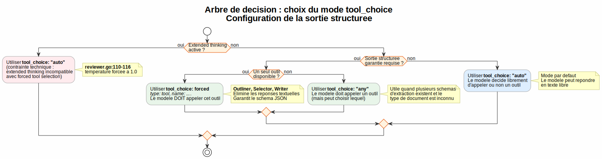
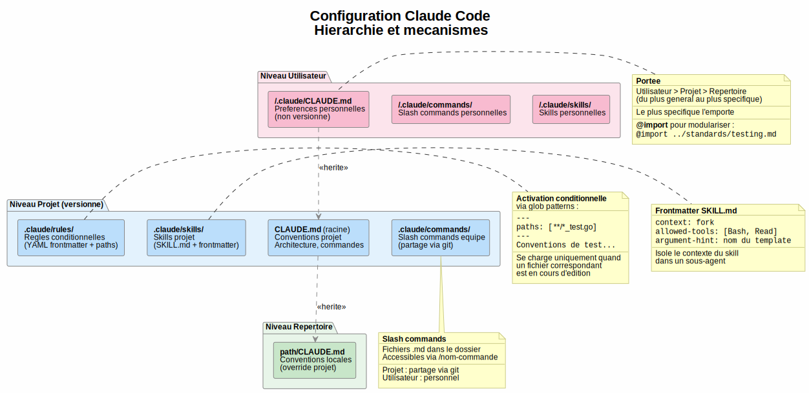
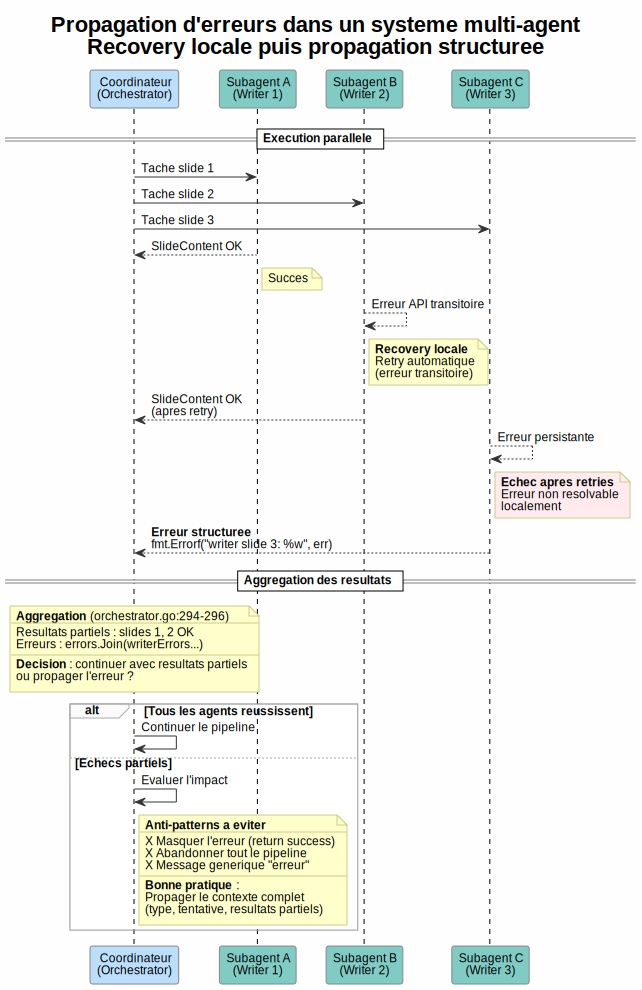

# Guide de preparation : Claude Certified Architect -- Foundations

**Document de reference** : *Claude Certified Architect -- Foundations Certification Exam Guide* (Anthropic, v0.1, 10 fevrier 2025)
**Date** : 8 mai 2026
**Codebase d'illustration** : `github.com/owulveryck/agentigslide` (commit `c75c1b4`)
**Auteur** : Claude Opus 4.6

---

## Comment utiliser ce guide

Ce document transforme la codebase `agentigslide` en support pedagogique pour la certification **Claude Certified Architect -- Foundations**. Pour chaque *task statement* de l'examen, il fournit :

1. **Concept** : explication theorique du concept, independante de la codebase
2. **Ce que l'examen attend** : les points de connaissance et competences cibles
3. **Illustration dans agentigslide** : comment la codebase implemente (ou non) le concept
4. **Points cles pour l'examen** : conseils pratiques, anti-patterns, regles de decision

L'examen est compose de **questions a choix multiples** basees sur des scenarios realistes. Le score minimum est **720/1000**. Il n'y a pas de penalite pour les mauvaises reponses.

Les diagrammes PlantUML sont generes en SVG dans ce meme repertoire.

---

## Synthese executive

| Domaine | Poids | Couverture agentigslide | Resume |
|---------|-------|------------------------|--------|
| 1. Agentic Architecture & Orchestration | 27% | **Excellent** | Pipeline multi-agent complet avec boucle de feedback, execution parallele, retry |
| 2. Tool Design & MCP Integration | 18% | **Bon** | Serveur MCP fonctionnel, descriptions d'outils detaillees, mais erreurs non structurees |
| 3. Claude Code Configuration & Workflows | 20% | **Partiel** | CLAUDE.md present, mais pas de commands/rules/skills |
| 4. Prompt Engineering & Structured Output | 20% | **Excellent** | tool_use avec schemas dynamiques, tool_choice force, validation/retry/feedback |
| 5. Context Management & Reliability | 15% | **Bon** | Prompt caching, delegation, gestion du contexte par blocs, mais pas de human review |

### Scenarios de l'examen

L'examen presente **4 scenarios** (parmi 6 possibles) qui encadrent les questions :

1. **Customer Support Resolution Agent** -- Agent SDK, MCP tools, escalation (Domaines 1, 2, 5)
2. **Code Generation with Claude Code** -- CLAUDE.md, slash commands, plan mode (Domaines 3, 5)
3. **Multi-Agent Research System** -- Coordinateur/subagents, synthese, provenance (Domaines 1, 2, 5)
4. **Developer Productivity with Claude** -- Built-in tools, MCP servers (Domaines 2, 3, 1)
5. **Claude Code for Continuous Integration** -- CI/CD, `-p` flag, review (Domaines 3, 4)
6. **Structured Data Extraction** -- JSON schemas, validation, batch (Domaines 4, 5)

---

## Domain 1 : Agentic Architecture & Orchestration (27%)

Ce domaine represente la plus grande part de l'examen. Il couvre la conception et l'implementation de systemes agentiques : des applications ou Claude agit de maniere autonome en utilisant des outils, en iterant sur ses resultats, et en coordonnant plusieurs instances de lui-meme.

---

### Task 1.1 -- Concevoir et implementer des boucles agentiques pour l'execution autonome

#### Concept

Une **boucle agentique** (agentic loop) est le mecanisme fondamental qui permet a Claude d'agir de maniere autonome. Contrairement a un simple appel API question-reponse, la boucle agentique transforme Claude en un agent capable d'utiliser des outils, d'observer leurs resultats, et de decider de sa prochaine action.

Le cycle fonctionne ainsi :
1. L'application envoie une requete a Claude avec une liste d'outils disponibles
2. Claude repond avec soit un appel d'outil (`stop_reason: "tool_use"`), soit une reponse finale (`stop_reason: "end_turn"`)
3. Si c'est un appel d'outil, l'application execute l'outil et renvoie le resultat a Claude
4. Claude integre ce resultat dans son raisonnement et decide de sa prochaine action
5. Le cycle continue jusqu'a ce que Claude considere la tache terminee

Le `stop_reason` est le **signal de controle** de la boucle. C'est le modele lui-meme qui decide quand arreter, pas un compteur arbitraire ni une analyse de texte.


#### Ce que l'examen attend

- **Savoir que** le `stop_reason` peut valoir `"tool_use"`, `"end_turn"`, ou `"max_tokens"`
- **Savoir que** les resultats d'outils doivent etre ajoutes a l'historique de conversation (`messages[]`) pour que le modele puisse raisonner sur eux a l'iteration suivante
- **Comprendre** la distinction entre la prise de decision par le modele (model-driven: Claude choisit quel outil appeler selon le contexte) et les arbres de decision pre-configures (pre-configured: l'application dicte la sequence d'outils)
- **Savoir eviter** les anti-patterns : parser le langage naturel pour determiner la terminaison, mettre un cap d'iterations arbitraire comme mecanisme principal d'arret, verifier le contenu textuel de la reponse pour detecter la completion

#### Illustration dans agentigslide

La codebase implemente des boucles agentiques via des appels Claude API avec `tool_use` et inspection du `stop_reason`. Bien que l'architecture passe par Vertex AI (pas directement l'API Anthropic), les patterns fondamentaux sont identiques.

**Inspection du `stop_reason`** : Chaque agent verifie explicitement `resp.StopReason == "max_tokens"` pour detecter les troncatures :
- `outliner.go:132` -- Outliner
- `selector.go:111` -- Selector
- `writer.go:155` -- Writer
- `reviewer.go:130` -- Reviewer

**Boucle interactive de l'Outliner** (`outliner.go:203-263`) : Implemente une boucle agentique multi-tour complete :

```go
// outliner.go:203 -- boucle agentique multi-tour
for round := 1; ; round++ {
    resp, err := a.client.RawPredictFull(ctx, a.model, messages, opts...)
    // ... parse tool_use ...
    feedback, err := feedbackFn(&outline)
    if feedback == "" { return &outline, nil } // approbation
    messages = append(messages, assistantMsg, userFeedbackMsg) // accumulation
}
```

L'accumulation des messages (`outliner.go:250-262`) inclut la reponse assistant et le tool_result + feedback utilisateur. C'est exactement le pattern decrit dans le Task Statement 1.1.

**Ecart notable** : L'architecture n'utilise pas `stop_reason == "tool_use"` vs `"end_turn"` comme mecanisme de boucle, car chaque agent fait un appel unique avec `tool_choice` force. La boucle est geree par l'orchestrateur Go, pas par le modele.

#### Points cles pour l'examen

- **Regle d'or** : utiliser `stop_reason` comme signal de controle, jamais l'analyse du texte de reponse
- **Anti-pattern frequent** : mettre `max_iterations = 10` comme seul garde-fou -- c'est un filet de securite, pas un mecanisme d'arret
- **Attention a `max_tokens`** : ce `stop_reason` signifie une troncature, pas une fin voulue. Il faut le traiter comme une erreur ou continuer avec une demande de completion
- **Chaque resultat d'outil enrichit le contexte** : c'est comme ca que l'agent "apprend" au fil des iterations

---

### Task 1.2 -- Orchestrer des systemes multi-agent avec le pattern coordinateur-subagent

#### Concept

Le pattern **coordinateur-subagent** (hub-and-spoke) est l'architecture de reference pour les systemes multi-agent. Un agent coordinateur central decompose la tache, delegue les sous-taches a des agents specialises (subagents), puis aggrege leurs resultats.

Les subagents operent avec un **contexte isole** : ils ne heritent pas automatiquement de l'historique de conversation du coordinateur. Chaque subagent recoit uniquement les informations dont il a besoin via son prompt. Cette isolation a deux avantages :
- Elle reduit la taille du contexte (chaque agent n'a que ce dont il a besoin)
- Elle evite les interferences entre les raisonnements des differents agents

Le coordinateur a quatre responsabilites :
1. **Decomposition** : analyser la requete et la diviser en sous-taches
2. **Delegation** : choisir quels subagents invoquer et avec quel contexte
3. **Aggregation** : combiner les resultats des subagents
4. **Gestion d'erreurs** : decider quoi faire quand un subagent echoue


#### Ce que l'examen attend

- **Savoir que** dans l'architecture hub-and-spoke, toute la communication inter-agent passe par le coordinateur
- **Savoir que** les subagents operent avec un contexte isole -- ils ne partagent pas l'historique du coordinateur
- **Comprendre** le role du coordinateur dans la decomposition, delegation, aggregation, et routage des erreurs
- **Connaitre le risque** de decomposition trop etroite : le coordinateur peut decomposer une tache trop finement et manquer des aspects importants (cf. Question 7 de l'examen)
- **Etre capable de** concevoir un coordinateur qui selectionne dynamiquement les subagents selon la complexite
- **Etre capable d'** implementer des boucles de raffinement iteratif ou le coordinateur evalue la synthese et re-delegue si necessaire

#### Illustration dans agentigslide

L'`Orchestrator` (`orchestrator.go`) implemente un pattern hub-and-spoke classique avec 5 etapes sequentielles :

```
User Request
    |
[Outliner] --> PresentationOutline
    |
[Selector] --> SelectionPlan (avec retry sur erreurs de validation)
    |
[Writers] (paralleles) --> SlideContent[]
    |
[Assembler] --> GenerationPlan
    |
[Reviewer] --> Approuve? --Non--> feedback aux Writers --> reassemble --> re-review
    |                                                                        |
    +------Oui-------> Google Slides API --> Presentation URL <--------------+
```

**Subagents isoles** : Chaque agent a son propre contexte, ses propres prompts, et ne partage pas l'historique de conversation des autres. Le Writer ne connait pas le raisonnement de l'Outliner.

**Delegation et aggregation** : L'orchestrateur transmet les resultats d'un agent au suivant via la structure `PipelineState` (`types.go:82`), qui utilise un `sync.Mutex` pour la concurrence.

**Boucle de raffinement iterative** : Le Reviewer evalue la sortie, renvoie des issues aux Writers concernes via `handleReviewIssuesReturn()` (`orchestrator.go:207-222`), et re-evalue avec `RunSubset` (`reviewer.go:169-277`).

**Risque de decomposition trop etroite** : Si la requete utilisateur est vague, l'Outliner pourrait manquer des aspects. Le mode `--chat` permet de raffiner le plan avant execution, mitigeant ce risque (ADR 005).

#### Points cles pour l'examen

- **Le coordinateur est le seul point de communication** : les subagents ne se parlent jamais directement
- **L'isolation du contexte est un avantage** (pas un handicap) : chaque agent a une fenetre de contexte propre, sans bruit
- **Question 7 type** : si le resultat final est incomplet, chercher d'abord si la decomposition du coordinateur est trop etroite avant de blamer les subagents
- **Boucle de raffinement** : le coordinateur doit pouvoir re-deleguer quand la synthese est insuffisante

---

### Task 1.3 -- Configurer l'invocation de subagents, le passage de contexte, et le spawning

#### Concept

Dans le **Claude Agent SDK**, les subagents sont invokes via l'outil `Task`. Le coordinateur doit inclure `"Task"` dans son `allowedTools` pour pouvoir spawner des subagents.

Chaque subagent est configure via un `AgentDefinition` qui specifie :
- Sa **description** et son **system prompt**
- Ses **outils autorises** (`allowedTools`)
- Ses **restrictions** (pas d'acces a certains outils)

Un point critique : **les subagents ne heritent pas automatiquement du contexte parent**. Tout ce qu'un subagent doit savoir doit etre explicitement inclus dans son prompt. Si le coordinateur veut qu'un subagent utilise les resultats d'un agent precedent, il doit les passer dans le prompt du subagent.

Le **fork de session** (`fork_session`) permet de creer des branches d'exploration independantes a partir d'une analyse commune. Utile pour comparer deux approches sans polluer le contexte de l'autre.

#### Ce que l'examen attend

- **Savoir que** l'outil `Task` est le mecanisme de spawning de subagents dans l'Agent SDK
- **Savoir que** `allowedTools` doit inclure `"Task"` pour qu'un coordinateur puisse invoquer des subagents
- **Savoir que** le contexte du subagent doit etre explicitement fourni dans son prompt
- **Connaitre** la configuration `AgentDefinition` (descriptions, system prompts, tool restrictions)
- **Connaitre** `fork_session` pour creer des branches d'exploration divergentes
- **Etre capable de** passer le contexte complet d'agents precedents directement dans le prompt du subagent
- **Etre capable de** utiliser des formats structures pour separer contenu et metadonnees lors du passage de contexte
- **Etre capable de** spawner des subagents en parallele en emettant plusieurs appels `Task` dans une seule reponse du coordinateur

#### Illustration dans agentigslide

La codebase utilise un orchestrateur Go natif plutot que le Claude Agent SDK, mais implemente les memes patterns :

**Contexte explicite** : Chaque agent recoit son contexte directement dans son prompt, pas par heritage. Le Writer recoit les champs du template, le slide need, et le feedback via ses parametres (`writer.go:63-125`).

**Formats structures** : Les donnees intermediaires utilisent des structures Go typees (`PresentationOutline`, `SelectionPlan`, `SlideContent`, `ReviewResult`) serializees en JSON.

**Execution parallele** : Les Writers sont lances en parallele via goroutines avec semaphore (`orchestrator.go:241-298`), ce qui correspond au pattern de spawning parallele de subagents :

```go
// orchestrator.go:241 -- equivalent de multiple Task tool calls
sem := make(chan struct{}, o.config.MaxParallel)
var wg sync.WaitGroup
for idx, need := range needs {
    wg.Add(1)
    go func(idx int, need SlideNeed) {
        sem <- struct{}{}
        defer func() { <-sem }()
        // ... writer work ...
    }(idx, need)
}
wg.Wait()
```

**Ecart** : L'architecture n'utilise pas `AgentDefinition` ni l'outil `Task` de l'Agent SDK -- c'est une implementation equivalente en Go natif, plus performante pour ce cas d'usage specifique.

#### Points cles pour l'examen

- **Passage de contexte** : toujours explicite, jamais implicite. "Ce que le subagent ne recoit pas, il ne le sait pas"
- **Parallelisme** : spawner plusieurs `Task` dans une seule reponse du coordinateur (pas un par tour)
- **Instructions au coordinateur** : specifier des objectifs et des criteres de qualite, pas des procedures etape par etape -- laisser le subagent adapter son approche
- **fork_session** : utile pour comparer des approches alternatives sans interference

---

### Task 1.4 -- Implementer des workflows multi-etapes avec enforcement et handoff

#### Concept

Un **workflow multi-etapes** est une sequence d'operations ou chaque etape depend du succes de la precedente. L'**enforcement** est le mecanisme qui garantit programmatiquement que les pre-requis sont remplis avant d'autoriser l'etape suivante.

Il y a deux approches pour garantir l'ordre des operations :
- **Enforcement programmatique** (hooks, prerequisite gates) : le code bloque les appels d'outils tant que les pre-requis ne sont pas valides. Cela fournit des **garanties deterministes**.
- **Guidance par prompt** : les instructions demandent au modele de suivre un certain ordre. Cela fournit une **compliance probabiliste** -- le modele suivra l'ordre la plupart du temps, mais pas toujours.

La regle : quand la non-conformite a des **consequences financieres, legales ou de securite**, utiliser l'enforcement programmatique. Le prompt seul ne suffit pas.

Le **handoff** est le protocole de transfert quand un agent ne peut pas resoudre un probleme. Un bon handoff inclut un resume structure : identifiant client, cause racine, actions tentees, action recommandee.

#### Ce que l'examen attend

- **Comprendre** la difference entre enforcement programmatique (deterministe) et guidance par prompt (probabiliste)
- **Savoir quand** utiliser l'enforcement programmatique : quand la conformite est critique (operations financieres, verification d'identite)
- **Connaitre** les protocoles de handoff structures : resume avec contexte pour les agents humains qui n'ont pas l'historique
- **Etre capable d'** implementer des pre-requis programmatiques qui bloquent les outils downstream (ex: bloquer `process_refund` tant que `get_customer` n'a pas retourne un ID verifie)
- **Etre capable de** decomposer des requetes multi-concerns en sous-taches independantes
- **Etre capable de** compiler des resumes de handoff structures (customer ID, root cause, refund amount, action recommandee)

#### Illustration dans agentigslide

**Enforcement programmatique** : La validation du Selector bloque le pipeline si les templates selectionnes n'existent pas dans le catalogue (`validate.go:159-257`). C'est l'equivalent du pattern "prerequisite gate" : le pipeline ne peut pas avancer tant que la selection n'est pas valide.

**Handoff structure** : L'orchestrateur assemble les resultats (`orchestrator.go:181-195`) en un `GenerationPlan` structure contenant toutes les informations necessaires pour l'execution.

**Degradation gracieuse** : Si le Reviewer ne valide pas apres N retries, l'orchestrateur continue avec un warning (`orchestrator.go:122-127`). Ce choix est documente dans l'ADR 001 -- c'est une decision architecturale deliberee qui favorise la completion sur la perfection.

**Enforcement post-generation** : `enforceMaxChars()` (`orchestrator.go:301-340`) tronque les champs qui depassent la limite du template. C'est une forme de hook post-tool-use qui garantit programmatiquement le respect des contraintes.

#### Points cles pour l'examen

- **Question 1 type** : si un agent saute une etape critique (12% du temps), la reponse est l'enforcement programmatique (pas le prompt, pas les few-shot examples)
- **Regle de decision** : "Est-ce que l'echec a des consequences irreversibles ?" Si oui -> enforcement programmatique. Si non -> guidance par prompt acceptable
- **Handoff** : toujours inclure le contexte complet pour le destinataire (humain ou agent) qui n'a pas l'historique de conversation
- **La degradation gracieuse est un choix valide** quand elle est documentee et justifiee

---

### Task 1.5 -- Appliquer les hooks Agent SDK pour l'interception et la normalisation

#### Concept

Les **hooks** sont des fonctions qui interceptent les appels d'outils a deux moments :
- **Avant l'execution** (pre-hook) : pour valider, modifier ou bloquer un appel d'outil
- **Apres l'execution** (post-hook, `PostToolUse`) : pour transformer le resultat avant que le modele ne le traite

Les hooks servent trois objectifs principaux :

1. **Normalisation des donnees** : convertir des formats heterogenes (timestamps Unix, ISO 8601, codes numeriques) en un format uniforme avant que l'agent ne les traite. Sans normalisation, le modele doit gerer la variabilite, ce qui est source d'erreurs.

2. **Enforcement de regles metier** : bloquer les operations qui violent les politiques (ex: refund > 500$ -> blocage + escalation). Contrairement aux instructions dans le prompt, les hooks fournissent des garanties deterministes : impossible de contourner.

3. **Redirection de workflow** : quand un hook detecte une violation, il peut rediriger vers un workflow alternatif (escalation humaine, validation manager).

La distinction cle : les **hooks** sont pour les regles deterministes (garantie a 100%), les **prompts** sont pour les comportements souhaites (probabiliste, ~95%).

#### Ce que l'examen attend

- **Connaitre** les patterns `PostToolUse` qui interceptent les resultats d'outils pour transformation
- **Connaitre** les hooks qui interceptent les appels sortants pour enforcement de regles metier
- **Comprendre** la distinction entre hooks (garantie deterministe) et prompts (compliance probabiliste)
- **Etre capable d'** implementer des `PostToolUse` hooks pour normaliser des donnees heterogenes
- **Etre capable d'** implementer des hooks d'interception qui bloquent les actions policy-violating et redirigent vers des workflows alternatifs
- **Etre capable de** choisir les hooks plutot que l'enforcement par prompt quand les regles metier exigent une conformite garantie

#### Illustration dans agentigslide

La codebase n'utilise pas les hooks Agent SDK (elle passe par un orchestrateur Go natif), mais implemente des patterns equivalents :

**Enforcement post-generation** : `enforceMaxChars()` (`orchestrator.go:301-340`) est fonctionnellement equivalent a un `PostToolUse` hook : il intercepte la sortie des Writers et tronque les champs qui depassent la limite du template.

**Validation programmatique** : `validateOutline()` et `validateSelection()` interceptent et valident les sorties avant de passer a l'etape suivante. C'est le pattern "prerequisite gate" implemente en Go plutot que via les hooks declaratifs de l'Agent SDK.

**Ecarts** : La normalisation des donnees est faite via validation Go plutot que via des hooks declaratifs. Il n'y a pas d'implementation de `PostToolUse` au sens Agent SDK.

#### Points cles pour l'examen

- **Hooks vs Prompts** : si la question mentionne "guaranteed compliance" ou "business rules with financial consequences", la reponse implique des hooks, pas des prompts
- **PostToolUse** : penser "middleware" -- il se place entre l'execution de l'outil et le traitement du resultat par l'agent
- **Cas d'usage typique** : normaliser les timestamps, les codes de statut, les formats de montants avant que l'agent ne les traite
- **L'enforcement par hook est non-contournable** : contrairement au prompt, l'agent ne peut pas "decider" d'ignorer le hook

---

### Task 1.6 -- Concevoir des strategies de decomposition de taches

#### Concept

La **decomposition de taches** est la maniere dont un systeme agentique divise un probleme complexe en sous-taches gereables. Il existe deux strategies fondamentales :

1. **Pipeline fixe sequentiel** (prompt chaining) : les etapes sont predefinies et executees dans un ordre fixe. Ideal pour les workflows predictibles ou chaque etape est bien comprise.

2. **Decomposition dynamique adaptative** : les sous-taches sont generees au fur et a mesure, en fonction de ce qui est decouvert a chaque etape. Ideal pour les taches exploratoires ou la portee n'est pas connue a l'avance.

Le **prompt chaining** decompose une tache en etapes sequentielles, ou la sortie de chaque etape devient l'entree de la suivante. Exemples :
- Code review : analyser chaque fichier individuellement, puis faire une passe cross-fichiers d'integration
- Data extraction : extraire les donnees, valider le schema, corriger les erreurs, enrichir les metadonnees

Le choix entre les deux depend de la **predictibilite** du workflow : si vous connaissez les etapes a l'avance, le pipeline fixe est plus fiable et plus efficace. Si la tache est exploratoire, la decomposition dynamique permet de s'adapter.

#### Ce que l'examen attend

- **Savoir quand** utiliser un pipeline fixe (taches predictibles) vs une decomposition dynamique (taches exploratoires)
- **Connaitre** le prompt chaining et ses avantages (reviews par fichier + passe d'integration)
- **Comprendre** l'interet des plans d'investigation adaptatifs qui generent des sous-taches en fonction des decouvertes
- **Etre capable de** choisir le pattern de decomposition adapte : prompt chaining pour les reviews multi-aspects predictibles, decomposition dynamique pour les investigations ouvertes
- **Etre capable de** decomposer des reviews de code en passes par fichier + passe d'integration pour eviter la dilution d'attention
- **Etre capable de** decomposer des taches ouvertes en faisant d'abord un mapping, puis un plan priorise qui s'adapte

#### Illustration dans agentigslide

Le pipeline illustre une **decomposition fixe sequentielle** (prompt chaining) en 5 etapes :

1. **Outliner** : analyse structurelle de la requete
2. **Selector** : mapping des besoins aux templates
3. **Writers** : generation de contenu (parallelise)
4. **Assembler** : assemblage du plan
5. **Reviewer** : validation qualite

C'est exactement le pattern "fixed sequential pipeline" recommande pour les workflows predictibles. Chaque etape a un role bien defini, des entrees/sorties claires, et des criteres de validation.

L'ADR 001 (`docs/adr/001-agentic-architecture.md`) documente le raisonnement derriere cette architecture et la transition depuis un pipeline monolithique (un seul appel Claude).

**Selection adaptative de modele** (`orchestrator.go:250-253`) : le choix du modele Writer s'adapte a la complexite de la tache (Haiku pour <=2 champs, Sonnet pour >2). C'est une forme de decomposition adaptative au sein d'un pipeline fixe.

#### Points cles pour l'examen

- **Prompt chaining = pipeline fixe** : etapes predefinies, ideal pour les workflows connus
- **Decomposition dynamique = exploration** : les sous-taches emergent au fur et a mesure
- **Question 12 type** : pour un code review de 14 fichiers, la reponse est "split into per-file passes + cross-file integration pass" (pas un modele plus gros, pas des PRs plus petits)
- **La dilution d'attention est reelle** : plus il y a de fichiers dans un seul contexte, moins la review est profonde

---

### Task 1.7 -- Gerer l'etat de session, la reprise et le fork

#### Concept

La **gestion de session** permet de maintenir la continuite du travail d'un agent a travers le temps. Trois mecanismes cles :

1. **`--resume <session-name>`** : reprend une session nommee precedente avec tout son contexte. Utile pour les investigations longues qui s'etalent sur plusieurs sessions de travail.

2. **`fork_session`** : cree une branche independante a partir d'une analyse existante pour explorer des approches divergentes. Par exemple, apres avoir analyse une codebase, forker pour comparer deux strategies de refactoring sans que l'une pollue l'autre.

3. **Session fresh avec resume injecte** : au lieu de reprendre une session avec des resultats d'outils potentiellement stales, demarrer une nouvelle session en injectant un resume structure des decouvertes precedentes. Plus fiable quand des fichiers ont ete modifies entre-temps.

La regle : **reprendre quand le contexte est encore valide**, repartir a neuf quand les resultats d'outils sont stales (fichiers modifies, etat change).

#### Ce que l'examen attend

- **Connaitre** `--resume` pour reprendre des sessions nommees
- **Connaitre** `fork_session` pour creer des branches d'exploration independantes
- **Comprendre** pourquoi un resume frais avec un resume injecte est parfois plus fiable qu'une reprise de session (resultats d'outils stales)
- **Savoir qu'** il faut informer l'agent des changements de fichiers quand on reprend une session apres des modifications
- **Etre capable de** choisir entre reprise (contexte valide) et session fraiche (contexte stale)
- **Etre capable d'** utiliser `fork_session` pour comparer des approches de test ou de refactoring
- **Etre capable d'** informer un agent repris des changements specifiques de fichiers pour une re-analyse ciblee

#### Illustration dans agentigslide

La codebase illustre partiellement ces concepts :

**Pre-built outline** : L'orchestrateur supporte un outline pre-construit via `Orchestrator.Outline` (`orchestrator.go:22-24`), permettant de reprendre le pipeline apres le mode interactif.

**Sauvegarde du plan** : Le plan JSON est sauvegardable (`slidegen/main.go` avec `--plan`), permettant de reprendre une execution echouee -- c'est fonctionnellement similaire a un `--resume`.

**Ecarts** : Pas de `--resume`, `fork_session`, ou sessions nommees au sens Claude Code. Pas de persistence structuree de l'etat pour crash recovery au sens Agent SDK.

#### Points cles pour l'examen

- **`--resume` vs session fraiche** : si les fichiers ont change, preferer une session fraiche avec un resume injecte
- **`fork_session`** : ideal pour "essayons les deux approches" -- separation complete des contextes
- **Les resultats d'outils stales sont dangereux** : ils representent un etat qui n'existe peut-etre plus
- **Informer l'agent des changements** : plutot que de re-explorer tout, dire "les fichiers X et Y ont change" pour une analyse ciblee

---

## Domain 2 : Tool Design & MCP Integration (18%)

Ce domaine couvre la conception d'interfaces d'outils efficaces et l'integration du **Model Context Protocol (MCP)**. Les outils sont le moyen par lequel un agent interagit avec le monde exterieur. Leur qualite determine directement la fiabilite du systeme.

---

### Task 2.1 -- Concevoir des interfaces d'outils efficaces avec des descriptions claires

#### Concept

Les **descriptions d'outils** sont le mecanisme principal par lequel un LLM decide quel outil utiliser. Claude lit les descriptions et choisit l'outil dont la description correspond le mieux a la tache en cours. Si les descriptions sont vagues, ambigues, ou se chevauchent, le modele fera des choix incorrects.

Une bonne description d'outil doit inclure :
- **Le but** : une premiere ligne claire sur ce que fait l'outil
- **Le format d'entree** : quels parametres, dans quel format
- **Les cas limites** : quand utiliser cet outil vs un outil similaire
- **Les exemples** : un ou deux exemples d'utilisation
- **Le format de sortie** : ce que l'outil retourne

Le **misrouting** se produit quand deux outils ont des descriptions similaires. Par exemple, `analyze_content` ("Analyzes content") et `analyze_document` ("Analyzes documents") sont presque indistinguables pour le modele. La solution : renommer pour differencier (`extract_web_results` vs `extract_document_data`) et enrichir les descriptions avec les cas d'usage specifiques.

Attention aussi aux **instructions keyword-sensitive** dans le system prompt : si le prompt dit "always analyze before responding", le modele peut systematiquement appeler un outil `analyze_*` meme quand ce n'est pas necessaire.

#### Ce que l'examen attend

- **Savoir que** les descriptions d'outils sont le mecanisme principal de selection
- **Comprendre** comment les descriptions ambigues causent le misrouting
- **Comprendre** l'impact des instructions keyword-sensitive dans le system prompt
- **Etre capable de** rediger des descriptions qui differecient clairement chaque outil
- **Etre capable de** renommer les outils et mettre a jour les descriptions pour eliminer les chevauchements
- **Etre capable de** decomposer les outils generiques en outils specifiques avec des contrats d'entree/sortie definis

#### Illustration dans agentigslide

La description de l'outil MCP `generate_slides` (`mcp-server/tool_description.txt`) est un exemple modele :
- **Premiere ligne claire** : but de l'outil
- **Format d'entree detaille** : format markdown attendu
- **Exemple complet** : un exemple de presentation
- **Contraintes** : temps de traitement, adaptation automatique
- **Format de sortie** : URL Google Slides

Les outils internes des agents sont egalement bien decrits et ne se chevauchent pas :
- `produce_outline` (`outliner.go:26-97`) : schema JSON avec enums, descriptions de champs
- `select_templates` (`selector.go:25-57`) : descriptions claires de chaque propriete
- `produce_slide_content` (`writer.go:27-57`) : schema dynamique avec contraintes maxLength
- `submit_review` (`reviewer.go:25-69`) : enum d'`issueType` avec 6 categories distinctes

Chaque outil a un nom distinct et une description non ambigue -- pas de risque de misrouting.

#### Points cles pour l'examen

- **Question 2 type** : si l'agent appelle le mauvais outil, la premiere action est d'ameliorer les descriptions (pas d'ajouter des few-shot, pas de routing layer)
- **Renommer > Decrire** : un mauvais nom avec une bonne description est moins efficace qu'un bon nom avec une description moyenne
- **Decomposer les outils generiques** : `analyze_document` -> `extract_data_points`, `summarize_content`, `verify_claim_against_source`
- **Verifier le system prompt** : les mots-cles du prompt peuvent biaiser la selection d'outils

---

### Task 2.2 -- Implementer des reponses d'erreur structurees pour les outils MCP

#### Concept

Quand un outil MCP echoue, la qualite de l'information retournee a l'agent determine sa capacite a reagir intelligemment. Un message generique ("Operation failed") ne donne aucune indication : faut-il reessayer ? modifier les parametres ? escalader ?

Le protocole MCP prevoit le flag **`isError`** pour signaler les echecs. Au-dela de ce flag, les erreurs structurees doivent inclure :

- **`errorCategory`** : la nature de l'erreur
  - `transient` : probleme temporaire (timeout, service indisponible) -> retry
  - `validation` : entree invalide -> corriger et reessayer
  - `permission` : acces refuse -> escalader
  - `business` : violation de regle metier -> informer l'utilisateur
- **`isRetryable`** : boolean indiquant si un retry a des chances de reussir
- **`description`** : message lisible pour l'humain

La distinction entre **erreur d'acces** (le service a echoue -> retry) et **resultat vide valide** (la requete a reussi mais n'a rien trouve -> pas de retry) est critique : sans cette distinction, l'agent gaspille des retries sur des resultats valides ou abandonne des requetes qui auraient reussi au retry.

#### Ce que l'examen attend

- **Connaitre** le pattern `isError` du protocole MCP
- **Comprendre** la distinction entre erreurs transitoires, de validation, de permission
- **Comprendre** pourquoi les reponses d'erreur uniformes ("Operation failed") empechent des decisions de recovery intelligentes
- **Comprendre** la difference entre erreurs d'acces et resultats vides valides
- **Etre capable de** retourner des erreurs structurees avec `errorCategory`, `isRetryable`, et description
- **Etre capable de** implementer une recovery locale dans les subagents pour les erreurs transitoires
- **Etre capable de** distinguer les echecs d'acces (retry) des resultats vides valides (pas de retry)

#### Illustration dans agentigslide

Le serveur MCP utilise `SetError()` pour signaler les erreurs (`mcp-server/main.go:185`) :

```go
func errResult(msg string) *mcp.CallToolResult {
    r := &mcp.CallToolResult{}
    r.SetError(fmt.Errorf("%s", msg))
    return r
}
```

**Ecarts importants** :
- Pas de `errorCategory` dans les reponses d'erreur
- Pas de flag `isRetryable` explicite
- Les messages d'erreur sont des strings non structures
- Un agent appelant ne peut pas distinguer une erreur transitoire d'une erreur de validation

**Recommandation** : enrichir `errResult()` avec une structure `{ "errorCategory": "...", "isRetryable": bool, "description": "..." }` pour permettre des decisions de recovery intelligentes.

#### Points cles pour l'examen

- **Question 8 type** : pour la propagation d'erreurs, la reponse est "retourner le contexte structure complet" (type d'echec, requete tentee, resultats partiels, alternatives)
- **Jamais de message generique** : "search unavailable" cache de l'information precieuse au coordinateur
- **isRetryable: false + explication** : pour les violations de regles metier, dire au modele pourquoi c'est bloque et quoi communiquer au client
- **Resultat vide != erreur** : une recherche qui ne trouve rien est un succes, pas un echec

---

### Task 2.3 -- Distribuer les outils entre agents et configurer tool_choice

#### Concept

Le nombre et le type d'outils accessibles a un agent impactent directement sa fiabilite. Donner 18 outils a un agent quand il n'en a besoin que de 4-5 degrade la qualite de selection : plus il y a de choix, plus le risque de mauvais choix augmente.

Le principe de **scoped tool access** (acces restreint aux outils pertinents) recommande :
- Chaque agent ne recoit que les outils necessaires a son role
- Les outils cross-role sont limites aux besoins haute-frequence
- Les cas complexes sont routes vers le coordinateur

Le parametre **`tool_choice`** controle comment le modele utilise les outils :
- `"auto"` : le modele peut repondre en texte ou appeler un outil (defaut)
- `"any"` : le modele doit appeler un outil (mais peut choisir lequel)
- `{"type": "tool", "name": "..."}` : le modele doit appeler cet outil specifique (forced)



#### Ce que l'examen attend

- **Savoir que** trop d'outils (ex: 18 au lieu de 4-5) degrade la fiabilite de selection
- **Savoir que** les agents tendent a mal utiliser les outils hors de leur specialisation
- **Connaitre** le principe de scoped tool access
- **Connaitre** les trois modes de `tool_choice` : `auto`, `any`, forced
- **Etre capable de** restreindre les outils de chaque subagent a ceux de son role
- **Etre capable de** remplacer des outils generiques par des outils contraints
- **Etre capable d'** utiliser `tool_choice` force pour garantir l'appel d'un outil specifique
- **Etre capable de** configurer `tool_choice: "any"` pour garantir un appel d'outil tout en laissant le choix du schema

#### Illustration dans agentigslide

Chaque agent recoit **exactement un outil** adapte a son role -- c'est la separation la plus stricte possible :

| Agent | Outil | tool_choice |
|-------|-------|-------------|
| Outliner | `produce_outline` | `{"type": "tool", "name": "produce_outline"}` |
| Selector | `select_templates` | `{"type": "tool", "name": "select_templates"}` |
| Writer | `produce_slide_content` | `{"type": "tool", "name": "produce_slide_content"}` |
| Reviewer | `submit_review` | Force ou `auto` (si extended thinking) |

**Exception pour le Reviewer** : quand `thinkingBudget > 0`, `tool_choice` passe a `"auto"` car extended thinking est incompatible avec le forced tool choice (`reviewer.go:110-116`). C'est un compromis documente.

**Selection de modele adaptative** (`orchestrator.go:250-253`) :
```go
writerModel := o.config.WriterModel
if len(templateFields) <= 2 {
    writerModel = o.config.WriterSimpleModel // Haiku pour les slides simples
}
```

#### Points cles pour l'examen

- **Question 9 type** : pour un subagent qui a besoin de faire des verifications simples (85% des cas), la reponse est un scoped `verify_fact` tool (pas tout le toolset du web search agent)
- **Regle des 4-5 outils max** par agent pour une fiabilite optimale
- **`tool_choice: "any"`** : garantit un outil mais laisse le choix -- utile quand le type de document est inconnu
- **Extended thinking + forced tool_choice = incompatible** : contrainte technique a connaitre

---

### Task 2.4 -- Integrer des serveurs MCP dans Claude Code et les workflows agents

#### Concept

Le **Model Context Protocol (MCP)** est un protocole standardise qui permet aux agents Claude de se connecter a des services externes. L'architecture MCP distingue :

- **MCP Host** : l'application hote (Claude Code, IDE, application custom)
- **MCP Client** : le composant qui communique avec les serveurs MCP
- **MCP Server** : le service qui expose des outils, des ressources, et des prompts

Les serveurs MCP sont configures a deux niveaux :
- **Projet** : fichier `.mcp.json` a la racine du repo (versionne, partage avec l'equipe)
- **Personnel** : `~/.claude.json` (experimental, non partage)

Le `.mcp.json` supporte l'**expansion de variables d'environnement** (`${GITHUB_TOKEN}`) pour gerer les credentials sans les commettre dans le code.

Les **MCP resources** sont un mecanisme pour exposer des catalogues de contenu (resumes d'issues, schemas de base de donnees, hierarchies de documentation). Contrairement aux outils (qui executent des actions), les resources donnent de la visibilite aux agents sans appels exploratoires.


#### Ce que l'examen attend

- **Connaitre** le scoping des serveurs MCP : `.mcp.json` (projet) vs `~/.claude.json` (personnel)
- **Connaitre** l'expansion de variables d'environnement dans `.mcp.json`
- **Savoir que** les outils de tous les serveurs MCP sont decouverts au moment de la connexion et disponibles simultanement
- **Connaitre** les MCP resources comme mecanisme d'exposition de catalogues
- **Etre capable de** configurer un serveur MCP partage dans `.mcp.json` avec expansion de variables
- **Etre capable de** configurer un serveur MCP personnel dans `~/.claude.json`
- **Etre capable de** enrichir les descriptions d'outils MCP pour que l'agent les prefere aux outils built-in
- **Etre capable de** choisir des serveurs MCP communautaires existants plutot que des implementations custom pour les integrations standard

#### Illustration dans agentigslide

`mcp-server/main.go` implemente un serveur MCP complet avec trois modes de transport :
- **stdio** (ligne 149) : processus local, mode par defaut
- **SSE** (ligne 155) : Server-Sent Events avec CORS
- **HTTP streamable** (ligne 165) : bidirectionnel avec protection cross-origin

La description de l'outil est chargee depuis un fichier embarque (`tool_description.txt`), ce qui la rend modifiable sans recompiler.

**Ecarts** :
- Pas de fichier `.mcp.json` pour configurer le serveur slidegen comme outil partage
- Pas de MCP resources : le catalogue `template_index.json` pourrait etre expose comme resource pour donner de la visibilite aux agents sans appels exploratoires
- **Recommandation** : ajouter un `.mcp.json` referençant le serveur avec expansion de variables pour les credentials

#### Points cles pour l'examen

- **`.mcp.json` = equipe** (versionne), **`~/.claude.json` = personnel** (non versionne)
- **Resources vs Tools** : Resources = lecture passive (catalogues, schemas), Tools = actions (generation, creation)
- **Preferer les serveurs communautaires** pour les integrations standard (Jira, GitHub), reserver les serveurs custom aux workflows specifiques
- **Expansion de variables** : `${GITHUB_TOKEN}` dans `.mcp.json` pour ne jamais committer de secrets

---

### Task 2.5 -- Selectionner et appliquer les outils built-in (Read, Write, Edit, Bash, Grep, Glob)

#### Concept

Claude Code dispose de **6 outils built-in** pour interagir avec le systeme de fichiers et le shell. Chacun a un cas d'usage optimal :

| Outil | Usage optimal |
|-------|--------------|
| **Grep** | Rechercher du contenu dans les fichiers (noms de fonctions, messages d'erreur, imports) |
| **Glob** | Trouver des fichiers par pattern de nom ou extension (`**/*.test.tsx`) |
| **Read** | Lire le contenu complet d'un fichier |
| **Write** | Ecrire un fichier entier (creation ou remplacement complet) |
| **Edit** | Modifier un fichier existant par correspondance de texte unique |
| **Bash** | Executer des commandes shell |

**Strategies cles** :
- **Grep avant Read** : d'abord trouver les points d'entree, puis suivre les imports et les flux
- **Edit avant Write** : pour des modifications, Edit n'envoie que le diff (plus efficace). Write est un fallback quand Edit echoue (texte non unique)
- **Construction incrementale** : commencer par Grep pour trouver les fonctions, puis Read pour comprendre les flux, puis Edit pour modifier

#### Ce que l'examen attend

- **Connaitre** les cas d'usage de chaque outil built-in
- **Savoir quand** utiliser Edit vs Read+Write (Edit pour les modifications ciblees, Read+Write quand le texte n'est pas unique)
- **Etre capable de** choisir Grep pour la recherche de contenu vs Glob pour les patterns de noms
- **Etre capable de** construire la comprehension d'un codebase incrementalement (Grep -> Read -> flow tracing)
- **Etre capable de** tracer l'usage de fonctions a travers des modules wrapper

#### Illustration dans agentigslide

Ce task statement concerne l'usage de Claude Code en tant qu'outil de developpement. La codebase elle-meme n'est pas un outil Claude Code, mais le `CLAUDE.md` documente les commandes de developpement pour aider Claude Code a travailler efficacement sur ce projet.

#### Points cles pour l'examen

- **Grep = contenu**, **Glob = noms de fichiers** : ne pas confondre
- **Edit > Bash(sed)** : toujours preferer Edit a sed/awk pour les modifications de fichiers
- **Read+Write comme fallback** : quand Edit echoue a cause d'un texte non unique
- **Incremental > exhaustif** : ne pas lire tous les fichiers d'un coup, mais tracer les flux de donnees

---

## Domain 3 : Claude Code Configuration & Workflows (20%)

Ce domaine couvre la configuration de Claude Code pour des workflows d'equipe : fichiers CLAUDE.md, slash commands, rules conditionnelles, plan mode, et integration CI/CD. C'est le domaine le moins couvert par agentigslide (qui est un systeme de generation, pas un outil Claude Code), mais les concepts sont fondamentaux pour l'examen.

---

### Task 3.1 -- Configurer les fichiers CLAUDE.md avec hierarchie, scoping et organisation modulaire

#### Concept

Les fichiers **CLAUDE.md** sont le mecanisme de configuration principal de Claude Code. Ils suivent une hierarchie a trois niveaux :

1. **Utilisateur** (`~/.claude/CLAUDE.md`) : preferences personnelles, non versionnees, ne s'appliquent qu'a cet utilisateur
2. **Projet** (`.claude/CLAUDE.md` ou `CLAUDE.md` a la racine) : conventions d'equipe, versionnees via git, partagees avec tous les developpeurs
3. **Repertoire** (`path/CLAUDE.md`) : conventions locales specifiques a un sous-systeme, versionnees

La resolution est **du plus specifique au plus general** : les instructions de repertoire overrident le projet, qui override l'utilisateur.

La directive **`@import`** permet de modulariser les instructions en referençant des fichiers externes (`@import ../standards/testing.md`). Cela evite la duplication et permet de partager des standards entre sous-modules.

Le repertoire **`.claude/rules/`** offre une alternative aux CLAUDE.md de sous-repertoires pour les conventions qui s'appliquent a des patterns de fichiers (pas des repertoires). Voir Task 3.3.



#### Ce que l'examen attend

- **Connaitre** la hierarchie CLAUDE.md : utilisateur > projet > repertoire
- **Savoir que** les settings utilisateur ne sont pas partages via git
- **Connaitre** la syntaxe `@import` pour la modularisation
- **Connaitre** `.claude/rules/` comme alternative aux CLAUDE.md de sous-repertoires
- **Etre capable de** diagnostiquer des problemes de hierarchie (ex: un nouveau membre ne recoit pas les instructions car elles sont au niveau utilisateur, pas projet)
- **Etre capable d'** utiliser `@import` pour inclure selectivement des fichiers de standards dans chaque package
- **Etre capable de** decomposer un CLAUDE.md monolithique en fichiers de rules thematiques dans `.claude/rules/`
- **Etre capable d'** utiliser `/memory` pour verifier quels fichiers de memoire sont charges

#### Illustration dans agentigslide

Le fichier `CLAUDE.md` a la racine est complet et bien structure :
- Vue d'ensemble du projet
- Architecture en 4 phases
- Variables d'environnement avec valeurs par defaut
- Commandes courantes
- Structure des repertoires
- Details d'implementation importants

**Ecarts** :
- Pas de CLAUDE.md dans les sous-repertoires (ex: `internal/agent/CLAUDE.md`)
- Pas d'utilisation de `@import` pour modulariser
- Pas de `.claude/rules/` (voir Task 3.3)
- **Recommandation** : ajouter un CLAUDE.md dans `internal/agent/` documentant les conventions specifiques aux agents

#### Points cles pour l'examen

- **Question 4 type** : si une commande doit etre disponible a tous les developpeurs qui clonent le repo, la mettre dans `.claude/commands/` (projet), pas `~/.claude/commands/` (personnel)
- **Si un developpeur ne recoit pas les instructions**, verifier si elles sont au bon niveau (projet vs utilisateur)
- **CLAUDE.md = toujours charge** (pour ce repertoire et ses parents), `.claude/rules/` = charge uniquement quand un fichier match

---

### Task 3.2 -- Creer et configurer des slash commands et skills personnalisees

#### Concept

Les **slash commands** sont des commandes personnalisees invocables via `/nom-commande` dans Claude Code. Elles sont definies comme des fichiers `.md` dans deux emplacements :

- **Projet** : `.claude/commands/review.md` -> disponible a toute l'equipe via git
- **Personnel** : `~/.claude/commands/review.md` -> disponible uniquement a cet utilisateur

Les **skills** sont des commands plus sophistiquees, definies dans `.claude/skills/nom/SKILL.md` avec un **frontmatter YAML** qui controle le comportement :

```yaml
---
context: fork          # Execute dans un sous-agent isole
allowed-tools:         # Restreint les outils disponibles
  - Bash
  - Read
argument-hint: "nom du template a analyser"  # Demande un argument
---
Instructions de la skill...
```

Le frontmatter `context: fork` est crucial : il execute la skill dans un sous-agent isole, empechant les sorties volumineuses de polluer le contexte de la conversation principale. Ideal pour les analyses de codebase, le brainstorming, ou l'exploration.

**Personnalisation** : on peut creer des variantes personnelles d'une skill dans `~/.claude/skills/` avec un nom different pour ne pas affecter les coequipiers.

#### Ce que l'examen attend

- **Connaitre** la distinction entre commands projet (`.claude/commands/`) et personnelles (`~/.claude/commands/`)
- **Connaitre** le format SKILL.md avec frontmatter (`context: fork`, `allowed-tools`, `argument-hint`)
- **Comprendre** `context: fork` pour l'isolation des skills volumineuses
- **Comprendre** la personnalisation de skills dans `~/.claude/skills/`
- **Etre capable de** creer des slash commands projet pour la disponibilite equipe via git
- **Etre capable d'** utiliser `context: fork` pour isoler les sorties volumineuses
- **Etre capable de** configurer `allowed-tools` pour restreindre les outils pendant l'execution d'une skill
- **Etre capable de** choisir entre skills (invocation a la demande) et CLAUDE.md (standards universels toujours charges)

#### Illustration dans agentigslide

**Absent** : pas de `.claude/commands/` ni `.claude/skills/` dans le projet.

**Recommandations** :
- `.claude/commands/analyze-template.md` : automatiser l'analyse de templates
- `.claude/commands/gen-slide.md` : generer une presentation en une commande
- `.claude/skills/agent-debug/SKILL.md` avec `context: fork` et `allowed-tools: [Bash, Read]` pour debugger le pipeline multi-agent

#### Points cles pour l'examen

- **Commands = templates de prompts**, **Skills = commands avec configuration avancee**
- **`context: fork`** : isole les sorties dans un sous-agent -- le contexte principal reste propre
- **`allowed-tools`** : securise la skill en limitant ce qu'elle peut faire (ex: pas de Write pour une skill d'analyse)
- **Projet vs personnel** : si l'equipe doit l'avoir -> `.claude/commands/`. Si c'est pour vous -> `~/.claude/commands/`

---

### Task 3.3 -- Appliquer des rules conditionnelles par chemin de fichier

#### Concept

Les fichiers `.claude/rules/` permettent de definir des **regles conditionnelles** qui se chargent uniquement quand Claude travaille sur des fichiers correspondant a un pattern glob specifique.

Chaque fichier rule a un **frontmatter YAML** avec un champ `paths` :

```yaml
---
paths:
  - "**/*_test.go"
---
Conventions de test :
- Utiliser table-driven tests
- Pas de mocks de base de donnees
```

Cette regle ne se charge que quand Claude edite un fichier qui matche `**/*_test.go`. Avantages :
- **Reduction du contexte** : pas de tokens gaspilles sur des conventions non pertinentes
- **Conventions cross-directory** : les tests sont eparpilles dans le codebase, un CLAUDE.md de sous-repertoire ne les couvre pas tous
- **Maintenabilite** : une seule source pour les conventions de test, pas de duplication

La difference avec les CLAUDE.md de sous-repertoires : `.claude/rules/` s'appliquent **par type de fichier** (peu importe le repertoire), les CLAUDE.md de sous-repertoires s'appliquent **par emplacement** (tous les fichiers du repertoire).

#### Ce que l'examen attend

- **Connaitre** le format `.claude/rules/` avec frontmatter `paths` contenant des patterns glob
- **Comprendre** comment les rules ne se chargent que quand un fichier match (reduction du contexte)
- **Comprendre** l'avantage des rules par rapport aux CLAUDE.md de sous-repertoires pour les fichiers repartis (tests, configs)
- **Etre capable de** creer des `.claude/rules/` avec des patterns glob (ex: `paths: ["terraform/**/*"]`)
- **Etre capable d'** utiliser des patterns glob pour appliquer des conventions par type de fichier (`**/*.test.tsx` pour tous les tests)
- **Etre capable de** choisir entre rules (fichiers par type) et CLAUDE.md de sous-repertoires (fichiers par emplacement)

#### Illustration dans agentigslide

**Absent** : pas de `.claude/rules/` dans le projet.

**Recommandations** :
- `.claude/rules/agents.md` avec `paths: ["internal/agent/**"]` : conventions des agents (un outil par agent, validation apres chaque appel API)
- `.claude/rules/prompts.md` avec `paths: ["internal/agent/prompt_*.txt", "internal/pipeline/prompt_*.txt.tmpl"]` : conventions de prompts (en francais, extraction uniquement)
- `.claude/rules/tests.md` avec `paths: ["**/*_test.go"]` : conventions de test

#### Points cles pour l'examen

- **Question 6 type** : pour des conventions de test reparties dans tout le codebase, la reponse est `.claude/rules/` avec glob patterns (pas un CLAUDE.md monolithique, pas des CLAUDE.md de sous-repertoires, pas des skills)
- **Rules = automatique** (se charge quand le fichier match), **Skills = manuel** (l'utilisateur doit invoquer)
- **Un CLAUDE.md de sous-repertoire ne fonctionne pas** quand les fichiers sont repartis (tests, configs CI, migrations)

---

### Task 3.4 -- Determiner quand utiliser le plan mode vs l'execution directe

#### Concept

Claude Code offre deux modes d'operation :

- **Plan mode** : Claude explore le codebase, comprend les dependances, et propose un plan d'implementation avant de faire des modifications. Mode securise pour les taches complexes.
- **Execution directe** : Claude fait les modifications immediatement. Rapide pour les taches simples et bien comprises.

**Quand utiliser le plan mode** :
- Changements a grande echelle (restructuration microservices, migration de bibliotheque)
- Decisions architecturales (plusieurs approches valides)
- Modifications multi-fichiers (45+ fichiers)
- Choix entre approches d'integration differentes

**Quand utiliser l'execution directe** :
- Bug fix simple avec stack trace claire
- Ajout d'une validation date a une seule fonction
- Changements bien compris et localises

Le **subagent Explore** est une technique pour isoler les sorties de decouverte volumineuses : il retourne un resume au contexte principal, evitant de remplir la fenetre de contexte avec des resultats d'exploration bruts.

**Combiner les deux** : utiliser le plan mode pour l'investigation, puis l'execution directe pour l'implementation.

#### Ce que l'examen attend

- **Savoir que** le plan mode est concu pour les taches complexes avec decisions architecturales
- **Savoir que** l'execution directe est appropriee pour les changements simples et bien scopes
- **Comprendre** que le plan mode permet l'exploration et la conception avant de committer
- **Connaitre** le subagent Explore pour isoler les sorties de decouverte
- **Etre capable de** selectionner le plan mode pour les restructurations, migrations, choix d'integration
- **Etre capable de** selectionner l'execution directe pour les bug fixes, ajouts de validation
- **Etre capable de** combiner plan mode (investigation) + execution directe (implementation)
- **Etre capable d'** utiliser le subagent Explore pour preserver le contexte principal

#### Illustration dans agentigslide

Le projet illustre cette distinction dans son propre mecanisme : le mode monolithique original (un seul appel Claude) est analogue a l'execution directe, tandis que le mode multi-agent (`--agent`) est analogue au plan mode. L'ADR 001 documente la transition du premier vers le second quand la complexite a depasse la capacite d'un seul appel.

#### Points cles pour l'examen

- **Question 5 type** : pour une restructuration monolith->microservices touchant des dizaines de fichiers, la reponse est le plan mode (pas l'execution directe avec des instructions detaillees)
- **Regle de decision** : "Est-ce que je connais toutes les etapes a l'avance ?" Oui -> execution directe. Non -> plan mode
- **Le plan mode n'est pas de la sur-ingenierie** : il empeche des re-travaux couteux en decouvrant les dependances tot
- **Combiner** : plan mode pour explorer + execution directe pour implementer le plan approuve

---

### Task 3.5 -- Appliquer des techniques de raffinement iteratif pour l'amelioration progressive

#### Concept

Le **raffinement iteratif** est le processus d'amelioration progressive de la sortie d'un agent a travers des cycles de feedback. Trois techniques principales :

1. **Exemples input/output concrets** : la maniere la plus efficace de communiquer des transformations attendues quand les descriptions en prose sont interpretees de maniere inconsistante par le modele.

2. **Iteration test-driven** : ecrire les tests d'abord, puis partager les echecs de tests avec Claude pour guider l'amelioration. Les tests definissent le "quoi", le modele implemente le "comment".

3. **Pattern interview** : faire poser des questions a Claude pour decouvrir des considerations que le developpeur n'a pas anticipees (strategies de cache, modes de defaillance, cas limites).

**Quand fournir tous les problemes en un message** (problemes interdependants) vs **quand iterer sequentiellement** (problemes independants) : les problemes qui interagissent doivent etre corriges ensemble, les problemes independants peuvent etre traites un par un.

#### Ce que l'examen attend

- **Connaitre** les exemples concrets comme technique la plus efficace pour clarifier les transformations
- **Connaitre** l'iteration test-driven (tests d'abord, puis iteration sur les echecs)
- **Connaitre** le pattern interview pour decouvrir des considerations non anticipees
- **Comprendre** quand fournir tous les problemes en un message vs iterer sequentiellement
- **Etre capable de** fournir 2-3 exemples concrets pour clarifier les exigences
- **Etre capable d'** ecrire des suites de tests avant l'implementation, puis iterer par partage des echecs
- **Etre capable d'** utiliser le pattern interview pour les domaines non familiers
- **Etre capable de** fournir des test cases specifiques avec input et output attendu pour les cas limites

#### Illustration dans agentigslide

**Mode interactif de l'Outliner** (`outliner.go:176-264`) : le mode `--chat` permet a l'utilisateur de raffiner le plan via des aller-retours conversationnels. C'est exactement le pattern interview : l'utilisateur valide, corrige ou enrichit le plan avant que le pipeline ne s'execute.

**Boucle Reviewer/Writer** : le Reviewer identifie des problemes specifiques et les renvoie aux Writers pour correction. C'est le pattern test-driven iteration : le Reviewer est le "test", le Writer implemente la "correction".

#### Points cles pour l'examen

- **Si les descriptions en prose ne marchent pas** -> ajouter des exemples concrets (pas plus de prose)
- **Pattern interview** : laisser Claude poser des questions AVANT d'implementer, surtout dans des domaines non familiers
- **Tests d'abord** : definir le comportement attendu via des tests, puis iterer sur les echecs
- **Problemes interdependants en un seul message** pour que le modele voit les interactions

---

### Task 3.6 -- Integrer Claude Code dans les pipelines CI/CD

#### Concept

Claude Code peut etre integre dans les pipelines CI/CD pour automatiser les code reviews, generer des tests, et fournir du feedback sur les pull requests. Les mecanismes cles :

- **Flag `-p` / `--print`** : execute Claude Code en mode non-interactif. Traite le prompt, affiche le resultat, et quitte sans attendre d'input utilisateur. Indispensable pour les pipelines automatises.

- **`--output-format json` + `--json-schema`** : produit une sortie structuree machine-parseable. Ideal pour poster des findings structures comme commentaires inline sur une PR.

- **Isolation de session** : la meme session Claude qui a genere le code est moins efficace pour le reviewer (elle garde le raisonnement de generation). Utiliser une instance independante pour la review.

- **CLAUDE.md en CI** : fournit le contexte projet (standards de test, conventions, criteres de review) a l'instance Claude Code CI. Memes fichiers que pour le developpement, charges automatiquement.

- **Feedback incrementiel** : quand une review est re-executee apres des corrections, inclure les findings precedents dans le contexte et instruire Claude de ne reporter que les issues nouvelles ou non resolues (eviter les commentaires dupliques).

#### Ce que l'examen attend

- **Connaitre** le flag `-p` pour le mode non-interactif en CI
- **Connaitre** `--output-format json` et `--json-schema` pour les sorties structurees
- **Comprendre** l'isolation de session (generateur != reviewer)
- **Savoir que** CLAUDE.md fournit le contexte projet en CI
- **Etre capable de** executer Claude Code en CI avec `-p`
- **Etre capable de** produire des sorties structurees pour le posting automatique de commentaires
- **Etre capable d'** inclure les findings precedents pour eviter les doublons
- **Etre capable de** fournir les fichiers de test existants pour eviter de suggerer des scenarios deja couverts
- **Etre capable de** documenter les standards de test dans CLAUDE.md pour ameliorer la qualite de generation

#### Illustration dans agentigslide

**Couverture partielle** : Le serveur MCP (`mcp-server/main.go`) peut etre utilise en mode `stdio` dans un pipeline automatise, mais il n'y a pas de configuration CI/CD documentee (GitHub Actions, etc.).

**Ecarts** :
- Pas de flag `-p` pour un mode non-interactif
- Pas d'utilisation de `--output-format json`
- Pas de configuration CI/CD documentee

#### Points cles pour l'examen

- **Question 10 type** : si Claude Code "hang" en CI, la reponse est d'ajouter le flag `-p` (pas `CLAUDE_HEADLESS`, pas `< /dev/null`, pas `--batch`)
- **Question 11 type** : pour le batch processing, utiliser la Message Batches API pour les taches non-bloquantes (overnight reports), garder les appels temps-reel pour les pre-merge checks
- **Instance separee pour la review** : ne pas reviewer avec la meme session qui a genere le code
- **CLAUDE.md sert aussi en CI** : les conventions de test, criteres de review, fixtures disponibles

---

## Domain 4 : Prompt Engineering & Structured Output (20%)

Ce domaine couvre les techniques pour obtenir des sorties fiables et structurees de Claude : criteres explicites, few-shot examples, schemas JSON, boucles de validation, batch processing, et architectures de review multi-pass.

---

### Task 4.1 -- Concevoir des prompts avec des criteres explicites pour ameliorer la precision

#### Concept

Les **criteres explicites** definissent exactement ce que l'agent doit detecter, signaler, ou produire. Ils remplacent les instructions vagues par des categories actionables.

Mauvais critere : "Report les problemes importants"
Bon critere : "Report uniquement les bugs confirmes et les vulnerabilites de securite. Ignorer les suggestions de style et les patterns locaux."

Pourquoi les instructions generales echouent :
- "Be conservative" n'est pas actionable -- conservative par rapport a quoi ?
- "Only report high-confidence findings" ne marche pas -- le modele est souvent incorrectement confiant sur les cas difficiles
- Les categories a haut taux de faux positifs sapent la confiance dans toutes les categories

L'impact des **faux positifs** est critique : si les developers voient 80% de faux positifs dans une categorie, ils commencent a ignorer cette categorie. Meme les vrais positifs sont ensuite ignores. Mieux vaut desactiver temporairement une categorie bruyante que de garder un taux de faux positifs eleve.

#### Ce que l'examen attend

- **Comprendre** l'importance des criteres explicites vs les instructions vagues
- **Comprendre** comment les instructions generales ("be conservative") echouent en pratique
- **Comprendre** l'impact des faux positifs sur la confiance des developpeurs
- **Etre capable de** rediger des criteres specifiques (quoi reporter vs quoi ignorer)
- **Etre capable de** desactiver temporairement les categories a faux positifs eleves
- **Etre capable de** definir des criteres de severite explicites avec des exemples de code pour chaque niveau

#### Illustration dans agentigslide

Les prompts systeme utilisent des criteres explicites et precis :

**Reviewer** (`prompt_reviewer.txt`) : 6 criteres de validation nommes :
- `overflow` : depassement de la limite de caracteres
- `duplicate` : contenu duplique entre slides
- `missing_content` : contenu de la requete non couvert
- `wrong_template` : template inadapte au contenu
- `incoherence` : incoherence entre slides
- `invented_content` : contenu invente non present dans la requete

Le schema de `ReviewIssue` utilise un **enum** pour `issueType`, ce qui force le modele a categoriser chaque issue dans une categorie predeterminee -- pas d'issues vagues comme "probleme de qualite".

**Writer** (`prompt_writer.txt`) : regles explicites sur le mapping contenu -> champs, respect des maxChars, markdown autorise.

**Outliner** (`prompt_outliner.txt`) : distinction claire entre extraction et invention de contenu.

#### Points cles pour l'examen

- **Explicite > General** : "flag comments only when claimed behavior contradicts actual code" > "check that comments are accurate"
- **Les faux positifs sont toxiques** : mieux vaut en reporter moins mais avec une precision elevee
- **Desactiver temporairement** les categories bruyantes pour restaurer la confiance
- **Enums dans les schemas** : forcent la categorisation precise, eliminent les descriptions vagues

---

### Task 4.2 -- Appliquer le few-shot prompting pour ameliorer la consistance et la qualite

#### Concept

Le **few-shot prompting** consiste a inclure 2-4 exemples d'input/output dans le prompt pour montrer au modele le format et le comportement attendus. C'est la technique la plus efficace quand les descriptions detaillees seules produisent des resultats inconsistants.

Les few-shot examples sont particulierement utiles pour :
- **Les scenarios ambigus** : montrer quel outil choisir ou quelle action prendre dans des cas limites
- **Le format de sortie** : montrer exactement la structure attendue (location, issue, severity, suggested fix)
- **La distinction acceptable/inacceptable** : montrer des patterns de code qui sont OK vs ceux qui sont des issues
- **Les formats de documents varies** : montrer l'extraction correcte depuis des citations inline, des bibliographies, des tableaux

Un avantage cle : les few-shot examples permettent au modele de **generaliser** a des situations nouvelles plutot que de simplement correspondre aux cas pre-specifies. Le modele apprend le "pattern" de raisonnement, pas juste les cas specifiques.

En extraction, les few-shot examples sont particulierement efficaces pour **reduire les hallucinations** : montrer le traitement correct de mesures informelles, de structures de documents variees.

#### Ce que l'examen attend

- **Connaitre** les few-shot examples comme technique la plus efficace pour la consistance
- **Comprendre** leur role dans la gestion des cas ambigus (selection d'outils, couverture de tests)
- **Comprendre** comment ils permettent la generalisation au-dela des cas pre-specifies
- **Connaitre** leur efficacite pour reduire les hallucinations en extraction
- **Etre capable de** creer 2-4 examples cibles pour des scenarios ambigus, montrant le raisonnement
- **Etre capable de** inclure des examples qui montrent le format de sortie exact
- **Etre capable de** fournir des examples distinguant les patterns acceptables des issues reelles
- **Etre capable de** montrer l'extraction correcte depuis des formats de documents varies

#### Illustration dans agentigslide

**Couverture partielle** :
- La description de l'outil MCP (`tool_description.txt`) inclut un exemple d'input complet -- c'est un one-shot example
- Les prompts des agents n'incluent pas de few-shot examples explicites

**Ecarts** :
- Pas d'exemples d'inputs/outputs dans les prompts du Selector et du Writer
- **Recommandation** : ajouter 1-2 exemples de sorties attendues dans les system prompts, surtout pour le mapping outline -> template (Selector) et le mapping content -> champs (Writer)

#### Points cles pour l'examen

- **Question 3 type** : pour calibrer l'escalation, la reponse est d'ajouter des criteres explicites avec few-shot examples (pas un confidence score auto-reporte, pas un classificateur ML)
- **Few-shot > Description** : si la description detaillee ne suffit pas, les examples sont le prochain levier (pas plus de description)
- **2-4 examples suffisent** : ne pas surcharger le prompt avec des dizaines d'examples
- **Montrer le raisonnement** : chaque example doit expliquer pourquoi cette action a ete choisie plutot qu'une alternative

---

### Task 4.3 -- Imposer la sortie structuree via tool_use et schemas JSON

#### Concept

Le mecanisme le plus fiable pour obtenir une sortie structuree de Claude est le **`tool_use`** avec des schemas JSON. Contrairement au text parsing ou aux instructions de formatage, ce mecanisme :

- **Elimine les erreurs de syntaxe** JSON (garantie par le schema)
- **Force la structure** des donnees (champs obligatoires, types, enums)
- **Ne previent pas les erreurs semantiques** (valeurs incorrectes, champs dans la mauvaise categorie)

Les trois modes de `tool_choice` determinent le comportement :
- `"auto"` : le modele peut retourner du texte au lieu d'appeler l'outil
- `"any"` : le modele DOIT appeler un outil (mais peut choisir lequel)
- Forced (`{"type": "tool", "name": "..."}`) : le modele DOIT appeler cet outil specifique

**Considerations de conception de schema** :
- **Champs required vs optional** : rendre optionnels (nullable) les champs dont l'information peut etre absente du document source. Sinon, le modele fabriquera des valeurs pour satisfaire les champs requis.
- **Enums avec "other"** : pour les categories extensibles, ajouter une valeur `"other"` + un champ `detail` libre pour capturer les cas non prevus
- **String patterns** : pour les formats specifiques (dates, codes), ajouter une description du format attendu

#### Ce que l'examen attend

- **Savoir que** `tool_use` avec JSON schemas est l'approche la plus fiable pour la sortie structuree
- **Comprendre** la distinction entre `tool_choice` `"auto"`, `"any"`, et forced
- **Savoir que** les schemas stricts eliminent les erreurs de syntaxe mais pas les erreurs semantiques
- **Comprendre** les considerations de conception : required vs optional, enums avec "other", string patterns
- **Etre capable de** definir des outils d'extraction avec des schemas JSON comme parametres d'entree
- **Etre capable de** configurer `tool_choice: "any"` quand plusieurs schemas existent
- **Etre capable de** forcer un outil specifique avec `tool_choice: {"type": "tool", "name": "..."}`
- **Etre capable de** rendre les champs optionnels/nullable quand l'information peut etre absente
- **Etre capable d'** ajouter des valeurs enum `"unclear"` et `"other"` + champs detail

#### Illustration dans agentigslide

C'est un des points les plus forts de la codebase. Chaque agent utilise `tool_use` avec des schemas JSON stricts :

**Schemas statiques** : Outliner, Selector, Reviewer ont des schemas definis en `json.RawMessage` literals.

**Schemas dynamiques** : le Writer genere son schema a runtime en fonction des champs du template (`writer.go:27-57`). Chaque champ template devient une propriete du schema avec `maxLength` calcule :

```go
func buildWriterTool(fields []TemplateField) vertex.Tool {
    properties := make(map[string]any, len(fields))
    for _, f := range fields {
        prop := map[string]any{"type": "string", "description": "..."}
        if f.MaxChars > 0 {
            prop["maxLength"] = f.MaxChars * 9 / 10
        }
        properties[f.VariableName] = prop
    }
}
```

Ce schema dynamique est un pattern avance qui elimine les erreurs de noms de champs inventes au niveau du schema (ADR 003).

**`tool_choice` force** : garantit l'appel de l'outil et elimine les reponses textuelles pour Outliner, Selector, Writer. Le Reviewer passe a `"auto"` quand extended thinking est active (contrainte technique).

#### Points cles pour l'examen

- **tool_use > text parsing** : toujours preferer le mecanisme d'outil pour les sorties structurees
- **Champs nullable** : si l'information peut etre absente, le champ doit etre nullable/optional pour eviter la fabrication
- **"auto" vs "any" vs forced** : auto = texte possible, any = outil garanti (choix libre), forced = outil specifique garanti
- **Schemas dynamiques** : generer les schemas a runtime quand les champs varient (comme les templates de slides)

---

### Task 4.4 -- Implementer validation, retry et boucles de feedback pour la qualite d'extraction

#### Concept

La **boucle retry-with-error-feedback** est le pattern principal pour corriger les erreurs d'extraction. Quand la validation echoue, les erreurs specifiques sont injectees dans le prompt du prochain appel pour guider la correction.

Le cycle :
1. Le modele genere une sortie structuree
2. La validation programmatique detecte des erreurs
3. Les erreurs specifiques sont ajoutees au prompt de l'appel suivant
4. Le modele regenere en tenant compte des erreurs
5. Re-validation

**Limites du retry** : les retries sont efficaces pour les erreurs de format ou de structure (le modele peut se corriger). Ils sont inefficaces quand l'information est simplement absente du document source -- aucun retry ne fera apparaitre de l'information qui n'existe pas.

Le **feedback loop design** doit inclure un champ `detected_pattern` dans les findings structures pour permettre une analyse systematique des patterns de rejet. Cela aide a identifier si les faux positifs suivent des patterns reguliers.

La distinction cle : les **erreurs de syntaxe** (JSON invalide) sont eliminees par `tool_use`. Les **erreurs semantiques** (valeurs incorrectes, champs mal remplis) necessitent une validation programmatique + retry.


#### Ce que l'examen attend

- **Connaitre** le pattern retry-with-error-feedback (injection d'erreurs specifiques dans le prompt)
- **Comprendre** les limites du retry (inefficace quand l'information est absente)
- **Connaitre** le design de feedback loop avec `detected_pattern` pour l'analyse des dismissals
- **Comprendre** la distinction entre erreurs semantiques (retry) et erreurs de syntaxe (eliminees par tool_use)
- **Etre capable d'** implementer des follow-up requests incluant le document original, l'extraction echouee, et les erreurs specifiques
- **Etre capable d'** identifier quand les retries seront inefficaces
- **Etre capable d'** ajouter des champs `detected_pattern` aux findings structures
- **Etre capable de** designer des flows de self-correction (extraire `calculated_total` et `stated_total` pour flaguer les divergences)

#### Illustration dans agentigslide

Trois mecanismes de retry-with-feedback distincts :

1. **Selector retry** (`orchestrator.go:59-89`) : si la validation echoue, l'erreur est injectee dans le prochain appel :
```go
// selector.go:72-75
if len(previousErrors) > 0 && previousErrors[0] != "" {
    outlinePrompt += "\n\nERREURS DE VALIDATION...\nCORRIGE ces erreurs..."
}
```

2. **Reviewer feedback loop** (`orchestrator.go:100-142`) : les issues identifiees par le Reviewer sont renvoyees aux Writers concernes via `handleReviewIssuesReturn()`, puis une re-review ciblee est lancee (`RunSubset`).

3. **Writer correction** (`writer.go:94-108`) : le feedback du Reviewer est injecte dans le prompt du Writer avec les details de chaque issue et la suggestion de correction.

4. **analyzeSlides retry** (`analyzeSlides/analyze_slides.go`) : sur erreur de parsing JSON, renvoie un prompt de correction avec l'erreur specifique.

Ces patterns correspondent parfaitement au "retry-with-error-feedback" de l'examen.

#### Points cles pour l'examen

- **Injecter l'erreur SPECIFIQUE** dans le prompt, pas juste "try again"
- **Retry sur format/structure = oui** (le modele peut se corriger)
- **Retry sur information absente = non** (inutile si l'info n'est pas dans le document)
- **Degradation gracieuse** : apres N retries, continuer avec un warning plutot qu'echouer completement

---

### Task 4.5 -- Concevoir des strategies de batch processing efficaces

#### Concept

La **Message Batches API** offre 50% de reduction de cout mais avec un processing time pouvant aller jusqu'a 24 heures, sans SLA de latence garanti. Elle est conçue pour les workloads **non-bloquants** et **tolerants a la latence**.

**Quand utiliser la Batch API** :
- Rapports techniques overnight
- Audits de code hebdomadaires
- Generation de tests nocturne
- Toute tache ou le resultat n'est pas attendu immediatement

**Quand NE PAS utiliser la Batch API** :
- Pre-merge checks (les developpeurs attendent le resultat pour merger)
- Analyse en temps reel
- Toute tache bloquante

Limitations techniques :
- **Pas de multi-turn tool calling** : la Batch API ne peut pas executer des outils mid-request
- **`custom_id`** : chaque requete batch a un identifiant pour correlater requete et reponse
- **Gestion des echecs** : resubmit uniquement les documents echoues (identifies par `custom_id`)

**Strategie de timing** : pour garantir un SLA de 30 heures, soumettre le batch dans des fenetres de 4 heures (laissant 24h de traitement + 6h de marge).

#### Ce que l'examen attend

- **Connaitre** la Message Batches API : 50% d'economie, jusqu'a 24h, pas de SLA de latence
- **Savoir que** la Batch API ne supporte pas le multi-turn tool calling
- **Connaitre** les `custom_id` pour la correlation
- **Etre capable de** matcher l'API au workflow : synchrone pour le bloquant, batch pour l'overnight
- **Etre capable de** calculer la frequence de soumission basee sur les contraintes SLA
- **Etre capable de** resubmit uniquement les echecs, avec modifications (chunking des documents trop longs)
- **Etre capable de** raffiner les prompts sur un echantillon avant de batch-processer les gros volumes

#### Illustration dans agentigslide

L'execution parallele des Writers (`orchestrator.go:238-298`) avec semaphore est une forme de batch processing avec controle de concurrence. La configuration `AGENT_MAX_PARALLEL` (defaut 3) controle le degre de parallelisme.

**Ecarts** : La codebase passe par Vertex AI, pas par la Message Batches API d'Anthropic. Le cas d'usage (generation interactive) ne justifie pas l'API batch (latence requise).

#### Points cles pour l'examen

- **Question 11 type** : batch pour l'overnight (tech debt reports), synchrone pour le bloquant (pre-merge checks)
- **custom_id** : permet de resubmit uniquement les echecs, pas tout le batch
- **Pas de tool calling dans le batch** : si votre workflow necessite des appels d'outils iteratifs, il ne peut pas etre batche
- **Prompt refinement d'abord** : tester sur un echantillon avant de lancer un batch de 10 000 documents

---

### Task 4.6 -- Concevoir des architectures de review multi-instance et multi-pass

#### Concept

La **self-review** (meme session qui genere et review) est limitee car le modele garde le contexte de raisonnement de la generation, ce qui le rend moins enclin a questionner ses propres decisions.

La solution est l'**independent review instance** : une instance Claude separee, sans le contexte de generation, qui review le resultat. Cette instance est plus objective et detecte des problemes subtils que la self-review manque.

La **multi-pass review** decompose les reviews volumineuses :
1. **Passes locales** (par fichier) : analyse approfondie de chaque fichier individuellement
2. **Passe d'integration** (cross-fichiers) : analyse des flux de donnees, coherence, impacts cross-fichiers

Cette decomposition evite la **dilution d'attention** : quand trop de fichiers sont dans un seul contexte, la review devient superficielle et inconsistante (feedback detaille sur certains fichiers, bugs evidents manques sur d'autres).

Les **verification passes** ou le modele auto-reporte sa confiance pour chaque finding permettent un routing calibre vers la review humaine.

#### Ce que l'examen attend

- **Comprendre** les limitations de la self-review (le modele garde son raisonnement de generation)
- **Connaitre** l'independent review instance (sans le contexte de generation)
- **Connaitre** la multi-pass review (passes locales + passe d'integration)
- **Etre capable de** utiliser une seconde instance independante pour reviewer du code genere
- **Etre capable de** decomposer les reviews multi-fichiers en passes locales + passe d'integration
- **Etre capable de** executer des verification passes avec scoring de confiance par finding

#### Illustration dans agentigslide

**Review independante** : Le Reviewer est une instance Claude separee qui n'a pas le contexte de raisonnement des Writers. Il recoit uniquement le plan assemble et la requete originale -- exactement le pattern "independent review instance".

**Multi-pass review** (`reviewer.go:169-277`) : `RunSubset()` ne re-evalue que les slides corrigees, evitant de re-traiter le plan entier (~114K tokens). C'est le pattern "focused per-element review" + "cross-element integration".

**Extended thinking** (`reviewer.go:110-116`) : Le Reviewer peut activer le "extended thinking" de Claude avec un budget de tokens configurable (`AGENT_REVIEWER_THINKING_BUDGET`, defaut 5120). Cela active un raisonnement plus profond pour la validation qualite.

#### Points cles pour l'examen

- **Question 12 type** : pour 14 fichiers avec review inconsistante, la reponse est "split into focused per-file passes + integration pass"
- **Self-review < Independent review** : toujours preferer une instance separee
- **Dilution d'attention = reelle** : plus de fichiers = review moins profonde
- **Un modele plus gros ne resout pas la dilution** : la taille du contexte ne compense pas la perte d'attention

---

## Domain 5 : Context Management & Reliability (15%)

Ce domaine couvre la gestion efficace de la fenetre de contexte, les strategies d'escalation, la propagation d'erreurs, et la calibration de confiance. Ce sont les aspects "fiabilite en production" de l'architecture agentique.

---

### Task 5.1 -- Gerer le contexte conversationnel pour preserver les informations critiques

#### Concept

La **fenetre de contexte** est la quantite limitee d'information qu'un modele peut traiter en une seule requete. Meme avec des fenetres de 200K tokens, la gestion du contexte est critique car :

1. **Risque de summarisation progressive** : les resumeurs condensent les valeurs numeriques, les pourcentages, les dates, et les attentes du client en resumes vagues. L'information precise est perdue.

2. **Effet "lost in the middle"** : les modeles traitent de maniere fiable le debut et la fin du contexte, mais peuvent omettre des informations situees au milieu.

3. **Accumulation des resultats d'outils** : les resultats d'outils s'accumulent dans le contexte et consomment des tokens disproportionnes par rapport a leur pertinence (ex: 40+ champs par lookup quand seulement 5 sont utiles).

4. **Coherence conversationnelle** : il est important de passer l'historique complet de conversation dans les requetes API subsequentes pour maintenir la coherence.


Strategies d'attenuation :
- **Extraction de faits** : extraire les faits transactionnels (montants, dates, numeros de commande) dans un bloc "case facts" persistant, hors de l'historique summarise
- **Trimming** : ne garder que les champs pertinents des resultats d'outils
- **Position-aware ordering** : placer les resumes cles au debut, les details organises par section au milieu
- **Delegation** : confier les taches volumineuses a des subagents avec leur propre fenetre de contexte

#### Ce que l'examen attend

- **Connaitre** les risques de summarisation progressive (perte de valeurs precises)
- **Connaitre** l'effet "lost in the middle"
- **Comprendre** comment les resultats d'outils s'accumulent dans le contexte
- **Comprendre** l'importance de l'historique complet pour la coherence conversationnelle
- **Etre capable d'** extraire les faits transactionnels dans un bloc persistant
- **Etre capable de** trimmer les resultats d'outils pour ne garder que les champs pertinents
- **Etre capable de** placer les resumes au debut et organiser les details avec des en-tetes
- **Etre capable de** demander aux subagents de retourner des donnees structurees (faits cles, citations, scores) plutot que du contenu verbeux

#### Illustration dans agentigslide

**Prompt caching** (`cache.go`) : Les system prompts sont structures en blocs `ContentBlock` avec `cache_control: {"type": "ephemeral"}` sur le dernier bloc. Le cout est reduit a 0.1x sur les cache hits apres un cout initial de 1.25x pour le write.

```go
func buildSystemBlocks(systemPrompt, templateInstructions string) []vertex.ContentBlock {
    return []vertex.ContentBlock{
        {Type: "text", Text: systemPrompt},
        {Type: "text", Text: "INSTRUCTIONS...\n" + templateInstructions,
         CacheControl: &vertex.CacheControl{Type: "ephemeral"}},
    }
}
```

**Cache dans les messages utilisateur** : Le Reviewer place un breakpoint de cache sur le catalogue et la requete utilisateur (`reviewer.go:88-95`), reutilise entre `Run()` et `RunSubset()`.

**Logging des metriques de cache** : Chaque agent log les tokens de cache (`cacheRead`, `cacheWrite`) pour le suivi des couts. L'ADR 002 documente la strategie de caching.

**Delegation a des agents specialises** : Chaque agent a un scope precis (Outliner ne connait pas les templates, Writer ne connait pas le plan global) -- c'est une forme de gestion du contexte par scope.

#### Points cles pour l'examen

- **"Case facts" block** : extraire les donnees critiques (montants, dates, IDs) hors de l'historique pour eviter leur perte lors de la summarisation
- **Trimmer les resultats d'outils** : ne pas envoyer 40 champs quand 5 suffisent
- **Resumes au debut, details au milieu** : contrer l'effet "lost in the middle"
- **Prompt caching** : breakpoint `ephemeral` sur le dernier bloc systeme pour reduire le cout des appels repetitifs

---

### Task 5.2 -- Concevoir des patterns d'escalation et de resolution d'ambiguite efficaces

#### Concept

L'**escalation** est le processus par lequel un agent decide de transferer un probleme a un humain ou a un systeme superieur. Les triggers d'escalation doivent etre **explicites et fondes sur des criteres** :

**Quand escalader** :
- Le client demande explicitement un agent humain -> escalader immediatement, sans investigation
- Gap ou exception de politique -> le probleme depasse les regles connues de l'agent
- Incapacite a faire des progres significatifs -> l'agent tourne en rond

**Quand NE PAS escalader** :
- Cas complexes mais dans le scope de l'agent -> tenter de resoudre d'abord
- Frustration du client -> ce n'est pas un proxy fiable de la complexite du cas
- Confidence score auto-reporte -> le modele est souvent incorrectement confiant sur les cas difficiles

La distinction cle : quand le client **demande explicitement** un humain, escalader immediatement. Quand l'issue est dans les capacites de l'agent mais que le client est frustre, proposer de resoudre mais escalader si le client insiste.

Quand plusieurs **correspondances client** sont trouvees, demander des identifiants supplementaires plutot que de choisir heuristiquement (risque d'erreur d'identite).

#### Ce que l'examen attend

- **Connaitre** les triggers d'escalation : demande client, gap de politique, incapacite a progresser
- **Comprendre** la distinction entre escalation sur demande explicite vs resolution dans le scope
- **Comprendre** pourquoi le sentiment et le confidence score auto-reporte sont des proxy non fiables
- **Comprendre** la gestion des correspondances multiples (demander des identifiants, pas de selection heuristique)
- **Etre capable d'** ajouter des criteres d'escalation explicites avec few-shot examples dans le system prompt
- **Etre capable d'** honorer immediatement les demandes explicites d'agents humains
- **Etre capable de** proposer une resolution quand l'issue est dans le scope, escalader si le client insiste
- **Etre capable d'** escalader quand la politique est ambigue ou silencieuse sur la demande specifique

#### Illustration dans agentigslide

**Mode interactif** : Le mode `--chat` de l'Outliner permet a l'utilisateur de valider ou corriger le plan avant execution. C'est une forme d'escalation vers l'humain.

**Degradation gracieuse** : Si le Reviewer n'approuve pas apres les retries, l'orchestrateur continue avec un warning (`orchestrator.go:122-127`).

**Ecarts** :
- Pas de criteres d'escalation explicites dans les prompts
- Pas de handoff structure vers un humain avec resume du contexte
- Pas de mecanisme de confiance calibree

#### Points cles pour l'examen

- **Question 3 type** : pour calibrer l'escalation, utiliser des criteres explicites + few-shot examples (pas un confidence score, pas un classificateur ML, pas le sentiment)
- **Client dit "je veux un humain"** -> escalader immediatement, pas d'investigation prealable
- **Sentiment != complexite** : un client frustre peut avoir un probleme simple, un client calme peut avoir un cas complexe
- **Correspondances multiples** : toujours demander des identifiants supplementaires, jamais de selection heuristique

---

### Task 5.3 -- Implementer des strategies de propagation d'erreurs dans les systemes multi-agent

#### Concept

Dans un systeme multi-agent, les erreurs peuvent survenir a n'importe quel niveau. La **propagation d'erreurs** est la maniere dont l'information d'echec remonte des subagents au coordinateur.

**Principes** :
- **Recovery locale d'abord** : chaque subagent tente de resoudre les erreurs transitoires localement (retry)
- **Propagation structuree** : quand un subagent ne peut pas resoudre, il remonte au coordinateur avec le contexte complet (type d'echec, requete tentee, resultats partiels, alternatives possibles)
- **Pas de suppression silencieuse** : retourner un resultat vide marque comme succes quand l'outil a echoue est un anti-pattern
- **Pas de terminaison prematuree** : abandonner tout le workflow a cause d'un echec partiel est un anti-pattern

Le contexte d'erreur structure permet au coordinateur de prendre des **decisions intelligentes** : reessayer avec des parametres modifies, tenter une approche alternative, ou continuer avec des resultats partiels.

La distinction entre **echec d'acces** (le service a echoue -> retry peut aider) et **resultat vide valide** (la requete a reussi mais n'a rien trouve -> pas de retry) est critique pour les decisions de recovery.



#### Ce que l'examen attend

- **Connaitre** le contexte d'erreur structure (type, requete, resultats partiels, alternatives)
- **Comprendre** la distinction entre echecs d'acces et resultats vides valides
- **Comprendre** pourquoi les messages generiques ("search unavailable") cachent l'information au coordinateur
- **Comprendre** que la suppression silencieuse et la terminaison prematuree sont des anti-patterns
- **Etre capable de** retourner un contexte d'erreur structure avec type, requete tentee, resultats partiels, alternatives
- **Etre capable de** distinguer echecs d'acces (retry) et resultats vides (succes sans correspondances)
- **Etre capable d'** implementer une recovery locale dans les subagents pour les erreurs transitoires
- **Etre capable de** structurer la sortie de synthese avec des annotations de couverture (bien couvert vs lacunaire)

#### Illustration dans agentigslide

**Erreurs contextuelles** : Chaque erreur est wrappee avec le nom de l'agent et le contexte :
```go
return nil, fmt.Errorf("outliner: %w", err)           // orchestrator.go:51
return nil, fmt.Errorf("selector: %w", err)            // orchestrator.go:67
return nil, fmt.Errorf("writers failed: %w", errors.Join(writerErrors...))
```

**Aggregation d'erreurs** : Les erreurs des Writers paralleles sont collectees et jointes via `errors.Join()` (`orchestrator.go:294-296`).

**Retry local + propagation** : Le Selector fait des retries locaux (jusqu'a `MaxSelectorRetries`) avant de propager. Le Reviewer fait de meme. C'est le pattern "local recovery for transient failures, propagate only unresolvable errors".

**Ecarts** :
- Les erreurs ne contiennent pas de `errorCategory` (transient vs validation)
- Pas de "partial results + what was attempted" structure
- Le Reviewer degrade silencieusement (`slog.Warn`) plutot que de signaler clairement

#### Points cles pour l'examen

- **Question 8 type** : pour la propagation d'erreurs d'un subagent, la reponse est "retourner le contexte structure complet" (pas un retry automatique avec message generique, pas une suppression silencieuse, pas une terminaison)
- **Recovery locale avant propagation** : ne pas remonter au coordinateur pour des erreurs transitoires resolvables localement
- **errors.Join()** : pour agreger les erreurs de subagents paralleles
- **Anti-pattern** : `return nil, nil` quand un outil echoue (suppression silencieuse)

---

### Task 5.4 -- Gerer le contexte efficacement dans l'exploration de codebase

#### Concept

L'exploration de grosses codebases remplit rapidement la fenetre de contexte avec des resultats d'outils verbeux. La **degradation du contexte** se manifeste par des reponses de plus en plus inconsistantes -- le modele reference des "typical patterns" au lieu des classes specifiques decouvertes plus tot.

**Strategies** :

1. **Delegation a des subagents** : confier les investigations specifiques (trouver tous les tests, tracer les flux de refund) a des subagents avec leur propre fenetre de contexte. Le coordinateur preserve la coordination de haut niveau.

2. **Fichiers scratchpad** : persister les decouvertes cles dans des fichiers que les agents peuvent referencer lors des questions suivantes. Contourne la degradation du contexte en externalisant la memoire.

3. **Resume entre phases** : avant de spawner des subagents pour une phase suivante, resumer les decouvertes de la phase precedente et les injecter dans le contexte initial.

4. **Persistence d'etat structuree** : chaque agent exporte son etat dans un emplacement connu. Le coordinateur charge un manifeste pour reprendre apres un crash.

5. **`/compact`** : reduire l'usage du contexte pendant les sessions d'exploration longues quand les resultats de decouverte remplissent la fenetre.

#### Ce que l'examen attend

- **Connaitre** la degradation du contexte dans les sessions longues
- **Connaitre** les fichiers scratchpad pour persister les decouvertes
- **Connaitre** la delegation a des subagents pour isoler les explorations volumineuses
- **Connaitre** la persistence d'etat structuree pour le crash recovery
- **Etre capable de** spawner des subagents pour des investigations specifiques
- **Etre capable de** maintenir des scratchpad files pour les decouvertes cles
- **Etre capable de** resumer les decouvertes avant de spawner des subagents pour la phase suivante
- **Etre capable de** designer un crash recovery avec export d'etat structure (manifeste)
- **Etre capable d'** utiliser `/compact` pour reduire le contexte

#### Illustration dans agentigslide

**Delegation a des agents specialises** : Chaque agent a un scope precis. L'Outliner ne connait pas les templates, le Writer ne connait pas le plan global -- chacun opere dans sa propre fenetre de contexte.

**Resume intermediaire** : L'Assembler (`orchestrator.go:181-195`) synthetise les resultats des Writers en un plan structure avant de le passer au Reviewer. C'est le pattern "resume between phases".

**Re-review ciblee** : `RunSubset` du Reviewer ne re-evalue que les slides corrigees (~quelques slides) au lieu du plan entier (~114K tokens). C'est une optimisation majeure de contexte.

**Ecarts** : Pas de scratchpad files ni de persistence d'etat pour crash recovery.

#### Points cles pour l'examen

- **Subagents = isolation de contexte** : chaque subagent a sa propre fenetre, sans le bruit du contexte principal
- **Scratchpad files** : externaliser les decouvertes dans des fichiers pour contrer la degradation
- **Resumer avant de deleguer** : ne pas passer le contexte brut, mais un resume structure
- **/compact** : utiliser quand les resultats d'exploration remplissent la fenetre

---

### Task 5.5 -- Concevoir des workflows de human review et de calibration de confiance

#### Concept

La **calibration de confiance** consiste a evaluer la fiabilite des sorties du modele pour router les cas a faible confiance vers une review humaine. Le risque : une metrique de precision globale (97%) peut masquer une performance mediocre sur certains types de documents ou certains champs.

**Approches** :

1. **Scores de confiance par champ** : le modele auto-reporte un score de confiance pour chaque champ extrait. Les champs a basse confiance sont routes vers une review humaine.

2. **Echantillonnage stratifie** : mesurer le taux d'erreur sur un echantillon aleatoire d'extractions "haute confiance". Detecte les degradations de performance et les patterns d'erreur nouveaux.

3. **Analyse par type de document et par champ** : verifier que la performance est consistante avant d'automatiser completement un segment.

4. **Calibration avec des validation sets labeles** : ajuster les seuils de routing review en utilisant des donnees de verite terrain.

Le piege : les metriques agregees masquent les problemes. Un systeme peut avoir 97% de precision globale mais 60% sur les factures manuscrites. Avant de reduire la review humaine, valider **par segment**.

#### Ce que l'examen attend

- **Connaitre** le risque des metriques de precision agregees qui masquent des sous-performances
- **Connaitre** l'echantillonnage stratifie pour la mesure d'erreur continue
- **Connaitre** la calibration de scores avec des validation sets labeles
- **Comprendre** l'importance de valider par type de document et par champ avant d'automatiser
- **Etre capable d'** implementer un echantillonnage stratifie aleatoire des extractions haute-confiance
- **Etre capable d'** analyser la precision par type de document et par champ
- **Etre capable de** faire auto-reporter des scores de confiance par champ
- **Etre capable de** router les extractions a basse confiance vers la review humaine

#### Illustration dans agentigslide

**Extended thinking du Reviewer** : active un raisonnement plus profond pour les decisions de validation.

**Logging detaille** : chaque issue du Reviewer est logguee avec son type, slide, champ et description (`reviewer.go:149-155`).

**Ecarts** :
- Pas de scoring de confiance par champ ou par slide
- Pas de routing vers un humain base sur la confiance
- Pas d'echantillonnage stratifie
- **Recommandation** : ajouter un champ `confidence` dans `ReviewIssue` et un seuil configurable pour l'escalade

#### Points cles pour l'examen

- **97% global != 97% partout** : toujours verifier par segment avant d'automatiser
- **Confidence score auto-reporte** : utile pour le routing mais doit etre calibre avec des labels
- **Echantillonnage stratifie** : mesurer les erreurs sur les extractions "haute confiance" pour detecter les drifts
- **Pas de reduction de review sans validation par segment**

---

### Task 5.6 -- Preserver la provenance de l'information et gerer l'incertitude dans la synthese multi-source

#### Concept

Quand un systeme multi-agent combine des informations de plusieurs sources, la **provenance** (d'ou vient chaque information) est souvent perdue lors de la synthese. Le risque : des affirmations non sourcees que personne ne peut verifier.

**Patterns** :

1. **Mappings claim-source** : chaque finding doit inclure la source (URL, nom de document, extrait pertinent) et la date de publication/collecte. Le synthesis agent doit preserver ces mappings.

2. **Gestion des conflits** : quand deux sources credibles donnent des statistiques differentes, annoter le conflit avec les deux valeurs et leurs sources plutot que de choisir arbitrairement. Laisser le coordinateur decider comment reconcilier.

3. **Donnees temporelles** : inclure les dates de publication dans les sorties structurees pour eviter d'interpreter des differences temporelles comme des contradictions.

4. **Format de sortie adapte** : les donnees financieres sont mieux presentees en tableaux, les actualites en prose, les findings techniques en listes structurees. Ne pas tout convertir en un format uniforme.

5. **Annotations de couverture** : la synthese doit distinguer les findings bien soutenus (multiples sources concordantes) des findings avec des lacunes (source unique ou indisponible).

#### Ce que l'examen attend

- **Comprendre** comment la provenance se perd lors de la summarisation
- **Comprendre** l'importance des mappings claim-source pour la synthese
- **Connaitre** la gestion des conflits entre sources (annoter, pas arbitrer)
- **Connaitre** le role des dates de publication pour l'interpretation temporelle
- **Etre capable de** demander aux subagents de produire des mappings claim-source structures
- **Etre capable de** structurer les rapports avec des sections "well-established" vs "contested"
- **Etre capable de** completer l'analyse de documents avec les valeurs conflictuelles annotees
- **Etre capable de** demander aux subagents d'inclure les dates de publication dans les sorties
- **Etre capable de** rendre les types de contenu dans le format adapte (tableaux, prose, listes)

#### Illustration dans agentigslide

**Rationale du Selector** : chaque selection de template inclut un champ `rationale` expliquant le choix (`selector.go:48-50`). C'est une forme basique de provenance.

**Tracabilite** : les logs structurees (`slog.Info`) avec champs semantiques (agent, model, duration, tokens) permettent de retracer chaque decision.

**Ecarts** :
- Pas de mapping source (quel contenu de la requete -> quel champ de quel slide)
- Pas de gestion de conflits entre sources
- Pas de dates dans les sorties structurees

#### Points cles pour l'examen

- **Claim-source mappings** : chaque affirmation dans la synthese doit etre tracable a sa source
- **Conflits** : annoter les deux valeurs avec leurs sources, pas de selection arbitraire
- **Dates** : toujours inclure pour eviter les faux conflits (une stat de 2022 vs 2024 n'est pas une contradiction)
- **Coverage gaps** : la synthese doit dire "ces aspects sont bien couverts, ces aspects ont des lacunes"

---

## Annexes

### A. Glossaire des termes cles

| Terme | Definition |
|-------|-----------|
| **Agentic loop** | Boucle de controle ou le modele appelle des outils, observe les resultats, et decide de la prochaine action |
| **stop_reason** | Signal de la reponse API indiquant pourquoi le modele a arrete de generer (`tool_use`, `end_turn`, `max_tokens`) |
| **tool_use** | Mecanisme par lequel le modele appelle un outil defini, avec des parametres structures |
| **tool_choice** | Parametre API controlant comment le modele utilise les outils (`auto`, `any`, forced) |
| **Hub-and-spoke** | Architecture ou un coordinateur central delegue aux subagents et aggrege les resultats |
| **MCP** | Model Context Protocol -- protocole standardise pour connecter des agents a des services externes |
| **MCP Resource** | Donnee consultable exposee par un serveur MCP (catalogue, schema) -- lecture passive, pas d'action |
| **MCP Tool** | Action executable exposee par un serveur MCP |
| **CLAUDE.md** | Fichier de configuration Claude Code definissant les conventions et instructions du projet |
| **`.claude/rules/`** | Fichiers de regles conditionnelles avec frontmatter `paths` pour activation par pattern glob |
| **`.claude/commands/`** | Slash commands personnalisees, invocables via `/nom-commande` |
| **`.claude/skills/`** | Commands avancees avec frontmatter YAML (`context: fork`, `allowed-tools`) |
| **Plan mode** | Mode d'exploration et de conception avant modification dans Claude Code |
| **Prompt caching** | Mecanisme de cache des blocs de prompt avec `cache_control: {"type": "ephemeral"}` |
| **Few-shot examples** | Exemples input/output inclus dans le prompt pour guider le modele |
| **Prompt chaining** | Pipeline ou la sortie d'une etape devient l'entree de la suivante |
| **Message Batches API** | API asynchrone pour traitement en lot (50% de reduction, jusqu'a 24h) |
| **custom_id** | Identifiant de correlation entre requetes et reponses batch |
| **Extended thinking** | Mode de raisonnement approfondi avec budget de tokens configurable |
| **PostToolUse hook** | Hook Agent SDK qui intercepte les resultats d'outils pour transformation |
| **fork_session** | Creation d'une branche d'exploration independante depuis une session existante |
| **isError** | Flag MCP signalant un echec d'outil |
| **errorCategory** | Classification structuree des erreurs (transient, validation, permission, business) |
| **Lost in the middle** | Effet ou le modele traite mieux le debut/fin du contexte que le milieu |
| **Scratchpad file** | Fichier persistant les decouvertes cles pour contrer la degradation de contexte |

### B. Checklist de revision par domaine

#### Domain 1 -- Agentic Architecture & Orchestration (27%)

- [ ] Je comprends le cycle de la boucle agentique (send -> stop_reason -> tool exec -> loop)
- [ ] Je sais distinguer `stop_reason: "tool_use"`, `"end_turn"`, et `"max_tokens"`
- [ ] Je connais le pattern hub-and-spoke coordinateur-subagent
- [ ] Je sais que les subagents ont un contexte isole (pas d'heritage automatique)
- [ ] Je connais `Task` tool et `allowedTools` dans l'Agent SDK
- [ ] Je sais quand utiliser l'enforcement programmatique vs la guidance par prompt
- [ ] Je connais les hooks `PostToolUse` pour l'interception et la normalisation
- [ ] Je sais choisir entre pipeline fixe (prompt chaining) et decomposition dynamique
- [ ] Je connais `--resume`, `fork_session`, et la gestion de sessions

#### Domain 2 -- Tool Design & MCP Integration (18%)

- [ ] Je sais rediger des descriptions d'outils qui evitent le misrouting
- [ ] Je connais le pattern `isError` et les erreurs structurees (errorCategory, isRetryable)
- [ ] Je sais distribuer les outils entre agents (scoped tool access, 4-5 max)
- [ ] Je connais les trois modes de `tool_choice` (auto, any, forced)
- [ ] Je connais le scoping des serveurs MCP (.mcp.json vs ~/.claude.json)
- [ ] Je sais distinguer MCP resources (catalogues) et tools (actions)
- [ ] Je connais les 6 outils built-in (Read, Write, Edit, Bash, Grep, Glob)

#### Domain 3 -- Claude Code Configuration & Workflows (20%)

- [ ] Je connais la hierarchie CLAUDE.md (user > project > directory)
- [ ] Je sais utiliser `@import` pour la modularisation
- [ ] Je sais creer des `.claude/rules/` avec des patterns glob dans le frontmatter
- [ ] Je sais creer des slash commands (`.claude/commands/`) et des skills (`.claude/skills/`)
- [ ] Je connais le frontmatter `context: fork`, `allowed-tools`, `argument-hint`
- [ ] Je sais choisir entre plan mode et execution directe
- [ ] Je connais le flag `-p` pour le mode CI/CD non-interactif
- [ ] Je sais utiliser `--output-format json` pour les sorties structurees CI

#### Domain 4 -- Prompt Engineering & Structured Output (20%)

- [ ] Je sais rediger des criteres explicites (pas "be conservative")
- [ ] Je comprends l'impact des faux positifs sur la confiance des developpeurs
- [ ] Je sais creer des few-shot examples pour les scenarios ambigus
- [ ] Je sais que `tool_use` + JSON schemas est l'approche la plus fiable pour la sortie structuree
- [ ] Je connais les considerations de schema (required vs optional, enums + "other")
- [ ] Je sais implementer le pattern retry-with-error-feedback
- [ ] Je connais les limites du retry (information absente = retry inutile)
- [ ] Je connais la Message Batches API (50%, 24h, pas de tool calling, custom_id)
- [ ] Je comprends la limitation de la self-review et l'avantage de l'independent review instance
- [ ] Je sais decomposer les reviews en passes locales + passe d'integration

#### Domain 5 -- Context Management & Reliability (15%)

- [ ] Je connais les risques de summarisation progressive
- [ ] Je comprends l'effet "lost in the middle"
- [ ] Je sais extraire les faits transactionnels dans un bloc "case facts" persistant
- [ ] Je connais les triggers d'escalation (demande client, gap de politique, inability to progress)
- [ ] Je sais que le sentiment et le confidence score auto-reporte ne sont pas des proxy fiables
- [ ] Je sais propager les erreurs avec un contexte structure complet
- [ ] Je sais distinguer echecs d'acces et resultats vides valides
- [ ] Je connais les strategies anti-degradation de contexte (delegation, scratchpad, /compact)
- [ ] Je sais concevoir un workflow de human review avec calibration de confiance
- [ ] Je comprends l'importance des claim-source mappings pour la provenance

### C. Matrice de couverture agentigslide vs examen

| Task | Couverture | Fichier(s) cle(s) | Notes |
|------|-----------|-------------------|-------|
| 1.1 | Excellent | outliner.go, orchestrator.go | Boucle multi-tour, stop_reason checks |
| 1.2 | Excellent | orchestrator.go | Hub-and-spoke complet |
| 1.3 | Bon | orchestrator.go, writer.go | Go natif vs Agent SDK |
| 1.4 | Excellent | validate.go, orchestrator.go | Validation gates, degradation gracieuse |
| 1.5 | Partiel | orchestrator.go | enforceMaxChars, pas de PostToolUse |
| 1.6 | Excellent | orchestrator.go, ADR 001 | Pipeline fixe sequentiel |
| 1.7 | Partiel | orchestrator.go, slidegen/main.go | Pre-built outline, pas de --resume |
| 2.1 | Excellent | tool_description.txt, tous agents | Descriptions detaillees, pas de chevauchement |
| 2.2 | Partiel | mcp-server/main.go | errResult() sans errorCategory |
| 2.3 | Excellent | tous agents | 1 outil/agent, tool_choice force |
| 2.4 | Bon | mcp-server/main.go | 3 transports, pas de .mcp.json |
| 2.5 | N/A | -- | Concerne l'usage de Claude Code |
| 3.1 | Bon | CLAUDE.md | Present mais pas de @import, pas de subdirectory |
| 3.2 | Absent | -- | Pas de .claude/commands/ ni .claude/skills/ |
| 3.3 | Absent | -- | Pas de .claude/rules/ |
| 3.4 | Indirect | ADR 001 | Illustre par l'architecture elle-meme |
| 3.5 | Bon | outliner.go | Mode --chat (interview pattern) |
| 3.6 | Partiel | mcp-server/main.go | Mode stdio utilisable en CI, pas de -p |
| 4.1 | Excellent | prompt_reviewer.txt, reviewer.go | 6 criteres nommes, enum issueType |
| 4.2 | Partiel | tool_description.txt | One-shot dans MCP, pas dans les agents |
| 4.3 | Excellent | writer.go, tous agents | Schemas dynamiques, tool_choice force |
| 4.4 | Excellent | orchestrator.go, selector.go, writer.go | 3 mecanismes de retry-with-feedback |
| 4.5 | Partiel | orchestrator.go | Paralleles avec semaphore, pas de Batch API |
| 4.6 | Excellent | reviewer.go | Independent review + RunSubset + extended thinking |
| 5.1 | Bon | cache.go, ADR 002 | Prompt caching avec breakpoints strategiques |
| 5.2 | Partiel | outliner.go | Mode interactif, pas de criteres d'escalation |
| 5.3 | Bon | orchestrator.go | errors.Join(), wrapping contextuel |
| 5.4 | Indirect | orchestrator.go | Delegation par scope, resume intermediaire |
| 5.5 | Partiel | reviewer.go | Extended thinking, pas de scoring de confiance |
| 5.6 | Partiel | selector.go | Rationale du Selector, pas de claim-source mapping |

### D. Fichiers sources references

| Fichier | Lignes | Role |
|---------|--------|------|
| `internal/agent/orchestrator.go` | 340 | Coordinateur central du pipeline multi-agent |
| `internal/agent/outliner.go` | 291 | Agent d'analyse structurelle avec boucle interactive |
| `internal/agent/selector.go` | 139 | Agent de matching templates avec retry |
| `internal/agent/writer.go` | 184 | Agent de generation de contenu avec schema dynamique |
| `internal/agent/reviewer.go` | 288 | Agent de validation qualite avec extended thinking |
| `internal/agent/validate.go` | 309 | Validation programmatique (outline, selection) |
| `internal/agent/cache.go` | 28 | Construction de system blocks avec cache ephemeral |
| `internal/agent/config.go` | 32 | Configuration des modeles et parametres agents |
| `internal/agent/types.go` | 100 | Structures de donnees intermediaires |
| `internal/agent/embed.go` | 15 | Prompts embarques via go:embed |
| `internal/agent/prompt_outliner.txt` | 23 | System prompt de l'Outliner |
| `internal/agent/prompt_selector.txt` | 21 | System prompt du Selector |
| `internal/agent/prompt_writer.txt` | 62 | System prompt du Writer |
| `internal/agent/prompt_reviewer.txt` | 12 | System prompt du Reviewer |
| `mcp-server/main.go` | 206 | Serveur MCP (stdio, SSE, HTTP) |
| `mcp-server/tool_description.txt` | 40 | Description de l'outil generate_slides |
| `CLAUDE.md` | 146 | Configuration Claude Code du projet |
| `docs/adr/001-agentic-architecture.md` | -- | ADR : architecture multi-agent |
| `docs/adr/002-prompt-caching.md` | -- | ADR : strategie de caching |
| `docs/adr/003-usage-tracking-and-quality.md` | -- | ADR : tracking et qualite |
| `docs/adr/004-prompt-externalization.md` | -- | ADR : externalisation des prompts |

### E. Diagrammes de reference

| Diagramme | Fichier | Concepts illustres |
|-----------|---------|-------------------|
| Boucle agentique | [agentic-loop.svg](agentic-loop.svg) | Task 1.1 : cycle stop_reason, accumulation de contexte |
| Orchestration multi-agent | [multi-agent-orchestration.svg](multi-agent-orchestration.svg) | Tasks 1.2, 1.3, 1.6 : hub-and-spoke, parallelisme, feedback |
| Decision tool_choice | [tool-choice-decision.svg](tool-choice-decision.svg) | Tasks 2.3, 4.3 : auto vs any vs forced |
| Architecture MCP | [mcp-architecture.svg](mcp-architecture.svg) | Tasks 2.1, 2.4 : client/serveur, transports, configuration |
| Configuration Claude Code | [claude-code-config.svg](claude-code-config.svg) | Tasks 3.1, 3.2, 3.3 : hierarchie, rules, commands, skills |
| Boucle retry-feedback | [retry-feedback-loop.svg](retry-feedback-loop.svg) | Task 4.4 : validation, injection d'erreur, retry |
| Propagation d'erreurs | [error-propagation.svg](error-propagation.svg) | Task 5.3 : recovery locale, propagation structuree |
| Gestion du contexte | [context-management.svg](context-management.svg) | Tasks 5.1, 5.4 : caching, delegation, trimming |
