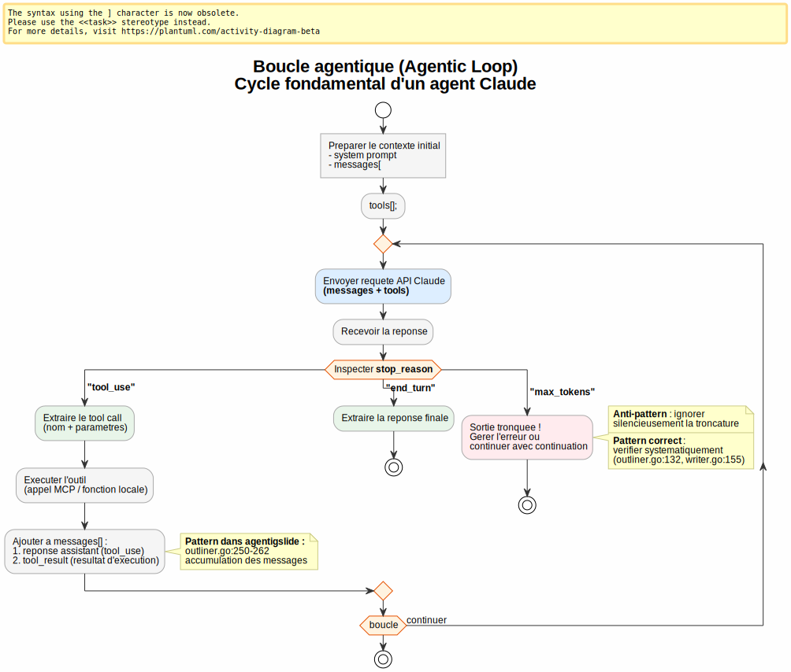
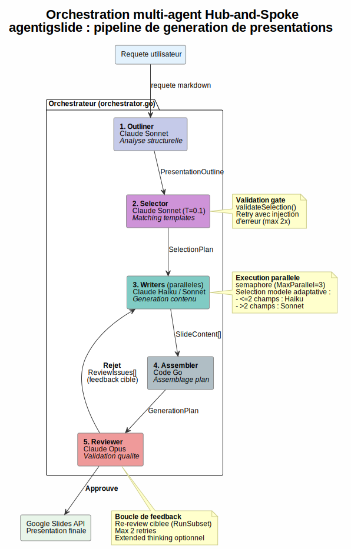
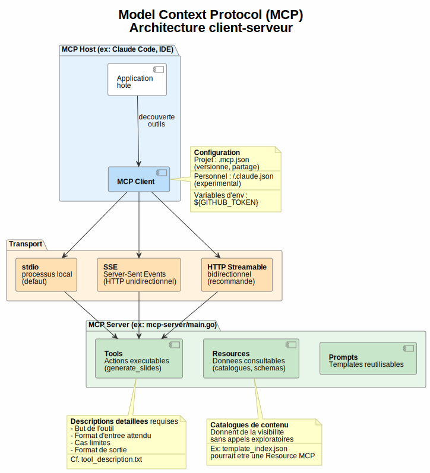
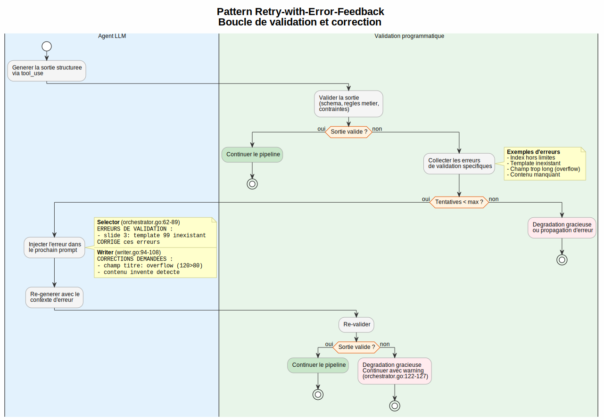
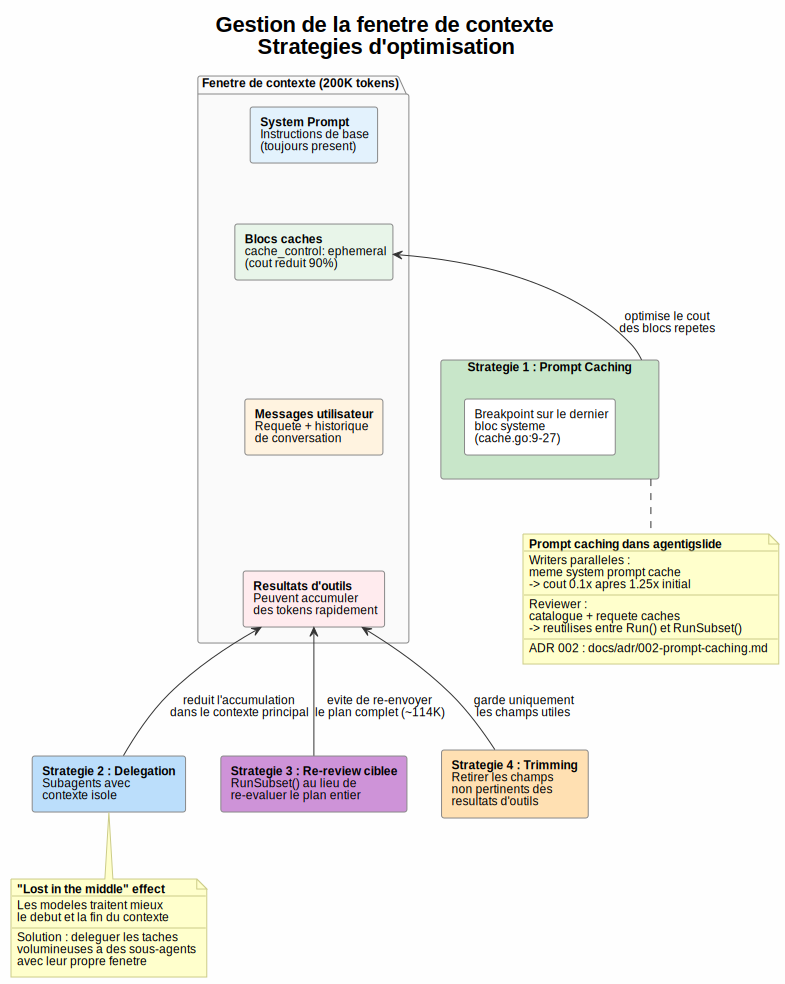

# Guide de préparation : Claude Certified Architect -- Foundations

**Document de référence** : *Claude Certified Architect -- Foundations Certification Exam Guide* (Anthropic, v0.1, 10 février 2025)
**Date** : 8 mai 2026
**Codebase d'illustration** : `github.com/owulveryck/agentigslide` (commit `c75c1b4`)
**Auteur** : Claude Opus 4.6

---

## Comment utiliser ce guide

Ce document transforme la codebase `agentigslide` en support pédagogique pour la certification **Claude Certified Architect -- Foundations**. Pour chaque *task statement* de l'examen, il fournit :

1. **Concept** : explication théorique du concept, indépendante de la codebase
2. **Ce que l'examen attend** : les points de connaissance et compétences cibles
3. **Illustration dans agentigslide** : comment la codebase implémente (ou non) le concept
4. **Points clés pour l'examen** : conseils pratiques, anti-patterns, règles de décision

L'examen est composé de **questions à choix multiples** basées sur des scénarios réalistes. Le score minimum est **720/1000**. Il n'y a pas de pénalité pour les mauvaises réponses.

Les diagrammes PlantUML sont générés en SVG dans le sous-répertoire `diagrams/`.

---

## Synthèse exécutive

| Domaine | Poids | Couverture agentigslide | Résumé |
|---------|-------|------------------------|--------|
| 1. Agentic Architecture & Orchestration | 27% | **Excellent** | Pipeline multi-agent complet avec boucle de feedback, exécution parallèle, retry |
| 2. Tool Design & MCP Integration | 18% | **Bon** | Serveur MCP fonctionnel, descriptions d'outils détaillées, erreurs structurées (validation/transient/business, ADR 008) |
| 3. Claude Code Configuration & Workflows | 20% | **Partiel** | CLAUDE.md présent, mais pas de commands/rules/skills |
| 4. Prompt Engineering & Structured Output | 20% | **Excellent** | tool_use avec schémas dynamiques, tool_choice force, validation/retry/feedback |
| 5. Context Management & Reliability | 15% | **Bon** | Prompt caching, délégation, gestion du contexte par blocs, mais pas de human review |

### Scénarios de l'examen

L'examen présente **4 scénarios** (parmi 6 possibles) qui encadrent les questions :

1. **Customer Support Resolution Agent** -- Agent SDK, MCP tools, escalation (Domaines 1, 2, 5)
2. **Code Generation with Claude Code** -- CLAUDE.md, slash commands, plan mode (Domaines 3, 5)
3. **Multi-Agent Research System** -- Coordinateur/subagents, synthèse, provenance (Domaines 1, 2, 5)
4. **Developer Productivity with Claude** -- Built-in tools, MCP servers (Domaines 2, 3, 1)
5. **Claude Code for Continuous Integration** -- CI/CD, `-p` flag, review (Domaines 3, 4)
6. **Structured Data Extraction** -- JSON schémas, validation, batch (Domaines 4, 5)

---

## Domain 1 : Agentic Architecture & Orchestration (27%)

Ce domaine représente la plus grande part de l'examen. Il couvre la conception et l'implémentation de systèmes agentiques : des applications où Claude agit de manière autonome en utilisant des outils, en itérant sur ses résultats, et en coordonnant plusieurs instances de lui-même.

---

### Task 1.1 -- Concevoir et implémenter des boucles agentiques pour l'exécution autonome

#### Concept

Une **boucle agentique** (agentic loop) est le mécanisme fondamental qui permet à un modèle d'agir de manière autonome. Contrairement à un simple appel API question-réponse, la boucle agentique transforme le modèle en un agent capable d'utiliser des outils, d'observer leurs résultats, et de décider de sa prochaine action.

Le cycle fonctionne ainsi :
1. L'application envoie une requête au modèle avec une liste d'outils disponibles
2. Le modèle répond avec soit un appel d'outil, soit une réponse finale
3. Si c'est un appel d'outil, l'application exécute l'outil et renvoie le résultat au modèle
4. Le modèle intègre ce résultat dans son raisonnement et décide de sa prochaine action
5. Le cycle continue jusqu'à ce que le modèle considère la tâche terminée

Le **signal de contrôle** de la boucle est la réponse du modèle elle-même. C'est le modèle qui décide quand arrêter, pas un compteur arbitraire ni une analyse de texte.

> **🔧 Toolkit Anthropic**
>
> Dans l'API Claude, le champ `stop_reason` indique pourquoi le modèle a arrêté de générer : `"tool_use"` (appel d'outil), `"end_turn"` (réponse finale), ou `"max_tokens"` (troncature). Ce champ est le signal de contrôle concret pour implémenter la boucle.



#### Ce que l'examen attend

- **Savoir que** les résultats d'outils doivent être ajoutés à l'historique de conversation pour que le modèle puisse raisonner sur eux à l'itération suivante
- **Comprendre** la distinction entre la prise de décision par le modèle (model-driven: le modèle choisit quel outil appeler selon le contexte) et les arbres de décision pré-configurés (pre-configured: l'application dicte la séquence d'outils)
- **Savoir éviter** les anti-patterns : parser le langage naturel pour déterminer la terminaison, mettre un cap d'itérations arbitraire comme mécanisme principal d'arrêt, vérifier le contenu textuel de la réponse pour détecter la complétion

> **🔧 Toolkit Anthropic**
>
> - **Savoir que** le `stop_reason` peut valoir `"tool_use"`, `"end_turn"`, ou `"max_tokens"`
> - Les résultats d'outils sont ajoutés au tableau `messages[]` de l'API Claude

#### Illustration dans agentigslide

La codebase implémente des boucles agentiques via des appels Claude API avec `tool_use` et inspection du `stop_reason`. Bien que l'architecture passe par Vertex AI (pas directement l'API Anthropic), les patterns fondamentaux sont identiques.

**Inspection du `stop_reason`** : Chaque agent vérifie explicitement `resp.StopReason == "max_tokens"` pour détecter les troncatures :
- `outliner.go:132` -- Outliner
- `selector.go:111` -- Selector
- `writer.go:155` -- Writer
- `reviewer.go:130` -- Reviewer

**Boucle interactive de l'Outliner** (`outliner.go:203-263`) : Implemente une boucle agentique multi-tour complète :

```go
// outliner.go:203 -- boucle agentique multi-tour
for round := 1; ; round++ {
    resp, err := a.client.RawPredictFull(ctx, a.model, messages, opts...)
    // ... parse tool_use ...
    feedback, err := feedbackFn(&outline)
    if feedback == "" { return &outline, nil } // approbation
    messages = append(messages, assistantMsg, userFeedbackMsg) // accumulation
}
```

L'accumulation des messages (`outliner.go:250-262`) inclut la réponse assistant et le tool_result + feedback utilisateur. C'est exactement le pattern décrit dans le Task Statement 1.1.

**Écart notable** : L'architecture n'utilise pas `stop_reason == "tool_use"` vs `"end_turn"` comme mécanisme de boucle, car chaque agent fait un appel unique avec `tool_choice` force. La boucle est gérée par l'orchestrateur Go, pas par le modèle.

#### Points clés pour l'examen

- **Règle d'or** : utiliser le signal de contrôle du modèle pour piloter la boucle, jamais l'analyse du texte de réponse
- **Anti-pattern fréquent** : mettre `max_iterations = 10` comme seul garde-fou -- c'est un filet de sécurité, pas un mécanisme d'arrêt
- **Chaque résultat d'outil enrichit le contexte** : c'est comme ca que l'agent "apprend" au fil des itérations

> **🔧 Toolkit Anthropic**
>
> - Utiliser `stop_reason` comme signal de contrôle concret
> - **Attention à `max_tokens`** : ce `stop_reason` signifie une troncature, pas une fin voulue. Il faut le traiter comme une erreur ou continuer avec une demande de complétion

---

### Task 1.2 -- Orchestrer des systèmes multi-agent avec le pattern coordinateur-subagent

#### Concept

Le pattern **coordinateur-subagent** (hub-and-spoke) est l'architecture de référence pour les systèmes multi-agent. Un agent coordinateur central décomposé la tâche, délègue les sous-tâches à des agents spécialisés (subagents), puis agrégé leurs résultats.

Les subagents opèrent avec un **contexte isolé** : ils ne héritent pas automatiquement de l'historique de conversation du coordinateur. Chaque subagent reçoit uniquement les informations dont il a besoin via son prompt. Cette isolation a deux avantages :
- Elle réduit la taille du contexte (chaque agent n'a que ce dont il a besoin)
- Elle évite les interférences entre les raisonnements des différents agents

Le coordinateur a quatre responsabilités :
1. **Décomposition** : analyser la requête et la diviser en sous-tâches
2. **Délégation** : choisir quels subagents invoquer et avec quel contexte
3. **Aggregation** : combiner les résultats des subagents
4. **Gestion d'erreurs** : décider quoi faire quand un subagent échoue



#### Ce que l'examen attend

- **Savoir que** dans l'architecture hub-and-spoke, toute la communication inter-agent passe par le coordinateur
- **Savoir que** les subagents opèrent avec un contexte isolé -- ils ne partagent pas l'historique du coordinateur
- **Comprendre** le rôle du coordinateur dans la décomposition, délégation, agrégation, et routage des erreurs
- **Connaître le risque** de décomposition trop étroite : le coordinateur peut décomposer une tâche trop finement et manquer des aspects importants (cf. Question 7 de l'examen)
- **Être capable de** concevoir un coordinateur qui sélectionne dynamiquement les subagents selon la complexité
- **Être capable d'** implémenter des boucles de raffinement itératif où le coordinateur évalue la synthèse et re-délègue si nécessaire

#### Illustration dans agentigslide

L'`Orchestrator` (`orchestrator.go`) implémente un pattern hub-and-spoke classique avec 5 étapes séquentielles :

```
User Request
    |
[Outliner] --> PresentationOutline
    |
[Selector] --> SelectionPlan (avec retry sur erreurs de validation)
    |
[Writers] (parallèles) --> SlideContent[]
    |
[Assembler] --> GenerationPlan
    |
[Reviewer] --> Approuve? --Non--> feedback aux Writers --> reassemble --> re-review
    |                                                                        |
    +------Oui-------> Google Slides API --> Presentation URL <--------------+
```

**Subagents isolés** : Chaque agent a son propre contexte, ses propres prompts, et ne partage pas l'historique de conversation des autres. Le Writer ne connaît pas le raisonnement de l'Outliner.

**Délégation et agrégation** : L'orchestrateur transmet les résultats d'un agent au suivant via la structure `PipelineState` (`types.go:82`), qui utilise un `sync.Mutex` pour la concurrence.

**Boucle de raffinement itérative** : Le Reviewer évalué la sortie, renvoie des issues aux Writers concernés via `handleReviewIssuesReturn()` (`orchestrator.go:207-222`), et re-évalué avec `RunSubset` (`reviewer.go:169-277`).

**Risque de décomposition trop étroite** : Si la requête utilisateur est vague, l'Outliner pourrait manquer des aspects. Le mode `--chat` permet de raffiner le plan avant exécution, mitigeant ce risque (ADR 005).

#### Points clés pour l'examen

- **Le coordinateur est le seul point de communication** : les subagents ne se parlent jamais directement
- **L'isolation du contexte est un avantage** (pas un handicap) : chaque agent a une fenêtre de contexte propre, sans bruit
- **Question 7 type** : si le résultat final est incomplet, chercher d'abord si la décomposition du coordinateur est trop étroite avant de blâmer les subagents
- **Boucle de raffinement** : le coordinateur doit pouvoir re-déléguer quand la synthèse est insuffisante

---

### Task 1.3 -- Configurer l'invocation de subagents, le passage de contexte, et le spawning

#### Concept

L'invocation de subagents nécessite un mécanisme de spawning, une configuration par subagent (description, outils autorisés, restrictions), et un passage de contexte explicite.

Un point critique : **les subagents ne héritent pas automatiquement du contexte parent**. Tout ce qu'un subagent doit savoir doit être explicitement inclus dans son prompt. Si le coordinateur veut qu'un subagent utilise les résultats d'un agent précédent, il doit les passer dans le prompt du subagent.

Le **fork de session** permet de créer des branches d'exploration indépendantes à partir d'une analyse commune. Utile pour comparer deux approches sans polluer le contexte de l'autre.

> **🔧 Toolkit Anthropic**
>
> Dans le **Claude Agent SDK**, les subagents sont invoqués via l'outil `Task`. Le coordinateur doit inclure `"Task"` dans son `allowedTools` pour pouvoir spawner des subagents. Chaque subagent est configuré via un `AgentDefinition` qui spécifie sa description, son system prompt, et ses outils autorisés (`allowedTools`). Le mécanisme `fork_session` permet de forker une session existante pour explorer des approches divergentes.

#### Ce que l'examen attend

- **Savoir que** le contexte du subagent doit être explicitement fourni dans son prompt
- **Être capable de** passer le contexte complet d'agents précédents directement dans le prompt du subagent
- **Être capable de** utiliser des formats structurés pour séparer contenu et métadonnées lors du passage de contexte
- **Être capable de** spawner des subagents en parallèle

> **🔧 Toolkit Anthropic**
>
> - **Savoir que** l'outil `Task` est le mécanisme de spawning de subagents dans l'Agent SDK
> - **Savoir que** `allowedTools` doit inclure `"Task"` pour qu'un coordinateur puisse invoquer des subagents
> - **Connaître** la configuration `AgentDefinition` (descriptions, system prompts, tool restrictions)
> - **Connaître** `fork_session` pour créer des branches d'exploration divergentes
> - Spawner des subagents en parallèle en émettant plusieurs appels `Task` dans une seule réponse du coordinateur

#### Illustration dans agentigslide

La codebase utilise un orchestrateur Go natif plutôt que le Claude Agent SDK, mais implémente les mêmes patterns :

**Contexte explicite** : Chaque agent reçoit son contexte directement dans son prompt, pas par héritage. Le Writer reçoit les champs du template, le slide need, et le feedback via ses paramètres (`writer.go:63-125`).

**Formats structurés** : Les données intermédiaires utilisent des structures Go typées (`PresentationOutline`, `SelectionPlan`, `SlideContent`, `ReviewResult`) sérialisées en JSON.

**Exécution parallèle** : Les Writers sont lancés en parallèle via goroutines avec semaphore (`orchestrator.go:241-298`), ce qui correspond au pattern de spawning parallèle de subagents :

```go
// orchestrator.go:241 -- equivalent de multiple Task tool calls
sem := make(chan struct{}, o.config.MaxParallel)
var wg sync.WaitGroup
for idx, need := range needs {
    wg.Add(1)
    go func(idx int, need SlideNeed) {
        sem <- struct{}{}
        defer func() { <-sem }()
        // ... writer work ...
    }(idx, need)
}
wg.Wait()
```

**Écart** : L'architecture n'utilise pas `AgentDefinition` ni l'outil `Task` de l'Agent SDK -- c'est une implémentation équivalente en Go natif, plus performante pour ce cas d'usage spécifique.

#### Points clés pour l'examen

- **Passage de contexte** : toujours explicite, jamais implicite. "Ce que le subagent ne reçoit pas, il ne le sait pas"
- **Parallélisme** : spawner plusieurs subagents dans une seule réponse du coordinateur (pas un par tour)
- **Instructions au coordinateur** : spécifier des objectifs et des critères de qualité, pas des procédures étape par étape -- laisser le subagent adapter son approche
- **Fork de session** : utile pour comparer des approches alternatives sans interférence

> **🔧 Toolkit Anthropic**
>
> - Émettre plusieurs appels `Task` dans une seule réponse pour le parallélisme
> - `fork_session` est le mécanisme concret de fork dans l'Agent SDK

---

### Task 1.4 -- Implémenter des workflows multi-étapes avec enforcement et handoff

#### Concept

Un **workflow multi-étapes** est une séquence d'opérations où chaque étape dépend du succès de la précédente. L'**enforcement** est le mécanisme qui garantit programmatiquement que les pré-requis sont remplis avant d'autoriser l'étape suivante.

Il y a deux approches pour garantir l'ordre des opérations :
- **Enforcement programmatique** (hooks, prerequisite gates) : le code bloque les appels d'outils tant que les pré-requis ne sont pas valides. Cela fournit des **garanties déterministes**.
- **Guidance par prompt** : les instructions demandent au modèle de suivre un certain ordre. Cela fournit une **compliance probabiliste** -- le modèle suivra l'ordre la plupart du temps, mais pas toujours.

La règle : quand la non-conformité a des **conséquences financières, légales ou de sécurité**, utiliser l'enforcement programmatique. Le prompt seul ne suffit pas.

Le **handoff** est le protocole de transfert quand un agent ne peut pas résoudre un problème. Un bon handoff inclut un résumé structuré : identifiant client, cause racine, actions tentées, action recommandée.

#### Ce que l'examen attend

- **Comprendre** la différence entre enforcement programmatique (déterministe) et guidance par prompt (probabiliste)
- **Savoir quand** utiliser l'enforcement programmatique : quand la conformité est critique (opérations financières, vérification d'identité)
- **Connaître** les protocoles de handoff structurés : résumé avec contexte pour les agents humains qui n'ont pas l'historique
- **Être capable d'** implémenter des pré-requis programmatiques qui bloquent les outils downstream (ex: bloquer `process_refund` tant que `get_customer` n'a pas retourné un ID vérifié)
- **Être capable de** décomposer des requêtes multi-concerns en sous-tâches indépendantes
- **Être capable de** compiler des résumés de handoff structurés (customer ID, root cause, refund amount, action recommandée)

#### Illustration dans agentigslide

**Enforcement programmatique** : La validation du Selector bloque le pipeline si les templates sélectionnés n'existent pas dans le catalogue (`validate.go:159-257`). C'est l'équivalent du pattern "prerequisite gate" : le pipeline ne peut pas avancer tant que la sélection n'est pas valide.

**Handoff structure** : L'orchestrateur assemble les résultats (`orchestrator.go:181-195`) en un `GenerationPlan` structuré contenant toutes les informations nécessaires pour l'exécution.

**Dégradation gracieuse** : Si le Reviewer ne valide pas après N retries, l'orchestrateur continue avec un warning (`orchestrator.go:122-127`). Ce choix est documenté dans l'ADR 001 -- c'est une décision architecturale délibérée qui favorise la complétion sur la perfection.

**Enforcement post-génération** : `enforceMaxChars()` (`orchestrator.go:301-340`) tronque les champs qui dépassent la limite du template. C'est une forme de hook post-tool-use qui garantit programmatiquement le respect des contraintes.

#### Points clés pour l'examen

- **Question 1 type** : si un agent saute une étape critique (12% du temps), la réponse est l'enforcement programmatique (pas le prompt, pas les few-shot examples)
- **Règle de décision** : "Est-ce que l'échec a des conséquences irréversibles ?" Si oui -> enforcement programmatique. Si non -> guidance par prompt acceptable
- **Handoff** : toujours inclure le contexte complet pour le destinataire (humain ou agent) qui n'a pas l'historique de conversation
- **La dégradation gracieuse est un choix valide** quand elle est documentée et justifiée

---

### Task 1.5 -- Appliquer les hooks Agent SDK pour l'interception et la normalisation

#### Concept

Les **hooks** sont des fonctions middleware qui interceptent les appels d'outils à deux moments :
- **Avant l'exécution** (pre-hook) : pour valider, modifier ou bloquer un appel d'outil
- **Après l'exécution** (post-hook) : pour transformer le résultat avant que le modèle ne le traite

Les hooks servent trois objectifs principaux :

1. **Normalisation des données** : convertir des formats hétérogènes (timestamps Unix, ISO 8601, codes numériques) en un format uniforme avant que l'agent ne les traite. Sans normalisation, le modèle doit gérer la variabilité, ce qui est source d'erreurs.

2. **Enforcement de règles métier** : bloquer les opérations qui violent les politiques (ex: refund > 500$ -> blocage + escalation). Contrairement aux instructions dans le prompt, les hooks fournissent des garanties déterministes : impossible de contourner.

3. **Redirection de workflow** : quand un hook détecte une violation, il peut rediriger vers un workflow alternatif (escalation humaine, validation manager).

La distinction clé : les **hooks** sont pour les règles déterministes (garantie à 100%), les **prompts** sont pour les comportements souhaités (probabiliste, ~95%).

> **🔧 Toolkit Anthropic**
>
> Dans l'Agent SDK, le hook **`PostToolUse`** intercepte les résultats d'outils après exécution pour transformation ou normalisation. Il se place entre l'exécution de l'outil et le traitement du résultat par l'agent.

#### Ce que l'examen attend

- **Connaître** les hooks qui interceptent les appels sortants pour enforcement de règles métier
- **Comprendre** la distinction entre hooks (garantie déterministe) et prompts (compliance probabiliste)
- **Être capable d'** implémenter des hooks post-exécution pour normaliser des données hétérogènes
- **Être capable d'** implémenter des hooks d'interception qui bloquent les actions policy-violating et redirigent vers des workflows alternatifs
- **Être capable de** choisir les hooks plutôt que l'enforcement par prompt quand les règles métier exigent une conformité garantie

> **🔧 Toolkit Anthropic**
>
> - **Connaître** le pattern `PostToolUse` de l'Agent SDK pour intercepter les résultats d'outils
> - Implémenter des `PostToolUse` hooks pour la normalisation et la transformation

#### Illustration dans agentigslide

La codebase n'utilise pas les hooks Agent SDK (elle passe par un orchestrateur Go natif), mais implémente des patterns équivalents :

**Enforcement post-génération** : `enforceMaxChars()` (`orchestrator.go:301-340`) est fonctionnellement équivalent à un `PostToolUse` hook : il intercepte la sortie des Writers et tronque les champs qui dépassent la limite du template.

**Validation programmatique** : `validateOutline()` et `validateSelection()` interceptent et valident les sorties avant de passer à l'étape suivante. C'est le pattern "prerequisite gate" implémente en Go plutôt que via les hooks déclaratifs de l'Agent SDK.

**Écarts** : La normalisation des données est faite via validation Go plutôt que via des hooks déclaratifs. Il n'y a pas d'implémentation de `PostToolUse` au sens Agent SDK.

#### Points clés pour l'examen

- **Hooks vs Prompts** : si la question mentionne "guaranteed compliance" ou "business rules with financial conséquences", la réponse implique des hooks, pas des prompts
- **Post-hook** : penser "middleware" -- il se place entre l'exécution de l'outil et le traitement du résultat par l'agent
- **Cas d'usage typique** : normaliser les timestamps, les codes de statut, les formats de montants avant que l'agent ne les traite
- **L'enforcement par hook est non-contournable** : contrairement au prompt, l'agent ne peut pas "décider" d'ignorer le hook

> **🔧 Toolkit Anthropic**
>
> - Le hook `PostToolUse` de l'Agent SDK est l'implémentation concrète du post-hook

---

### Task 1.6 -- Concevoir des stratégies de décomposition de tâches

#### Concept

La **décomposition de tâches** est la manière dont un système agentique divise un problème complexe en sous-tâches gérables. Il existe deux stratégies fondamentales :

1. **Pipeline fixe séquentiel** (prompt chaining) : les étapes sont prédéfinies et exécutées dans un ordre fixe. Idéal pour les workflows prédictibles où chaque étape est bien comprise.

2. **Décomposition dynamique adaptative** : les sous-tâches sont générées au fur et à mesure, en fonction de ce qui est découvert à chaque étape. Idéal pour les tâches exploratoires où la portée n'est pas connue à l'avancé.

Le **prompt chaining** décomposé une tâche en étapes séquentielles, où la sortie de chaque étape devient l'entrée de la suivante. Exemples :
- Code review : analyser chaque fichier individuellement, puis faire une passe cross-fichiers d'intégration
- Data extraction : extraire les données, valider le schéma, corriger les erreurs, enrichir les métadonnées

Le choix entre les deux dépend de la **prédictibilité** du workflow : si vous connaissez les étapes à l'avancé, le pipeline fixe est plus fiable et plus efficace. Si la tâche est exploratoire, la décomposition dynamique permet de s'adapter.

#### Ce que l'examen attend

- **Savoir quand** utiliser un pipeline fixe (tâches prédictibles) vs une décomposition dynamique (tâches exploratoires)
- **Connaître** le prompt chaining et ses avantages (reviews par fichier + passe d'intégration)
- **Comprendre** l'intérêt des plans d'investigation adaptatifs qui génèrent des sous-tâches en fonction des découvertes
- **Être capable de** choisir le pattern de décomposition adapte : prompt chaining pour les reviews multi-aspects prédictibles, décomposition dynamique pour les investigations ouvertes
- **Être capable de** décomposer des reviews de code en passes par fichier + passe d'intégration pour éviter la dilution d'attention
- **Être capable de** décomposer des tâches ouvertes en faisant d'abord un mapping, puis un plan priorisé qui s'adapte

#### Illustration dans agentigslide

Le pipeline illustre une **décomposition fixe séquentielle** (prompt chaining) en 5 étapes :

1. **Outliner** : analyse structurelle de la requête
2. **Selector** : mapping des besoins aux templates
3. **Writers** : génération de contenu (parallélisé)
4. **Assembler** : assemblage du plan
5. **Reviewer** : validation qualité

C'est exactement le pattern "fixed sequential pipeline" recommandé pour les workflows prédictibles. Chaque étape à un rôle bien défini, des entrées/sorties claires, et des critères de validation.

L'ADR 001 (`docs/adr/001-agentic-architecture.md`) documenté le raisonnement derrière cette architecture et la transition depuis un pipeline monolithique (un seul appel Claude).

**Selection adaptative de modèle** (`orchestrator.go:250-253`) : le choix du modèle Writer s'adapte à la complexité de la tâche (Haiku pour <=2 champs, Sonnet pour >2). C'est une forme de décomposition adaptative au sein d'un pipeline fixe.

#### Points clés pour l'examen

- **Prompt chaining = pipeline fixe** : étapes prédéfinies, idéal pour les workflows connus
- **Décomposition dynamique = exploration** : les sous-tâches émergent au fur et à mesure
- **Question 12 type** : pour un code review de 14 fichiers, la réponse est "split into per-file passes + cross-file intégration pass" (pas un modèle plus gros, pas des PRs plus petits)
- **La dilution d'attention est reelle** : plus il y a de fichiers dans un seul contexte, moins la review est profonde

---

### Task 1.7 -- Gérer l'état de session, la reprise et le fork

#### Concept

La **gestion de session** permet de maintenir la continuité du travail d'un agent à travers le temps. Trois mécanismes clés :

1. **Reprise de session** : reprendre une session précédente avec tout son contexte. Utile pour les investigations longues qui s'étalent sur plusieurs sessions de travail.

2. **Fork de session** : créer une branche indépendante à partir d'une analyse existante pour explorer des approches divergentes. Par exemple, après avoir analysé une codebase, forker pour comparer deux stratégies de refactoring sans que l'une pollue l'autre.

3. **Session fraîche avec résumé injecté** : au lieu de reprendre une session avec des résultats d'outils potentiellement stales, démarrer une nouvelle session en injectant un résumé structuré des découvertes précédentes. Plus fiable quand des fichiers ont été modifiés entre-temps.

La règle : **reprendre quand le contexte est encore valide**, repartir à neuf quand les résultats d'outils sont stales (fichiers modifiés, état changé).

> **🔧 Toolkit Anthropic**
>
> - **`--resume <session-name>`** : reprend une session nommée dans Claude Code
> - **`fork_session`** : mécanisme de fork de session dans l'Agent SDK

#### Ce que l'examen attend

- **Comprendre** pourquoi une session fraîche avec un résumé injecté est parfois plus fiable qu'une reprise de session (résultats d'outils stales)
- **Savoir qu'** il faut informer l'agent des changements de fichiers quand on reprend une session après des modifications
- **Être capable de** choisir entre reprise (contexte valide) et session fraîche (contexte stale)
- **Être capable de** forker une session pour comparer des approches de test ou de refactoring
- **Être capable d'** informer un agent repris des changements spécifiques de fichiers pour une ré-analyse ciblée

> **🔧 Toolkit Anthropic**
>
> - **Connaître** `--resume` pour reprendre des sessions nommées dans Claude Code
> - **Connaître** `fork_session` pour créer des branches d'exploration indépendantes dans l'Agent SDK

#### Illustration dans agentigslide

La codebase illustre partiellement ces concepts :

**Pre-built outline** : L'orchestrateur supporte un outline pre-construit via `Orchestrator.Outline` (`orchestrator.go:22-24`), permettant de reprendre le pipeline après le mode interactif.

**Sauvegarde du plan** : Le plan JSON est sauvegardable (`slidegen/main.go` avec `--plan`), permettant de reprendre une exécution échouée -- c'est fonctionnellement similaire à un `--résumé`.

**Écarts** : Pas de `--résumé`, `fork_session`, ou sessions nommées au sens Claude Code. Pas de persistence structurée de l'état pour crash recovery au sens Agent SDK.

#### Points clés pour l'examen

- **Reprise vs session fraîche** : si les fichiers ont changé, préférer une session fraîche avec un résumé injecté
- **Fork de session** : idéal pour "essayons les deux approches" -- séparation complète des contextes
- **Les résultats d'outils stales sont dangereux** : ils représentent un état qui n'existe peut-être plus
- **Informer l'agent des changements** : plutôt que de re-explorer tout, dire "les fichiers X et Y ont changé" pour une analyse ciblée

> **🔧 Toolkit Anthropic**
>
> - `--resume` dans Claude Code, `fork_session` dans l'Agent SDK

---

## Domain 2 : Tool Design & MCP Integration (18%)

Ce domaine couvre la conception d'interfaces d'outils efficaces et l'intégration du **Model Context Protocol (MCP)**. Les outils sont le moyen par lequel un agent interagit avec le monde extérieur. Leur qualité détermine directement la fiabilité du système.

---

### Task 2.1 -- Concevoir des interfaces d'outils efficaces avec des descriptions claires

#### Concept

Les **descriptions d'outils** sont le mécanisme principal par lequel un LLM décide quel outil utiliser. Claude lit les descriptions et choisit l'outil dont la description correspond le mieux à la tâche en cours. Si les descriptions sont vagues, ambiguës, ou se chevauchent, le modèle fera des choix incorrects.

Une bonne description d'outil doit inclure :
- **Le but** : une première ligne claire sur ce que fait l'outil
- **Le format d'entrée** : quels paramètres, dans quel format
- **Les cas limites** : quand utiliser cet outil vs un outil similaire
- **Les exemples** : un ou deux exemples d'utilisation
- **Le format de sortie** : ce que l'outil retourné

Le **misrouting** se produit quand deux outils ont des descriptions similaires. Par exemple, `analyze_content` ("Analyzes content") et `analyze_document` ("Analyzes documents") sont presque indistinguables pour le modèle. La solution : renommer pour différencier (`extract_web_results` vs `extract_document_data`) et enrichir les descriptions avec les cas d'usage spécifiques.

Attention aussi aux **instructions keyword-sensitive** dans le system prompt : si le prompt dit "always analyze before responding", le modèle peut systématiquement appeler un outil `analyze_*` même quand ce n'est pas nécessaire.

#### Ce que l'examen attend

- **Savoir que** les descriptions d'outils sont le mécanisme principal de sélection
- **Comprendre** comment les descriptions ambiguës causent le misrouting
- **Comprendre** l'impact des instructions keyword-sensitive dans le system prompt
- **Être capable de** rédiger des descriptions qui différencient clairement chaque outil
- **Être capable de** renommer les outils et mettre à jour les descriptions pour éliminer les chevauchements
- **Être capable de** décomposer les outils génériques en outils spécifiques avec des contrats d'entrée/sortie définis

#### Illustration dans agentigslide

La description de l'outil MCP `generate_slides` (`mcp-server/tool_description.txt`) est un exemple modèle :
- **Premiere ligne claire** : but de l'outil
- **Format d'entrée détaillé** : format markdown attendu
- **Exemple complet** : un exemple de présentation
- **Contraintes** : temps de traitement, adaptation automatique
- **Format de sortie** : URL Google Slides

Les outils internes des agents sont egalement bien décrits et ne se chevauchent pas :
- `produce_outline` (`outliner.go:26-97`) : schéma JSON avec enums, descriptions de champs
- `select_templates` (`selector.go:25-57`) : descriptions claires de chaque propriété
- `produce_slide_content` (`writer.go:27-57`) : schéma dynamique avec contraintes maxLength
- `submit_review` (`reviewer.go:25-69`) : enum d'`issueType` avec 6 catégories distinctes

Chaque outil a un nom distinct et une description non ambiguë -- pas de risque de misrouting.

#### Points clés pour l'examen

- **Question 2 type** : si l'agent appelle le mauvais outil, la première action est d'ameliorer les descriptions (pas d'ajouter des few-shot, pas de routing layer)
- **Renommer > Decrire** : un mauvais nom avec une bonne description est moins efficace qu'un bon nom avec une description moyenne
- **Decomposer les outils génériques** : `analyze_document` -> `extract_data_points`, `summarize_content`, `verify_claim_against_source`
- **Verifier le system prompt** : les mots-clés du prompt peuvent biaiser la sélection d'outils

---

### Task 2.2 -- Implémenter des réponses d'erreur structurées pour les outils MCP

#### Concept

Quand un outil échoue, la qualité de l'information retournée à l'agent détermine sa capacité à réagir intelligemment. Un message générique ("Operation failed") ne donne aucune indication : faut-il réessayer ? modifier les paramètres ? escalader ?

Les erreurs structurées doivent inclure :

- **Catégorie d'erreur** : la nature de l'erreur
  - `transient` : problème temporaire (timeout, service indisponible) -> retry
  - `validation` : entrée invalide -> corriger et réessayer
  - `permission` : accès refusé -> escalader
  - `business` : violation de règle métier -> informer l'utilisateur
- **Indicateur de retry** : boolean indiquant si un retry a des chances de réussir
- **Description** : message lisible pour l'humain

La distinction entre **erreur d'accès** (le service a échoué -> retry) et **résultat vide valide** (la requête a réussi mais n'a rien trouvé -> pas de retry) est critique : sans cette distinction, l'agent gaspille des retries sur des résultats valides ou abandonne des requêtes qui auraient réussi au retry.

> **🔧 Toolkit Anthropic**
>
> Le protocole MCP fournit le flag **`isError`** pour signaler les échecs. Les bonnes pratiques recommandent d'enrichir avec **`errorCategory`** (transient, validation, permission, business) et **`isRetryable`** (boolean) pour permettre des décisions de recovery intelligentes.

#### Ce que l'examen attend

- **Comprendre** la distinction entre erreurs transitoires, de validation, de permission
- **Comprendre** pourquoi les réponses d'erreur uniformes ("Operation failed") empêchent des décisions de recovery intelligentes
- **Comprendre** la différence entre erreurs d'accès et résultats vides valides
- **Être capable de** retourner des erreurs structurées avec catégorie, indicateur de retry, et description
- **Être capable de** implémenter une recovery locale dans les subagents pour les erreurs transitoires
- **Être capable de** distinguer les échecs d'accès (retry) des résultats vides valides (pas de retry)

> **🔧 Toolkit Anthropic**
>
> - **Connaître** le flag `isError` du protocole MCP
> - Retourner des erreurs avec `errorCategory`, `isRetryable`, et description dans les réponses MCP

#### Illustration dans agentigslide

Le serveur MCP utilise `structuredError()` pour retourner des erreurs categorisees (`exp/mcp-server/main.go`) :

```go
type errorCategory string

const (
    errValidation errorCategory = "validation"
    errTransient  errorCategory = "transient"
    errBusiness   errorCategory = "business"
)

func structuredError(cat errorCategory, retryable bool, msg string) *mcp.CallToolResult {
    text := fmt.Sprintf("[%s] %s\nRetryable: %v", cat, msg, retryable)
    r := &mcp.CallToolResult{}
    r.SetError(fmt.Errorf("%s", text))
    return r
}
```

Les 4 sites d'erreur sont categorises : contenu vide (`validation`), pipeline echoue (`transient` si timeout/rate limit, `business` sinon), plan sans slides (`business`), creation echouee (`transient`). La fonction `isTransientPipelineError()` inspecte le message d'erreur pour detecter les indicateurs de problemes temporaires (429, 529, timeout, context deadline).

Le format textuel est un compromis impose par le SDK MCP Go v1.6.0 qui ne supporte que `SetError(err)` sans champ structure additionnel. Voir [ADR 008](../../docs/adr/008-structured-mcp-errors.md).

#### Points clés pour l'examen

- **Question 8 type** : pour la propagation d'erreurs, la réponse est "retourner le contexte structuré complet" (type d'échec, requête tentée, résultats partiels, alternatives)
- **Jamais de message générique** : "search unavailable" cache de l'information précieuse au coordinateur
- **Résultat vide != erreur** : une recherche qui ne trouve rien est un succès, pas un échec

> **🔧 Toolkit Anthropic**
>
> - `isRetryable: false` + explication : pour les violations de règles métier, dire au modèle pourquoi c'est bloqué et quoi communiquer au client

---

### Task 2.3 -- Distribuer les outils entre agents et configurer tool_choice

#### Concept

Le nombre et le type d'outils accessibles à un agent impactent directement sa fiabilité. Donner 18 outils à un agent quand il n'en a besoin que de 4-5 dégrade la qualité de sélection : plus il y a de choix, plus le risque de mauvais choix augmente.

Le principe de **scoped tool access** (accès restreint aux outils pertinents) recommande :
- Chaque agent ne reçoit que les outils nécessaires à son rôle
- Les outils cross-rôle sont limités aux besoins haute-fréquence
- Les cas complexes sont routés vers le coordinateur

Le contrôle de l'utilisation des outils peut varier : le modèle peut avoir le choix de répondre en texte ou d'appeler un outil, être forcé d'appeler un outil (au choix), ou être forcé d'appeler un outil spécifique.

> **🔧 Toolkit Anthropic**
>
> Le paramètre **`tool_choice`** de l'API Claude contrôle ce comportement :
> - `"auto"` : le modèle peut répondre en texte ou appeler un outil (défaut)
> - `"any"` : le modèle doit appeler un outil (mais peut choisir lequel)
> - `{"type": "tool", "name": "..."}` : le modèle doit appeler cet outil spécifique (forced)


#### Ce que l'examen attend

- **Savoir que** trop d'outils (ex: 18 au lieu de 4-5) dégrade la fiabilité de sélection
- **Savoir que** les agents tendent à mal utiliser les outils hors de leur spécialisation
- **Connaître** le principe de scoped tool access
- **Être capable de** restreindre les outils de chaque subagent à ceux de son rôle
- **Être capable de** remplacer des outils génériques par des outils contraints

> **🔧 Toolkit Anthropic**
>
> - **Connaître** les trois modes de `tool_choice` : `auto`, `any`, forced
> - Utiliser `tool_choice` forced pour garantir l'appel d'un outil spécifique
> - Configurer `tool_choice: "any"` pour garantir un appel d'outil tout en laissant le choix du schéma

#### Illustration dans agentigslide

Chaque agent reçoit **exactement un outil** adapte à son rôle -- c'est la séparation la plus stricte possible :

| Agent | Outil | tool_choice |
|-------|-------|-------------|
| Outliner | `produce_outline` | `{"type": "tool", "name": "produce_outline"}` |
| Selector | `select_templates` | `{"type": "tool", "name": "select_templates"}` |
| Writer | `produce_slide_content` | `{"type": "tool", "name": "produce_slide_content"}` |
| Reviewer | `submit_review` | Force ou `auto` (si extended thinking) |

**Exception pour le Reviewer** : quand `thinkingBudget > 0`, `tool_choice` passe a `"auto"` car extended thinking est incompatible avec le forced tool choice (`reviewer.go:110-116`). C'est un compromis documenté.

**Selection de modèle adaptative** (`orchestrator.go:250-253`) :
```go
writerModel := o.config.WriterModel
if len(templateFields) <= 2 {
    writerModel = o.config.WriterSimpleModel // Haiku pour les slides simples
}
```

#### Points clés pour l'examen

- **Question 9 type** : pour un subagent qui a besoin de faire des vérifications simples (85% des cas), la réponse est un scoped `verify_fact` tool (pas tout le toolset du web search agent)
- **Règle des 4-5 outils max** par agent pour une fiabilité optimale

> **🔧 Toolkit Anthropic**
>
> - **`tool_choice: "any"`** : garantit un outil mais laisse le choix -- utile quand le type de document est inconnu
> - **Extended thinking + forced `tool_choice` = incompatible** : contrainte technique à connaître

---

### Task 2.4 -- Intégrer des serveurs MCP dans Claude Code et les workflows agents

#### Concept

Un **protocole standardisé d'intégration** permet aux agents de se connecter à des services externes via une architecture client-serveur, exposant des outils, des ressources, et des prompts de manière uniforme.

> **🔧 Toolkit Anthropic**
>
> Le **Model Context Protocol (MCP)** implémente cette architecture :
>
> - **MCP Host** : l'application hôte (Claude Code, IDE, application custom)
> - **MCP Client** : le composant qui communique avec les serveurs MCP
> - **MCP Server** : le service qui expose des outils, des ressources, et des prompts
>
> Les serveurs MCP sont configurés à deux niveaux :
> - **Projet** : fichier `.mcp.json` à la racine du repo (versionné, partagé avec l'équipe)
> - **Personnel** : `~/.claude.json` (expérimental, non partagé)
>
> Le `.mcp.json` supporte l'**expansion de variables d'environnement** (`${GITHUB_TOKEN}`) pour gérer les credentials sans les committer dans le code.
>
> Les **MCP resources** sont un mécanisme pour exposer des catalogues de contenu (résumés d'issues, schémas de base de données, hiérarchies de documentation). Contrairement aux outils (qui exécutent des actions), les resources donnent de la visibilité aux agents sans appels exploratoires.



#### Ce que l'examen attend

- **Savoir que** les outils de tous les serveurs d'intégration sont découverts au moment de la connexion et disponibles simultanément
- **Être capable de** enrichir les descriptions d'outils pour que l'agent les préfère aux outils built-in
- **Être capable de** choisir des serveurs communautaires existants plutôt que des implémentations custom pour les intégrations standard

> **🔧 Toolkit Anthropic**
>
> - **Connaître** le scoping des serveurs MCP : `.mcp.json` (projet) vs `~/.claude.json` (personnel)
> - **Connaître** l'expansion de variables d'environnement dans `.mcp.json`
> - **Connaître** les MCP resources comme mécanisme d'exposition de catalogues
> - Configurer un serveur MCP partagé dans `.mcp.json` avec expansion de variables
> - Configurer un serveur MCP personnel dans `~/.claude.json`

#### Illustration dans agentigslide

`mcp-server/main.go` implémente un serveur MCP complet avec trois modes de transport :
- **stdio** (ligne 149) : processus local, mode par défaut
- **SSE** (ligne 155) : Server-Sent Events avec CORS
- **HTTP streamable** (ligne 165) : bidirectionnel avec protection cross-origin

La description de l'outil est chargee depuis un fichier embarque (`tool_description.txt`), ce qui la rend modifiable sans recompiler.

**Écarts** :
- Pas de fichier `.mcp.json` pour configurer le serveur slidegen comme outil partagé
- Pas de MCP resources : le catalogue `template_index.json` pourrait être exposé comme resource pour donner de la visibilité aux agents sans appels exploratoires
- **Recommandation** : ajouter un `.mcp.json` référençant le serveur avec expansion de variables pour les credentials

#### Points clés pour l'examen

- **Préférer les serveurs communautaires** pour les intégrations standard (Jira, GitHub), réserver les serveurs custom aux workflows spécifiques

> **🔧 Toolkit Anthropic**
>
> - **`.mcp.json` = équipe** (versionné), **`~/.claude.json` = personnel** (non versionné)
> - **Resources vs Tools** : Resources = lecture passive (catalogues, schémas), Tools = actions (génération, création)
> - **Expansion de variables** : `${GITHUB_TOKEN}` dans `.mcp.json` pour ne jamais committer de secrets

---

### Task 2.5 -- Sélectionner et appliquer les outils built-in (Read, Write, Edit, Bash, Grep, Glob)

#### Concept

Un agent de développement dispose d'outils d'interaction avec le système de fichiers et le shell. La stratégie d'utilisation suit des patterns récurrents : rechercher avant de lire, modifier par diff plutôt que par réécriture complète, et construire la compréhension incrémentalement.

> **🔧 Toolkit Anthropic**
>
> Claude Code dispose de **6 outils built-in** :
>
> | Outil | Usage optimal |
> |-------|--------------|
> | **Grep** | Rechercher du contenu dans les fichiers (noms de fonctions, messages d'erreur, imports) |
> | **Glob** | Trouver des fichiers par pattern de nom ou extension (`**/*.test.tsx`) |
> | **Read** | Lire le contenu complet d'un fichier |
> | **Write** | Écrire un fichier entier (création ou remplacement complet) |
> | **Edit** | Modifier un fichier existant par correspondance de texte unique |
> | **Bash** | Exécuter des commandes shell |
>
> **Stratégies clés** :
> - **Grep avant Read** : d'abord trouver les points d'entrée, puis suivre les imports et les flux
> - **Edit avant Write** : pour des modifications, Edit n'envoie que le diff (plus efficace). Write est un fallback quand Edit échoue (texte non unique)
> - **Construction incrémentale** : commencer par Grep pour trouver les fonctions, puis Read pour comprendre les flux, puis Edit pour modifier

#### Ce que l'examen attend

- **Être capable de** construire la compréhension d'un codebase incrémentalement (recherche -> lecture -> traçage de flux)
- **Être capable de** tracer l'usage de fonctions à travers des modules wrapper

> **🔧 Toolkit Anthropic**
>
> - **Connaître** les cas d'usage de chaque outil built-in de Claude Code
> - Savoir quand utiliser Edit vs Read+Write (Edit pour les modifications ciblées, Read+Write quand le texte n'est pas unique)
> - Choisir Grep pour la recherche de contenu vs Glob pour les patterns de noms

#### Illustration dans agentigslide

Ce task statement concerne l'usage de Claude Code en tant qu'outil de développement. La codebase elle-même n'est pas un outil Claude Code, mais le `CLAUDE.md` documenté les commandes de développement pour aider Claude Code a travailler efficacement sur ce projet.

#### Points clés pour l'examen

- **Incrémental > exhaustif** : ne pas lire tous les fichiers d'un coup, mais tracer les flux de données

> **🔧 Toolkit Anthropic**
>
> - **Grep = contenu**, **Glob = noms de fichiers** : ne pas confondre
> - **Edit > Bash(sed)** : toujours préférer Edit à sed/awk pour les modifications de fichiers
> - **Read+Write comme fallback** : quand Edit échoue à cause d'un texte non unique

---

## Domain 3 : Claude Code Configuration & Workflows (20%)

Ce domaine couvre la configuration de Claude Code pour des workflows d'équipe : fichiers CLAUDE.md, slash commands, rules conditionnelles, plan mode, et intégration CI/CD. C'est le domaine le moins couvert par agentigslide (qui est un système de génération, pas un outil Claude Code), mais les concepts sont fondamentaux pour l'examen.

---

### Task 3.1 -- Configurer les fichiers CLAUDE.md avec hiérarchie, scoping et organisation modulaire

#### Concept

La configuration d'un agent de développement repose sur une **hiérarchie de fichiers de configuration** permettant de définir des conventions à différents niveaux (utilisateur, projet, sous-répertoire), avec résolution du plus spécifique au plus général. La modularisation des instructions et les règles conditionnelles par type de fichier complètent ce mécanisme.

> **🔧 Toolkit Anthropic**
>
> Les fichiers **CLAUDE.md** sont le mécanisme de configuration principal de Claude Code. Ils suivent une hiérarchie à trois niveaux :
>
> 1. **Utilisateur** (`~/.claude/CLAUDE.md`) : préférences personnelles, non versionnées, ne s'appliquent qu'à cet utilisateur
> 2. **Projet** (`.claude/CLAUDE.md` ou `CLAUDE.md` à la racine) : conventions d'équipe, versionnées via git, partagées avec tous les développeurs
> 3. **Répertoire** (`path/CLAUDE.md`) : conventions locales spécifiques à un sous-système, versionnées
>
> La résolution est **du plus spécifique au plus général** : les instructions de répertoire overrident le projet, qui override l'utilisateur.
>
> La directive **`@import`** permet de modulariser les instructions en référençant des fichiers externes (`@import ../standards/testing.md`). Cela évite la duplication et permet de partager des standards entre sous-modules.
>
> Le répertoire **`.claude/rules/`** offre une alternative aux CLAUDE.md de sous-répertoires pour les conventions qui s'appliquent à des patterns de fichiers (pas des répertoires). Voir Task 3.3.


#### Ce que l'examen attend

- **Comprendre** le principe d'une hiérarchie de configuration (utilisateur > projet > répertoire)
- **Être capable de** diagnostiquer des problèmes de hiérarchie (ex: un nouveau membre ne reçoit pas les instructions car elles sont au niveau utilisateur, pas projet)

> **🔧 Toolkit Anthropic**
>
> - **Connaître** la hiérarchie CLAUDE.md : `~/.claude/CLAUDE.md` (utilisateur) > `CLAUDE.md` racine (projet) > `path/CLAUDE.md` (répertoire)
> - **Savoir que** les settings utilisateur ne sont pas partagés via git
> - **Connaître** la syntaxe `@import` pour la modularisation
> - **Connaître** `.claude/rules/` comme alternative aux CLAUDE.md de sous-répertoires
> - Décomposer un CLAUDE.md monolithique en fichiers de rules thématiques dans `.claude/rules/`
> - Utiliser `/memory` pour vérifier quels fichiers de mémoire sont chargés

#### Illustration dans agentigslide

Le fichier `CLAUDE.md` à la racine est complet et bien structuré :
- Vue d'ensemble du projet
- Architecture en 4 phases
- Variables d'environnement avec valeurs par défaut
- Commandes courantes
- Structure des répertoires
- Details d'implémentation importants

**Écarts** :
- Pas de CLAUDE.md dans les sous-répertoires (ex: `internal/agent/CLAUDE.md`)
- Pas d'utilisation de `@import` pour modulariser
- Pas de `.claude/rules/` (voir Task 3.3)
- **Recommandation** : ajouter un CLAUDE.md dans `internal/agent/` documentant les conventions spécifiques aux agents

#### Points clés pour l'examen

- **Si un développeur ne reçoit pas les instructions**, vérifier si elles sont au bon niveau (projet vs utilisateur)

> **🔧 Toolkit Anthropic**
>
> - **Question 4 type** : si une commande doit être disponible à tous les développeurs qui clonent le repo, la mettre dans `.claude/commands/` (projet), pas `~/.claude/commands/` (personnel)
> - **CLAUDE.md = toujours chargé** (pour ce répertoire et ses parents), `.claude/rules/` = chargé uniquement quand un fichier match

---

### Task 3.2 -- Creer et configurer des slash commands et skills personnalisées

#### Concept

Les **commandes réutilisables** sont des templates de prompts invocables à la demande, permettant de standardiser des workflows d'équipe. Elles peuvent être partagées (projet) ou personnelles, et offrir une isolation de contexte pour les tâches volumineuses.

> **🔧 Toolkit Anthropic**
>
> Les **slash commands** sont invocables via `/nom-commande` dans Claude Code, définies comme des fichiers `.md` :
>
> - **Projet** : `.claude/commands/review.md` -> disponible à toute l'équipe via git
> - **Personnel** : `~/.claude/commands/review.md` -> disponible uniquement à cet utilisateur
>
> Les **skills** sont des commands plus sophistiquées, définies dans `.claude/skills/nom/SKILL.md` avec un **frontmatter YAML** :
>
> ```yaml
> ---
> context: fork          # Exécute dans un sous-agent isolé
> allowed-tools:         # Restreint les outils disponibles
>   - Bash
>   - Read
> argument-hint: "nom du template à analyser"  # Demande un argument
> ---
> Instructions de la skill...
> ```
>
> Le frontmatter `context: fork` est crucial : il exécute la skill dans un sous-agent isolé, empêchant les sorties volumineuses de polluer le contexte de la conversation principale. Idéal pour les analyses de codebase, le brainstorming, ou l'exploration.
>
> **Personnalisation** : on peut créer des variantes personnelles d'une skill dans `~/.claude/skills/` avec un nom différent pour ne pas affecter les coéquipiers.

#### Ce que l'examen attend

- **Comprendre** la distinction entre commandes partagées (projet) et personnelles
- **Comprendre** l'isolation de contexte pour les commandes volumineuses
- **Être capable de** choisir entre commandes à la demande et configurations universelles toujours chargées

> **🔧 Toolkit Anthropic**
>
> - **Connaître** la distinction entre commands projet (`.claude/commands/`) et personnelles (`~/.claude/commands/`)
> - **Connaître** le format SKILL.md avec frontmatter (`context: fork`, `allowed-tools`, `argument-hint`)
> - **Comprendre** `context: fork` pour l'isolation des skills volumineuses
> - **Comprendre** la personnalisation de skills dans `~/.claude/skills/`
> - Créer des slash commands projet pour la disponibilité équipe via git
> - Configurer `allowed-tools` pour restreindre les outils pendant l'exécution d'une skill

#### Illustration dans agentigslide

**Absent** : pas de `.claude/commands/` ni `.claude/skills/` dans le projet.

**Recommandations** :
- `.claude/commands/analyze-template.md` : automatiser l'analyse de templates
- `.claude/commands/gen-slide.md` : générer une présentation en une commande
- `.claude/skills/agent-debug/SKILL.md` avec `context: fork` et `allowed-tools: [Bash, Read]` pour debugger le pipeline multi-agent

#### Points clés pour l'examen

- **Commands = templates de prompts**, **Skills = commands avec configuration avancée**
- **Isolation de contexte** : isole les sorties dans un sous-agent -- le contexte principal reste propre
- **Restriction d'outils** : sécurise la commande en limitant ce qu'elle peut faire (ex: pas d'écriture pour une commande d'analyse)
- **Projet vs personnel** : si l'équipe doit l'avoir -> partagé. Si c'est pour vous -> personnel

> **🔧 Toolkit Anthropic**
>
> - `context: fork` dans le frontmatter SKILL.md pour l'isolation
> - `allowed-tools` pour la restriction d'outils
> - `.claude/commands/` (projet) vs `~/.claude/commands/` (personnel)

---

### Task 3.3 -- Appliquer des rules conditionnelles par chemin de fichier

#### Concept

Les **règles conditionnelles** permettent de charger des conventions uniquement quand l'agent travaille sur des fichiers correspondant à un pattern donné. Avantages :
- **Réduction du contexte** : pas de tokens gaspillés sur des conventions non pertinentes
- **Conventions cross-directory** : les tests sont éparpillés dans le codebase, une configuration de sous-répertoire ne les couvre pas tous
- **Maintenabilité** : une seule source pour les conventions de test, pas de duplication

La distinction clé : les règles conditionnelles s'appliquent **par type de fichier** (peu importe le répertoire), les configurations de sous-répertoires s'appliquent **par emplacement** (tous les fichiers du répertoire).

> **🔧 Toolkit Anthropic**
>
> Les fichiers `.claude/rules/` implémentent ce mécanisme. Chaque fichier rule a un **frontmatter YAML** avec un champ `paths` :
>
> ```yaml
> ---
> paths:
>   - "**/*_test.go"
> ---
> Conventions de test :
> - Utiliser table-driven tests
> - Pas de mocks de base de donnees
> ```
>
> Cette règle ne se charge que quand Claude édite un fichier qui matche `**/*_test.go`.

#### Ce que l'examen attend

- **Comprendre** comment les règles conditionnelles ne se chargent que quand un fichier match (réduction du contexte)
- **Comprendre** l'avantage des règles par type vs les configurations de sous-répertoires pour les fichiers répartis (tests, configs)
- **Être capable de** choisir entre règles par type de fichier et configurations par emplacement

> **🔧 Toolkit Anthropic**
>
> - **Connaître** le format `.claude/rules/` avec frontmatter `paths` contenant des patterns glob
> - Créer des `.claude/rules/` avec des patterns glob (ex: `paths: ["terraform/**/*"]`)
> - Utiliser des patterns glob pour appliquer des conventions par type de fichier (`**/*.test.tsx` pour tous les tests)

#### Illustration dans agentigslide

**Absent** : pas de `.claude/rules/` dans le projet.

**Recommandations** :
- `.claude/rules/agents.md` avec `paths: ["internal/agent/**"]` : conventions des agents (un outil par agent, validation après chaque appel API)
- `.claude/rules/prompts.md` avec `paths: ["internal/agent/prompt_*.txt", "internal/pipeline/prompt_*.txt.tmpl"]` : conventions de prompts (en français, extraction uniquement)
- `.claude/rules/tests.md` avec `paths: ["**/*_test.go"]` : conventions de test

#### Points clés pour l'examen

- **Rules = automatique** (se charge quand le fichier match), **Skills = manuel** (l'utilisateur doit invoquer)
- **Une configuration de sous-répertoire ne fonctionne pas** quand les fichiers sont répartis (tests, configs CI, migrations)

> **🔧 Toolkit Anthropic**
>
> - **Question 6 type** : pour des conventions de test réparties dans tout le codebase, la réponse est `.claude/rules/` avec glob patterns (pas un CLAUDE.md monolithique, pas des CLAUDE.md de sous-répertoires, pas des skills)

---

### Task 3.4 -- Déterminer quand utiliser le plan mode vs l'exécution directe

#### Concept

Un agent de développement bénéficie de deux modes d'opération : **planification avant exécution** (explorer, comprendre les dépendances, proposer un plan) et **exécution directe** (modifications immédiates).

**Quand planifier** :
- Changements à grande échelle (restructuration microservices, migration de bibliothèque)
- Décisions architecturales (plusieurs approches valides)
- Modifications multi-fichiers (45+ fichiers)
- Choix entre approches d'intégration différentes

**Quand exécuter directement** :
- Bug fix simple avec stack trace claire
- Ajout d'une validation date à une seule fonction
- Changements bien compris et localisés

L'**isolation des sorties de découverte** est une technique pour éviter de remplir la fenêtre de contexte avec des résultats d'exploration bruts : déléguer l'exploration à un sous-agent qui retourne un résumé.

**Combiner les deux** : planifier pour l'investigation, puis exécuter directement pour l'implémentation.

> **🔧 Toolkit Anthropic**
>
> - **Plan mode** dans Claude Code : explore le codebase et propose un plan avant modification
> - **Subagent Explore** : isole les sorties de découverte volumineuses dans un sous-agent dédié

#### Ce que l'examen attend

- **Savoir que** la planification est conçue pour les tâches complexes avec décisions architecturales
- **Savoir que** l'exécution directe est appropriée pour les changements simples et bien scopés
- **Comprendre** que la planification permet l'exploration et la conception avant de modifier
- **Être capable de** sélectionner la planification pour les restructurations, migrations, choix d'intégration
- **Être capable de** sélectionner l'exécution directe pour les bug fixes, ajouts de validation
- **Être capable de** combiner planification (investigation) + exécution directe (implémentation)
- **Être capable d'** isoler les sorties de découverte pour préserver le contexte principal

> **🔧 Toolkit Anthropic**
>
> - **Plan mode** dans Claude Code pour la planification
> - **Subagent Explore** pour l'isolation des découvertes

#### Illustration dans agentigslide

Le projet illustre cette distinction dans son propre mécanisme : le mode monolithique original (un seul appel Claude) est analogue à l'exécution directe, tandis que le mode multi-agent (`--agent`) est analogue au plan mode. L'ADR 001 documenté la transition du premier vers le second quand la complexité a dépasse la capacité d'un seul appel.

#### Points clés pour l'examen

- **Règle de décision** : "Est-ce que je connais toutes les étapes à l'avance ?" Oui -> exécution directe. Non -> planification
- **La planification n'est pas de la sur-ingénierie** : elle empêche des re-travaux coûteux en découvrant les dépendances tôt
- **Combiner** : planifier pour explorer + exécuter directement pour implémenter le plan approuvé

> **🔧 Toolkit Anthropic**
>
> - **Question 5 type** : pour une restructuration monolith->microservices touchant des dizaines de fichiers, la réponse est le plan mode (pas l'exécution directe avec des instructions détaillées)

---

### Task 3.5 -- Appliquer des techniques de raffinement itératif pour l'amelioration progressive

#### Concept

Le **raffinement itératif** est le processus d'amelioration progressive de la sortie d'un agent à travers des cycles de feedback. Trois techniques principales :

1. **Exemples input/output concrets** : la manière la plus efficace de communiquer des transformations attendues quand les descriptions en prose sont interprétées de manière inconsistante par le modèle.

2. **Iteration test-driven** : ecrire les tests d'abord, puis partager les échecs de tests avec Claude pour guider l'amelioration. Les tests définissent le "quoi", le modèle implémente le "comment".

3. **Pattern interview** : faire poser des questions à Claude pour découvrir des considerations que le développeur n'a pas anticipees (stratégies de cache, modes de defaillance, cas limites).

**Quand fournir tous les problèmes en un message** (problèmes interdependants) vs **quand itérer sequentiellement** (problèmes indépendants) : les problèmes qui interagissent doivent être corriges ensemble, les problèmes indépendants peuvent être traites un par un.

#### Ce que l'examen attend

- **Connaître** les exemples concrets comme technique la plus efficace pour clarifier les transformations
- **Connaître** l'itération test-driven (tests d'abord, puis itération sur les échecs)
- **Connaître** le pattern interview pour découvrir des considerations non anticipees
- **Comprendre** quand fournir tous les problèmes en un message vs itérer sequentiellement
- **Être capable de** fournir 2-3 exemples concrets pour clarifier les exigences
- **Être capable d'** ecrire des suites de tests avant l'implémentation, puis itérer par partagé des échecs
- **Être capable d'** utiliser le pattern interview pour les domaines non familiers
- **Être capable de** fournir des test cases spécifiques avec input et output attendu pour les cas limites

#### Illustration dans agentigslide

**Mode interactif de l'Outliner** (`outliner.go:176-264`) : le mode `--chat` permet à l'utilisateur de raffiner le plan via des aller-retours conversationnels. C'est exactement le pattern interview : l'utilisateur valide, corrige ou enrichit le plan avant que le pipeline ne s'exécute.

**Boucle Reviewer/Writer** : le Reviewer identifié des problèmes spécifiques et les renvoie aux Writers pour correction. C'est le pattern test-driven itération : le Reviewer est le "test", le Writer implémente la "correction".

#### Points clés pour l'examen

- **Si les descriptions en prose ne marchent pas** -> ajouter des exemples concrets (pas plus de prose)
- **Pattern interview** : laisser Claude poser des questions AVANT d'implémenter, surtout dans des domaines non familiers
- **Tests d'abord** : définir le comportement attendu via des tests, puis itérer sur les échecs
- **Problemes interdependants en un seul message** pour que le modèle voit les interactions

---

### Task 3.6 -- Intégrer Claude Code dans les pipelines CI/CD

#### Concept

L'intégration d'un agent de développement dans les **pipelines CI/CD** permet d'automatiser les code reviews, générer des tests, et fournir du feedback sur les pull requests. Les principes clés :

- **Mode non-interactif** : l'agent traite le prompt, affiche le résultat, et quitte sans attendre d'input utilisateur. Indispensable pour les pipelines automatisés.

- **Sortie structurée** : produire une sortie machine-parseable pour poster des findings structurés comme commentaires inline sur une PR.

- **Isolation de session** : la même session qui a généré le code est moins efficace pour le reviewer (elle garde le raisonnement de génération). Utiliser une instance indépendante pour la review.

- **Configuration projet en CI** : fournir le contexte projet (standards de test, conventions, critères de review) à l'instance CI. Mêmes fichiers que pour le développement, chargés automatiquement.

- **Feedback incrémentiel** : quand une review est re-exécutée après des corrections, inclure les findings précédents dans le contexte et instruire l'agent de ne reporter que les issues nouvelles ou non résolues (éviter les commentaires dupliqués).

> **🔧 Toolkit Anthropic**
>
> - **Flag `-p` / `--print`** : exécute Claude Code en mode non-interactif
> - **`--output-format json` + `--json-schema`** : sortie structurée machine-parseable
> - **CLAUDE.md** fournit le contexte projet automatiquement en CI

#### Ce que l'examen attend

- **Comprendre** l'isolation de session (générateur != reviewer)
- **Être capable de** produire des sorties structurées pour le posting automatique de commentaires
- **Être capable d'** inclure les findings précédents pour éviter les doublons
- **Être capable de** fournir les fichiers de test existants pour éviter de suggérer des scénarios déjà couverts
- **Être capable de** documenter les standards de test pour améliorer la qualité de génération

> **🔧 Toolkit Anthropic**
>
> - **Connaître** le flag `-p` pour le mode non-interactif en CI
> - **Connaître** `--output-format json` et `--json-schema` pour les sorties structurées
> - **Savoir que** CLAUDE.md fournit le contexte projet en CI
> - Exécuter Claude Code en CI avec `-p`

#### Illustration dans agentigslide

**Couverture partielle** : Le serveur MCP (`mcp-server/main.go`) peut être utilise en mode `stdio` dans un pipeline automatise, mais il n'y a pas de configuration CI/CD documentée (GitHub Actions, etc.).

**Écarts** :
- Pas de flag `-p` pour un mode non-interactif
- Pas d'utilisation de `--output-format json`
- Pas de configuration CI/CD documentée

#### Points clés pour l'examen

- **Instance séparée pour la review** : ne pas reviewer avec la même session qui a généré le code
- **La configuration projet sert aussi en CI** : les conventions de test, critères de review, fixtures disponibles

> **🔧 Toolkit Anthropic**
>
> - **Question 10 type** : si Claude Code "hang" en CI, la réponse est d'ajouter le flag `-p` (pas `CLAUDE_HEADLESS`, pas `< /dev/null`, pas `--batch`)
> - **Question 11 type** : pour le batch processing, utiliser la Message Batches API pour les tâches non-bloquantes (overnight reports), garder les appels temps réel pour les pre-merge checks
> - **CLAUDE.md sert aussi en CI** : chargé automatiquement

---

## Domain 4 : Prompt Engineering & Structured Output (20%)

Ce domaine couvre les techniques pour obtenir des sorties fiables et structurées de Claude : critères explicites, few-shot examples, schémas JSON, boucles de validation, batch processing, et architectures de review multi-pass.

---

### Task 4.1 -- Concevoir des prompts avec des critères explicites pour ameliorer la précision

#### Concept

Les **critères explicites** définissent exactement ce que l'agent doit détecter, signaler, ou produire. Ils remplacent les instructions vagues par des catégories actionnables.

Mauvais critère : "Report les problèmes importants"
Bon critère : "Report uniquement les bugs confirmes et les vulnérabilités de sécurité. Ignorer les suggestions de style et les patterns locaux."

Pourquoi les instructions générales echouent :
- "Be conservative" n'est pas actionnable -- conservative par rapport a quoi ?
- "Only report high-confidence findings" ne marche pas -- le modèle est souvent incorrectement confiant sur les cas difficiles
- Les catégories à haut taux de faux positifs sapent la confiance dans toutes les catégories

L'impact des **faux positifs** est critique : si les developers voient 80% de faux positifs dans une catégorie, ils commencent a ignorer cette catégorie. Meme les vrais positifs sont ensuite ignores. Mieux vaut désactiver temporairement une catégorie bruyante que de garder un taux de faux positifs élevé.

#### Ce que l'examen attend

- **Comprendre** l'importance des critères explicites vs les instructions vagues
- **Comprendre** comment les instructions générales ("be conservative") echouent en pratique
- **Comprendre** l'impact des faux positifs sur la confiance des développeurs
- **Être capable de** rédiger des critères spécifiques (quoi reporter vs quoi ignorer)
- **Être capable de** désactiver temporairement les catégories a faux positifs élevés
- **Être capable de** définir des critères de sévérité explicites avec des exemples de code pour chaque niveau

#### Illustration dans agentigslide

Les prompts système utilisent des critères explicites et précis :

**Reviewer** (`prompt_reviewer.txt`) : 6 critères de validation nommés :
- `overflow` : dépassement de la limite de caractères
- `duplicate` : contenu dupliqué entre slides
- `missing_content` : contenu de la requête non couvert
- `wrong_template` : template inadapte au contenu
- `incohérence` : incohérence entre slides
- `invented_content` : contenu inventé non présent dans la requête

Le schéma de `ReviewIssue` utilise un **enum** pour `issueType`, ce qui force le modèle a catégoriser chaque issue dans une catégorie prédéterminée -- pas d'issues vagues comme "problème de qualité".

**Writer** (`prompt_writer.txt`) : règles explicites sur le mapping contenu -> champs, respect des maxChars, markdown autorisé.

**Outliner** (`prompt_outliner.txt`) : distinction claire entre extraction et invention de contenu.

#### Points clés pour l'examen

- **Explicite > General** : "flag comments only when claimed behavior contradicts actual code" > "check that comments are accurate"
- **Les faux positifs sont toxiques** : mieux vaut en reporter moins mais avec une précision élevée
- **Desactiver temporairement** les catégories bruyantes pour restaurer la confiance
- **Enums dans les schémas** : forcent la categorisation précise, éliminent les descriptions vagues

---

### Task 4.2 -- Appliquer le few-shot prompting pour ameliorer la consistance et la qualité

#### Concept

Le **few-shot prompting** consiste a inclure 2-4 exemples d'input/output dans le prompt pour montrer au modèle le format et le comportement attendus. C'est la technique la plus efficace quand les descriptions détaillées seules produisent des résultats inconsistants.

Les few-shot examples sont particulièrement utiles pour :
- **Les scénarios ambigus** : montrer quel outil choisir ou quelle action prendre dans des cas limites
- **Le format de sortie** : montrer exactement la structure attendue (location, issue, severity, suggested fix)
- **La distinction acceptable/inacceptable** : montrer des patterns de code qui sont OK vs ceux qui sont des issues
- **Les formats de documents variés** : montrer l'extraction correcte depuis des citations inline, des bibliographies, des tableaux

Un avantage clé : les few-shot examples permettent au modèle de **généraliser** à des situations nouvelles plutôt que de simplement correspondre aux cas pré-spécifiés. Le modèle apprend le "pattern" de raisonnement, pas juste les cas spécifiques.

En extraction, les few-shot examples sont particulièrement efficaces pour **réduire les hallucinations** : montrer le traitement correct de mesures informelles, de structures de documents variées.

#### Ce que l'examen attend

- **Connaître** les few-shot examples comme technique la plus efficace pour la consistance
- **Comprendre** leur rôle dans la gestion des cas ambigus (sélection d'outils, couverture de tests)
- **Comprendre** comment ils permettent la généralisation au-delà des cas pré-spécifiés
- **Connaître** leur efficacité pour réduire les hallucinations en extraction
- **Être capable de** créer 2-4 examples cibles pour des scénarios ambigus, montrant le raisonnement
- **Être capable de** inclure des examples qui montrent le format de sortie exact
- **Être capable de** fournir des examples distinguant les patterns acceptables des issues reelles
- **Être capable de** montrer l'extraction correcte depuis des formats de documents variés

#### Illustration dans agentigslide

**Couverture partielle** :
- La description de l'outil MCP (`tool_description.txt`) inclut un exemple d'input complet -- c'est un one-shot example
- Les prompts des agents n'incluent pas de few-shot examples explicites

**Écarts** :
- Pas d'exemples d'inputs/outputs dans les prompts du Selector et du Writer
- **Recommandation** : ajouter 1-2 exemples de sorties attendues dans les system prompts, surtout pour le mapping outline -> template (Selector) et le mapping content -> champs (Writer)

#### Points clés pour l'examen

- **Question 3 type** : pour calibrer l'escalation, la réponse est d'ajouter des critères explicites avec few-shot examples (pas un confidence score auto-reporté, pas un classificateur ML)
- **Few-shot > Description** : si la description détaillée ne suffit pas, les examples sont le prochain levier (pas plus de description)
- **2-4 examples suffisent** : ne pas surcharger le prompt avec des dizaines d'examples
- **Montrer le raisonnement** : chaque example doit expliquer pourquoi cette action a ete choisie plutôt qu'une alternative

---

### Task 4.3 -- Imposer la sortie structurée via tool_use et schémas JSON

#### Concept

Le mécanisme le plus fiable pour obtenir une sortie structurée d'un modèle est l'**appel d'outil avec schémas JSON**. Contrairement au text parsing ou aux instructions de formatage, ce mécanisme :

- **Élimine les erreurs de syntaxe** JSON (garantie par le schéma)
- **Force la structure** des données (champs obligatoires, types, enums)
- **Ne prévient pas les erreurs sémantiques** (valeurs incorrectes, champs dans la mauvaise catégorie)

Le contrôle de l'utilisation des outils détermine si le modèle peut répondre en texte, doit appeler un outil (au choix), ou doit appeler un outil spécifique.

**Considérations de conception de schéma** :
- **Champs required vs optional** : rendre optionnels (nullable) les champs dont l'information peut être absente du document source. Sinon, le modèle fabriquera des valeurs pour satisfaire les champs requis.
- **Enums avec "other"** : pour les catégories extensibles, ajouter une valeur `"other"` + un champ `detail` libre pour capturer les cas non prévus
- **String patterns** : pour les formats spécifiques (dates, codes), ajouter une description du format attendu

> **🔧 Toolkit Anthropic**
>
> Le mécanisme **`tool_use`** de l'API Claude implémente l'appel d'outil avec schémas JSON. Les trois modes de `tool_choice` contrôlent le comportement :
> - `"auto"` : le modèle peut retourner du texte au lieu d'appeler l'outil
> - `"any"` : le modèle DOIT appeler un outil (mais peut choisir lequel)
> - Forced (`{"type": "tool", "name": "..."}`) : le modèle DOIT appeler cet outil spécifique

#### Ce que l'examen attend

- **Savoir que** l'appel d'outil avec JSON schémas est l'approche la plus fiable pour la sortie structurée
- **Savoir que** les schémas stricts éliminent les erreurs de syntaxe mais pas les erreurs sémantiques
- **Comprendre** les considérations de conception : required vs optional, enums avec "other", string patterns
- **Être capable de** définir des outils d'extraction avec des schémas JSON comme paramètres d'entrée
- **Être capable de** rendre les champs optionnels/nullable quand l'information peut être absente
- **Être capable d'** ajouter des valeurs enum `"unclear"` et `"other"` + champs detail

> **🔧 Toolkit Anthropic**
>
> - **Comprendre** la distinction entre `tool_choice` `"auto"`, `"any"`, et forced
> - Configurer `tool_choice: "any"` quand plusieurs schémas existent
> - Forcer un outil spécifique avec `tool_choice: {"type": "tool", "name": "..."}`

#### Illustration dans agentigslide

C'est un des points les plus forts de la codebase. Chaque agent utilise `tool_use` avec des schémas JSON stricts :

**Schemas statiques** : Outliner, Selector, Reviewer ont des schémas définis en `json.RawMessage` literals.

**Schemas dynamiques** : le Writer généré son schéma a runtime en fonction des champs du template (`writer.go:27-57`). Chaque champ template devient une propriété du schéma avec `maxLength` calcule :

```go
func buildWriterTool(fields []TemplateField) vertex.Tool {
    properties := make(map[string]any, len(fields))
    for _, f := range fields {
        prop := map[string]any{"type": "string", "description": "..."}
        if f.MaxChars > 0 {
            prop["maxLength"] = f.MaxChars * 9 / 10
        }
        properties[f.VariableName] = prop
    }
}
```

Ce schéma dynamique est un pattern avancé qui éliminé les erreurs de noms de champs inventés au niveau du schéma (ADR 003).

**`tool_choice` force** : garantit l'appel de l'outil et éliminé les réponses textuelles pour Outliner, Selector, Writer. Le Reviewer passe a `"auto"` quand extended thinking est activé (contrainte technique).

#### Points clés pour l'examen

- **Appel d'outil > text parsing** : toujours préférer le mécanisme d'outil pour les sorties structurées
- **Champs nullable** : si l'information peut être absente, le champ doit être nullable/optional pour éviter la fabrication
- **Schémas dynamiques** : générer les schémas à runtime quand les champs varient (comme les templates de slides)

> **🔧 Toolkit Anthropic**
>
> - **`tool_use`** est le mécanisme concret dans l'API Claude
> - **"auto" vs "any" vs forced** : auto = texte possible, any = outil garanti (choix libre), forced = outil spécifique garanti

---

### Task 4.4 -- Implémenter validation, retry et boucles de feedback pour la qualité d'extraction

#### Concept

La **boucle retry-with-error-feedback** est le pattern principal pour corriger les erreurs d'extraction. Quand la validation échoue, les erreurs spécifiques sont injectees dans le prompt du prochain appel pour guider la correction.

Le cycle :
1. Le modèle généré une sortie structurée
2. La validation programmatique détecte des erreurs
3. Les erreurs spécifiques sont ajoutees au prompt de l'appel suivant
4. Le modèle regenere en tenant compte des erreurs
5. Re-validation

**Limites du retry** : les retries sont efficaces pour les erreurs de format ou de structure (le modèle peut se corriger). Ils sont inefficaces quand l'information est simplement absente du document source -- aucun retry ne fera apparaître de l'information qui n'existe pas.

Le **feedback loop design** doit inclure un champ `detected_pattern` dans les findings structurés pour permettre une analyse systématique des patterns de rejet. Cela aide à identifier si les faux positifs suivent des patterns réguliers.

La distinction clé : les **erreurs de syntaxe** (JSON invalide) sont éliminées par le mécanisme d'appel d'outil. Les **erreurs sémantiques** (valeurs incorrectes, champs mal remplis) nécessitent une validation programmatique + retry.



#### Ce que l'examen attend

- **Connaître** le pattern retry-with-error-feedback (injection d'erreurs spécifiques dans le prompt)
- **Comprendre** les limites du retry (inefficace quand l'information est absente)
- **Connaître** le design de feedback loop avec `detected_pattern` pour l'analyse des dismissals
- **Comprendre** la distinction entre erreurs sémantiques (retry) et erreurs de syntaxe (éliminées par l'appel d'outil)
- **Être capable d'** implémenter des follow-up requests incluant le document original, l'extraction échouée, et les erreurs spécifiques
- **Être capable d'** identifier quand les retries seront inefficaces
- **Être capable d'** ajouter des champs `detected_pattern` aux findings structurés
- **Être capable de** designer des flows de self-correction (extraire `calculated_total` et `stated_total` pour flaguer les divergences)

#### Illustration dans agentigslide

Trois mécanismes de retry-with-feedback distincts :

1. **Selector retry** (`orchestrator.go:59-89`) : si la validation échoue, l'erreur est injectee dans le prochain appel :
```go
// selector.go:72-75
if len(previousErrors) > 0 && previousErrors[0] != "" {
    outlinePrompt += "\n\nERREURS DE VALIDATION...\nCORRIGE ces erreurs..."
}
```

2. **Reviewer feedback loop** (`orchestrator.go:100-142`) : les issues identifiées par le Reviewer sont renvoyees aux Writers concernés via `handleReviewIssuesReturn()`, puis une re-review ciblée est lancée (`RunSubset`).

3. **Writer correction** (`writer.go:94-108`) : le feedback du Reviewer est injecte dans le prompt du Writer avec les details de chaque issue et la suggestion de correction.

4. **analyzeSlides retry** (`analyzeSlides/analyze_slides.go`) : sur erreur de parsing JSON, renvoie un prompt de correction avec l'erreur spécifique.

Ces patterns correspondent parfaitement au "retry-with-error-feedback" de l'examen.

#### Points clés pour l'examen

- **Injecter l'erreur SPECIFIQUE** dans le prompt, pas juste "try again"
- **Retry sur format/structure = oui** (le modèle peut se corriger)
- **Retry sur information absente = non** (inutile si l'info n'est pas dans le document)
- **Dégradation gracieuse** : après N retries, continuer avec un warning plutôt qu'échouer complètement

---

### Task 4.5 -- Concevoir des stratégies de batch processing efficaces

#### Concept

Le **batch processing** permet de traiter des volumes importants de requêtes à coût réduit, en échange d'une latence plus élevée. Il est conçu pour les workloads **non-bloquants** et **tolérants à la latence**.

**Quand utiliser le batch** :
- Rapports techniques overnight
- Audits de code hebdomadaires
- Génération de tests nocturne
- Toute tâche où le résultat n'est pas attendu immédiatement

**Quand NE PAS utiliser le batch** :
- Pre-merge checks (les développeurs attendent le résultat pour merger)
- Analyse en temps réel
- Toute tâche bloquante

**Stratégie de timing** : pour garantir un SLA, soumettre le batch dans des fenêtres qui laissent suffisamment de marge pour le traitement.

> **🔧 Toolkit Anthropic**
>
> La **Message Batches API** offre 50% de réduction de coût avec un processing time pouvant aller jusqu'à 24 heures, sans SLA de latence garanti.
>
> Limitations techniques :
> - **Pas de multi-turn tool calling** : la Batch API ne peut pas exécuter des outils mid-request
> - **`custom_id`** : chaque requête batch a un identifiant pour corréler requête et réponse
> - **Gestion des échecs** : resubmit uniquement les documents échoués (identifiés par `custom_id`)

#### Ce que l'examen attend

- **Être capable de** matcher le mode au workflow : synchrone pour le bloquant, batch pour l'overnight
- **Être capable de** calculer la fréquence de soumission basée sur les contraintes SLA
- **Être capable de** resubmit uniquement les échecs, avec modifications (chunking des documents trop longs)
- **Être capable de** raffiner les prompts sur un échantillon avant de batch-processer les gros volumes

> **🔧 Toolkit Anthropic**
>
> - **Connaître** la Message Batches API : 50% d'économie, jusqu'à 24h, pas de SLA de latence
> - **Savoir que** la Batch API ne supporte pas le multi-turn tool calling
> - **Connaître** les `custom_id` pour la corrélation

#### Illustration dans agentigslide

L'exécution parallèle des Writers (`orchestrator.go:238-298`) avec semaphore est une forme de batch processing avec contrôle de concurrence. La configuration `AGENT_MAX_PARALLEL` (défaut 3) contrôle le degré de parallélisme.

**Écarts** : La codebase passe par Vertex AI, pas par la Message Batches API d'Anthropic. Le cas d'usage (génération interactive) ne justifié pas l'API batch (latence requise).

#### Points clés pour l'examen

- **Batch pour l'overnight** (tech debt reports), **synchrone pour le bloquant** (pre-merge checks)
- **Pas de tool calling dans le batch** : si votre workflow nécessite des appels d'outils itératifs, il ne peut pas être batché
- **Prompt refinement d'abord** : tester sur un échantillon avant de lancer un batch de 10 000 documents

> **🔧 Toolkit Anthropic**
>
> - **`custom_id`** : permet de resubmit uniquement les échecs, pas tout le batch
> - Message Batches API : 50% de réduction, jusqu'à 24h de traitement

---

### Task 4.6 -- Concevoir des architectures de review multi-instance et multi-pass

#### Concept

La **self-review** (même session qui généré et review) est limitee car le modèle garde le contexte de raisonnement de la génération, ce qui le rend moins enclin a questionner ses propres décisions.

La solution est l'**independent review instance** : une instance Claude séparée, sans le contexte de génération, qui review le résultat. Cette instance est plus objective et détecte des problèmes subtils que la self-review manque.

La **multi-pass review** décomposé les reviews volumineuses :
1. **Passes locales** (par fichier) : analyse approfondie de chaque fichier individuellement
2. **Passe d'intégration** (cross-fichiers) : analyse des flux de données, cohérence, impacts cross-fichiers

Cette décomposition évite la **dilution d'attention** : quand trop de fichiers sont dans un seul contexte, la review devient superficielle et inconsistante (feedback détaillé sur certains fichiers, bugs évidents manqués sur d'autres).

Les **vérification passes** où le modèle auto-reporté sa confiance pour chaque finding permettent un routing calibré vers la review humaine.

#### Ce que l'examen attend

- **Comprendre** les limitations de la self-review (le modèle garde son raisonnement de génération)
- **Connaître** l'independent review instance (sans le contexte de génération)
- **Connaître** la multi-pass review (passes locales + passe d'intégration)
- **Être capable de** utiliser une seconde instance indépendante pour reviewer du code généré
- **Être capable de** décomposer les reviews multi-fichiers en passes locales + passe d'intégration
- **Être capable de** exécuter des vérification passes avec scoring de confiance par finding

#### Illustration dans agentigslide

**Review indépendante** : Le Reviewer est une instance Claude séparée qui n'a pas le contexte de raisonnement des Writers. Il reçoit uniquement le plan assemble et la requête originale -- exactement le pattern "independent review instance".

**Multi-pass review** (`reviewer.go:169-277`) : `RunSubset()` ne re-évalué que les slides corrigees, evitant de re-traiter le plan entier (~114K tokens). C'est le pattern "focused per-élément review" + "cross-élément intégration".

**Extended thinking** (`reviewer.go:110-116`) : Le Reviewer peut activer le "extended thinking" de Claude avec un budget de tokens configurable (`AGENT_REVIEWER_THINKING_BUDGET`, défaut 5120). Cela activé un raisonnement plus profond pour la validation qualité.

#### Points clés pour l'examen

- **Question 12 type** : pour 14 fichiers avec review inconsistante, la réponse est "split into focused per-file passes + intégration pass"
- **Self-review < Independent review** : toujours préférer une instance séparée
- **Dilution d'attention = reelle** : plus de fichiers = review moins profonde
- **Un modèle plus gros ne resout pas la dilution** : la taille du contexte ne compense pas la perte d'attention

---

## Domain 5 : Context Management & Reliability (15%)

Ce domaine couvre la gestion efficace de la fenêtre de contexte, les stratégies d'escalation, la propagation d'erreurs, et la calibration de confiance. Ce sont les aspects "fiabilité en production" de l'architecture agentique.

---

### Task 5.1 -- Gérer le contexte conversationnel pour préserver les informations critiques

#### Concept

La **fenêtre de contexte** est la quantite limitee d'information qu'un modèle peut traiter en une seule requête. Meme avec des fenêtres de 200K tokens, la gestion du contexte est critique car :

1. **Risque de summarisation progressive** : les résumeurs condensent les valeurs numériques, les pourcentages, les dates, et les attentes du client en résumés vagues. L'information précise est perdue.

2. **Effet "lost in the middle"** : les modèles traitent de manière fiable le début et la fin du contexte, mais peuvent omettre des informations situees au milieu.

3. **Accumulation des résultats d'outils** : les résultats d'outils s'accumulent dans le contexte et consomment des tokens disproportionnés par rapport à leur pertinence (ex: 40+ champs par lookup quand seulement 5 sont utiles).

4. **Coherence conversationnelle** : il est important de passer l'historique complet de conversation dans les requêtes API subsequentes pour maintenir la cohérence.



Strategies d'attenuation :
- **Extraction de faits** : extraire les faits transactionnels (montants, dates, numeros de commande) dans un bloc "case facts" persistant, hors de l'historique summarise
- **Trimming** : ne garder que les champs pertinents des résultats d'outils
- **Position-aware ordering** : placer les résumés clés au début, les details organises par section au milieu
- **Délégation** : confier les tâches volumineuses à des subagents avec leur propre fenêtre de contexte

#### Ce que l'examen attend

- **Connaître** les risques de summarisation progressive (perte de valeurs précises)
- **Connaître** l'effet "lost in the middle"
- **Comprendre** comment les résultats d'outils s'accumulent dans le contexte
- **Comprendre** l'importance de l'historique complet pour la cohérence conversationnelle
- **Être capable d'** extraire les faits transactionnels dans un bloc persistant
- **Être capable de** trimmer les résultats d'outils pour ne garder que les champs pertinents
- **Être capable de** placer les résumés au début et organiser les details avec des en-têtes
- **Être capable de** demander aux subagents de retourner des données structurées (faits clés, citations, scores) plutôt que du contenu verbeux

#### Illustration dans agentigslide

**Prompt caching** (`cache.go`) : Les system prompts sont structurés en blocs `ContentBlock` avec `cache_control: {"type": "ephemeral"}` sur le dernier bloc. Le coût est réduit à 0.1x sur les cache hits après un coût initial de 1.25x pour le write.

```go
func buildSystemBlocks(systemPrompt, templateInstructions string) []vertex.ContentBlock {
    return []vertex.ContentBlock{
        {Type: "text", Text: systemPrompt},
        {Type: "text", Text: "INSTRUCTIONS...\n" + templateInstructions,
         CacheControl: &vertex.CacheControl{Type: "ephemeral"}},
    }
}
```

**Cache dans les messages utilisateur** : Le Reviewer place un breakpoint de cache sur le catalogue et la requête utilisateur (`reviewer.go:88-95`), reutilise entre `Run()` et `RunSubset()`.

**Logging des métriques de cache** : Chaque agent log les tokens de cache (`cacheRead`, `cacheWrite`) pour le suivi des coûts. L'ADR 002 documenté la stratégie de caching.

**Délégation à des agents spécialisés** : Chaque agent a un scope précis (Outliner ne connaît pas les templates, Writer ne connaît pas le plan global) -- c'est une forme de gestion du contexte par scope.

#### Points clés pour l'examen

- **"Case facts" block** : extraire les données critiques (montants, dates, IDs) hors de l'historique pour éviter leur perte lors de la summarisation
- **Trimmer les résultats d'outils** : ne pas envoyer 40 champs quand 5 suffisent
- **Résumés au début, détails au milieu** : contrer l'effet "lost in the middle"

> **🔧 Toolkit Anthropic**
>
> - **Prompt caching** : breakpoint `cache_control: {"type": "ephemeral"}` sur le dernier bloc système pour réduire le coût des appels répétitifs (0.1x sur cache hit après 1.25x de write initial)

---

### Task 5.2 -- Concevoir des patterns d'escalation et de resolution d'ambiguite efficaces

#### Concept

L'**escalation** est le processus par lequel un agent décide de transferer un problème à un humain ou à un système superieur. Les triggers d'escalation doivent être **explicites et fondes sur des critères** :

**Quand escalader** :
- Le client demande explicitement un agent humain -> escalader immediatement, sans investigation
- Gap ou exception de politique -> le problème dépasse les règles connues de l'agent
- Incapacite à faire des progres significatifs -> l'agent tourne en rond

**Quand NE PAS escalader** :
- Cas complexes mais dans le scope de l'agent -> tenter de résoudre d'abord
- Frustration du client -> ce n'est pas un proxy fiable de la complexité du cas
- Confidence score auto-reporté -> le modèle est souvent incorrectement confiant sur les cas difficiles

La distinction clé : quand le client **demande explicitement** un humain, escalader immediatement. Quand l'issue est dans les capacites de l'agent mais que le client est frustre, proposer de résoudre mais escalader si le client insiste.

Quand plusieurs **correspondances client** sont trouvees, demander des identifiants supplementaires plutôt que de choisir heuristiquement (risque d'erreur d'identité).

#### Ce que l'examen attend

- **Connaître** les triggers d'escalation : demande client, gap de politique, incapacite a progresser
- **Comprendre** la distinction entre escalation sur demande explicite vs resolution dans le scope
- **Comprendre** pourquoi le sentiment et le confidence score auto-reporté sont des proxy non fiables
- **Comprendre** la gestion des correspondances multiples (demander des identifiants, pas de sélection heuristique)
- **Être capable d'** ajouter des critères d'escalation explicites avec few-shot examples dans le system prompt
- **Être capable d'** honorer immediatement les demandes explicites d'agents humains
- **Être capable de** proposer une resolution quand l'issue est dans le scope, escalader si le client insiste
- **Être capable d'** escalader quand la politique est ambiguë ou silencieuse sur la demande spécifique

#### Illustration dans agentigslide

**Mode interactif** : Le mode `--chat` de l'Outliner permet à l'utilisateur de valider ou corriger le plan avant exécution. C'est une forme d'escalation vers l'humain.

**Dégradation gracieuse** : Si le Reviewer n'approuve pas après les retries, l'orchestrateur continue avec un warning (`orchestrator.go:122-127`).

**Écarts** :
- Pas de critères d'escalation explicites dans les prompts
- Pas de handoff structure vers un humain avec résumé du contexte
- Pas de mécanisme de confiance calibrée

#### Points clés pour l'examen

- **Question 3 type** : pour calibrer l'escalation, utiliser des critères explicites + few-shot examples (pas un confidence score, pas un classificateur ML, pas le sentiment)
- **Client dit "je veux un humain"** -> escalader immediatement, pas d'investigation préalable
- **Sentiment != complexité** : un client frustre peut avoir un problème simple, un client calme peut avoir un cas complexe
- **Correspondances multiples** : toujours demander des identifiants supplementaires, jamais de sélection heuristique

---

### Task 5.3 -- Implémenter des stratégies de propagation d'erreurs dans les systèmes multi-agent

#### Concept

Dans un système multi-agent, les erreurs peuvent survenir a n'importe quel niveau. La **propagation d'erreurs** est la manière dont l'information d'échec remonte des subagents au coordinateur.

**Principes** :
- **Recovery locale d'abord** : chaque subagent tente de résoudre les erreurs transitoires localement (retry)
- **Propagation structurée** : quand un subagent ne peut pas résoudre, il remonte au coordinateur avec le contexte complet (type d'échec, requête tentée, résultats partiels, alternatives possibles)
- **Pas de suppression silencieuse** : retourner un résultat vide marque comme succès quand l'outil a échoue est un anti-pattern
- **Pas de terminaison prematuree** : abandonner tout le workflow à cause d'un échec partiel est un anti-pattern

Le contexte d'erreur structure permet au coordinateur de prendre des **décisions intelligentes** : réessayer avec des paramètres modifiés, tenter une approche alternative, ou continuer avec des résultats partiels.

La distinction entre **échec d'acces** (le service a échoue -> retry peut aider) et **résultat vide valide** (la requête a réussi mais n'a rien trouve -> pas de retry) est critique pour les décisions de recovery.


#### Ce que l'examen attend

- **Connaître** le contexte d'erreur structure (type, requête, résultats partiels, alternatives)
- **Comprendre** la distinction entre échecs d'acces et résultats vides valides
- **Comprendre** pourquoi les messages génériques ("search unavailable") cachent l'information au coordinateur
- **Comprendre** que la suppression silencieuse et la terminaison prematuree sont des anti-patterns
- **Être capable de** retourner un contexte d'erreur structure avec type, requête tentée, résultats partiels, alternatives
- **Être capable de** distinguer échecs d'acces (retry) et résultats vides (succès sans correspondances)
- **Être capable d'** implémenter une recovery locale dans les subagents pour les erreurs transitoires
- **Être capable de** structurer la sortie de synthèse avec des annotations de couverture (bien couvert vs lacunaire)

#### Illustration dans agentigslide

**Erreurs contextuelles** : Chaque erreur est wrappée avec le nom de l'agent et le contexte :
```go
return nil, fmt.Errorf("outliner: %w", err)           // orchestrator.go:51
return nil, fmt.Errorf("selector: %w", err)            // orchestrator.go:67
return nil, fmt.Errorf("writers failed: %w", errors.Join(writerErrors...))
```

**Aggregation d'erreurs** : Les erreurs des Writers parallèles sont collectees et jointes via `errors.Join()` (`orchestrator.go:294-296`).

**Retry local + propagation** : Le Selector fait des retries locaux (jusqu'à `MaxSelectorRetries`) avant de propager. Le Reviewer fait de même. C'est le pattern "local recovery for transient failures, propagate only unresolvable errors".

**Écarts** :
- Les erreurs ne contiennent pas de `errorCategory` (transient vs validation)
- Pas de "partial results + what was attempted" structure
- Le Reviewer dégradé silencieusement (`slog.Warn`) plutôt que de signaler clairement

#### Points clés pour l'examen

- **Question 8 type** : pour la propagation d'erreurs d'un subagent, la réponse est "retourner le contexte structuré complet" (pas un retry automatique avec message générique, pas une suppression silencieuse, pas une terminaison)
- **Recovery locale avant propagation** : ne pas remonter au coordinateur pour des erreurs transitoires résolvables localement
- **errors.Join()** : pour agreger les erreurs de subagents parallèles
- **Anti-pattern** : `return nil, nil` quand un outil échoue (suppression silencieuse)

---

### Task 5.4 -- Gérer le contexte efficacement dans l'exploration de codebase

#### Concept

L'exploration de grosses codebases remplit rapidement la fenêtre de contexte avec des résultats d'outils verbeux. La **dégradation du contexte** se manifeste par des réponses de plus en plus inconsistantes -- le modèle référence des "typical patterns" au lieu des classes spécifiques découvertes plus tot.

**Strategies** :

1. **Délégation à des subagents** : confier les investigations spécifiques (trouver tous les tests, tracer les flux de refund) à des subagents avec leur propre fenêtre de contexte. Le coordinateur préserve la coordination de haut niveau.

2. **Fichiers scratchpad** : persister les découvertes clés dans des fichiers que les agents peuvent référencer lors des questions suivantes. Contourne la dégradation du contexte en externalisant la memoire.

3. **Résumé entre phases** : avant de spawner des subagents pour une phase suivante, résumer les découvertes de la phase précédente et les injecter dans le contexte initial.

4. **Persistence d'état structurée** : chaque agent exporte son état dans un emplacement connu. Le coordinateur charge un manifeste pour reprendre après un crash.

5. **Compactage du contexte** : réduire l'usage du contexte pendant les sessions d'exploration longues quand les résultats de découverte remplissent la fenêtre.

> **🔧 Toolkit Anthropic**
>
> La commande `/compact` dans Claude Code implémente ce compactage.

#### Ce que l'examen attend

- **Connaître** la dégradation du contexte dans les sessions longues
- **Connaître** les fichiers scratchpad pour persister les découvertes
- **Connaître** la délégation à des subagents pour isoler les explorations volumineuses
- **Connaître** la persistence d'état structurée pour le crash recovery
- **Être capable de** spawner des subagents pour des investigations spécifiques
- **Être capable de** maintenir des scratchpad files pour les découvertes clés
- **Être capable de** résumer les découvertes avant de spawner des subagents pour la phase suivante
- **Être capable de** designer un crash recovery avec export d'état structuré (manifeste)

> **🔧 Toolkit Anthropic**
>
> - Utiliser `/compact` dans Claude Code pour réduire le contexte des sessions longues

#### Illustration dans agentigslide

**Délégation à des agents spécialisés** : Chaque agent a un scope précis. L'Outliner ne connaît pas les templates, le Writer ne connaît pas le plan global -- chacun opère dans sa propre fenêtre de contexte.

**Résumé intermédiaire** : L'Assembler (`orchestrator.go:181-195`) synthetise les résultats des Writers en un plan structuré avant de le passer au Reviewer. C'est le pattern "résumé between phases".

**Re-review ciblée** : `RunSubset` du Reviewer ne re-évalué que les slides corrigees (~quelques slides) au lieu du plan entier (~114K tokens). C'est une optimisation majeure de contexte.

**Écarts** : Pas de scratchpad files ni de persistence d'état pour crash recovery.

#### Points clés pour l'examen

- **Subagents = isolation de contexte** : chaque subagent a sa propre fenêtre, sans le bruit du contexte principal
- **Scratchpad files** : externaliser les découvertes dans des fichiers pour contrer la dégradation
- **Résumer avant de déléguer** : ne pas passer le contexte brut, mais un résumé structuré

> **🔧 Toolkit Anthropic**
>
> - **/compact** dans Claude Code : réduire l'usage du contexte quand les résultats d'exploration remplissent la fenêtre

---

### Task 5.5 -- Concevoir des workflows de human review et de calibration de confiance

#### Concept

La **calibration de confiance** consiste a évaluer la fiabilité des sorties du modèle pour router les cas a faible confiance vers une review humaine. Le risque : une métrique de précision globale (97%) peut masquer une performance médiocre sur certains types de documents ou certains champs.

**Approches** :

1. **Scores de confiance par champ** : le modèle auto-reporté un score de confiance pour chaque champ extrait. Les champs a basse confiance sont routes vers une review humaine.

2. **Échantillonnage stratifié** : mesurer le taux d'erreur sur un échantillon aleatoire d'extractions "haute confiance". Detecte les degradations de performance et les patterns d'erreur nouveaux.

3. **Analyse par type de document et par champ** : vérifier que la performance est consistante avant d'automatiser complètement un segment.

4. **Calibration avec des validation sets labélisés** : ajuster les seuils de routing review en utilisant des données de vérité terrain.

Le piège : les métriques agregees masquent les problèmes. Un système peut avoir 97% de précision globale mais 60% sur les factures manuscrites. Avant de réduire la review humaine, valider **par segment**.

#### Ce que l'examen attend

- **Connaître** le risque des métriques de précision agregees qui masquent des sous-performances
- **Connaître** l'échantillonnage stratifié pour la mesure d'erreur continue
- **Connaître** la calibration de scores avec des validation sets labélisés
- **Comprendre** l'importance de valider par type de document et par champ avant d'automatiser
- **Être capable d'** implémenter un échantillonnage stratifié aleatoire des extractions haute-confiance
- **Être capable d'** analyser la précision par type de document et par champ
- **Être capable de** faire auto-reporter des scores de confiance par champ
- **Être capable de** router les extractions a basse confiance vers la review humaine

#### Illustration dans agentigslide

**Extended thinking du Reviewer** : activé un raisonnement plus profond pour les décisions de validation.

**Logging détaillé** : chaque issue du Reviewer est logguée avec son type, slide, champ et description (`reviewer.go:149-155`).

**Écarts** :
- Pas de scoring de confiance par champ ou par slide
- Pas de routing vers un humain base sur la confiance
- Pas d'échantillonnage stratifié
- **Recommandation** : ajouter un champ `confidence` dans `ReviewIssue` et un seuil configurable pour l'escalade

#### Points clés pour l'examen

- **97% global != 97% partout** : toujours vérifier par segment avant d'automatiser
- **Confidence score auto-reporté** : utile pour le routing mais doit être calibré avec des labels
- **Échantillonnage stratifié** : mesurer les erreurs sur les extractions "haute confiance" pour détecter les drifts
- **Pas de réduction de review sans validation par segment**

---

### Task 5.6 -- Préserver la provenance de l'information et gérer l'incertitude dans la synthèse multi-source

#### Concept

Quand un système multi-agent combine des informations de plusieurs sources, la **provenance** (d'ou vient chaque information) est souvent perdue lors de la synthèse. Le risque : des affirmations non sourcees que personne ne peut vérifier.

**Patterns** :

1. **Mappings claim-source** : chaque finding doit inclure la source (URL, nom de document, extrait pertinent) et la date de publication/collecte. Le synthesis agent doit préserver ces mappings.

2. **Gestion des conflits** : quand deux sources credibles donnent des statistiques différentes, annoter le conflit avec les deux valeurs et leurs sources plutôt que de choisir arbitrairement. Laisser le coordinateur décider comment reconcilier.

3. **Donnees temporelles** : inclure les dates de publication dans les sorties structurées pour éviter d'interpréter des différences temporelles comme des contradictions.

4. **Format de sortie adapte** : les données financières sont mieux présentées en tableaux, les actualites en prose, les findings techniques en listes structurées. Ne pas tout convertir en un format uniforme.

5. **Annotations de couverture** : la synthèse doit distinguer les findings bien soutenus (multiples sources concordantes) des findings avec des lacunes (source unique ou indisponible).

#### Ce que l'examen attend

- **Comprendre** comment la provenance se perd lors de la summarisation
- **Comprendre** l'importance des mappings claim-source pour la synthèse
- **Connaître** la gestion des conflits entre sources (annoter, pas arbitrer)
- **Connaître** le rôle des dates de publication pour l'interpretation temporelle
- **Être capable de** demander aux subagents de produire des mappings claim-source structurés
- **Être capable de** structurer les rapports avec des sections "well-established" vs "contested"
- **Être capable de** completer l'analyse de documents avec les valeurs conflictuelles annotees
- **Être capable de** demander aux subagents d'inclure les dates de publication dans les sorties
- **Être capable de** rendre les types de contenu dans le format adapte (tableaux, prose, listes)

#### Illustration dans agentigslide

**Rationale du Selector** : chaque sélection de template inclut un champ `rationale` expliquant le choix (`selector.go:48-50`). C'est une forme basique de provenance.

**Traçabilité** : les logs structurés (`slog.Info`) avec champs sémantiques (agent, model, duration, tokens) permettent de retracer chaque décision.

**Écarts** :
- Pas de mapping source (quel contenu de la requête -> quel champ de quel slide)
- Pas de gestion de conflits entre sources
- Pas de dates dans les sorties structurées

#### Points clés pour l'examen

- **Claim-source mappings** : chaque affirmation dans la synthèse doit être tracable à sa source
- **Conflits** : annoter les deux valeurs avec leurs sources, pas de sélection arbitraire
- **Dates** : toujours inclure pour éviter les faux conflits (une stat de 2022 vs 2024 n'est pas une contradiction)
- **Coverage gaps** : la synthèse doit dire "ces aspects sont bien couverts, ces aspects ont des lacunes"

---

## Annexes

### A. Glossaire des termes clés

**Termes généraux**

| Terme | Définition |
|-------|-----------|
| **Agentic loop** | Boucle de contrôle où le modèle appelle des outils, observe les résultats, et décide de la prochaine action |
| **Hub-and-spoke** | Architecture où un coordinateur central délègue aux subagents et agrège les résultats |
| **Few-shot examples** | Exemples input/output inclus dans le prompt pour guider le modèle |
| **Prompt chaining** | Pipeline où la sortie d'une étape devient l'entrée de la suivante |
| **Lost in the middle** | Effet où le modèle traite mieux le début/fin du contexte que le milieu |
| **Scratchpad file** | Fichier persistant les découvertes clés pour contrer la dégradation de contexte |
| **Scoped tool access** | Principe de restreindre les outils d'un agent à ceux nécessaires à son rôle |
| **Batch processing** | Traitement en lot de requêtes à coût réduit, en échange d'une latence plus élevée |

> **🔧 Toolkit Anthropic**
>
> | Terme | Définition |
> |-------|-----------|
> | **stop_reason** | Signal de la réponse API Claude indiquant pourquoi le modèle a arrêté de générer (`tool_use`, `end_turn`, `max_tokens`) |
> | **tool_use** | Mécanisme par lequel le modèle appelle un outil défini, avec des paramètres structurés |
> | **tool_choice** | Paramètre API contrôlant comment le modèle utilise les outils (`auto`, `any`, forced) |
> | **MCP** | Model Context Protocol -- protocole standardisé pour connecter des agents à des services externes |
> | **MCP Resource** | Donnée consultable exposée par un serveur MCP (catalogue, schéma) -- lecture passive, pas d'action |
> | **MCP Tool** | Action exécutable exposée par un serveur MCP |
> | **CLAUDE.md** | Fichier de configuration Claude Code définissant les conventions et instructions du projet |
> | **`.claude/rules/`** | Fichiers de règles conditionnelles avec frontmatter `paths` pour activation par pattern glob |
> | **`.claude/commands/`** | Slash commands personnalisées, invocables via `/nom-commande` |
> | **`.claude/skills/`** | Commands avancées avec frontmatter YAML (`context: fork`, `allowed-tools`) |
> | **Plan mode** | Mode d'exploration et de conception avant modification dans Claude Code |
> | **Prompt caching** | Mécanisme de cache des blocs de prompt avec `cache_control: {"type": "ephemeral"}` |
> | **Message Batches API** | API asynchrone pour traitement en lot (50% de réduction, jusqu'à 24h) |
> | **custom_id** | Identifiant de corrélation entre requêtes et réponses batch |
> | **Extended thinking** | Mode de raisonnement approfondi avec budget de tokens configurable |
> | **PostToolUse hook** | Hook Agent SDK qui intercepte les résultats d'outils pour transformation |
> | **fork_session** | Création d'une branche d'exploration indépendante depuis une session existante |
> | **isError** | Flag MCP signalant un échec d'outil |
> | **errorCategory** | Classification structurée des erreurs (transient, validation, permission, business) |

### B. Checklist de révision par domaine

#### Domain 1 -- Agentic Architecture & Orchestration (27%)

- [ ] Je comprends le cycle de la boucle agentique (envoi -> signal de contrôle -> exécution outil -> boucle)
- [ ] Je connais le pattern hub-and-spoke coordinateur-subagent
- [ ] Je sais que les subagents ont un contexte isolé (pas d'héritage automatique)
- [ ] Je sais quand utiliser l'enforcement programmatique vs la guidance par prompt
- [ ] Je connais les hooks (pre/post) pour l'interception et la normalisation
- [ ] Je sais choisir entre pipeline fixe (prompt chaining) et décomposition dynamique
- [ ] Je connais les mécanismes de reprise et fork de session

> **🔧 Toolkit Anthropic**
>
> - [ ] Je sais distinguer `stop_reason: "tool_use"`, `"end_turn"`, et `"max_tokens"`
> - [ ] Je connais `Task` tool et `allowedTools` dans l'Agent SDK
> - [ ] Je connais le hook `PostToolUse` de l'Agent SDK
> - [ ] Je connais `--resume` et `fork_session`

#### Domain 2 -- Tool Design & MCP Integration (18%)

- [ ] Je sais rédiger des descriptions d'outils qui évitent le misrouting
- [ ] Je connais les erreurs structurées (catégorie, indicateur de retry, description)
- [ ] Je sais distribuer les outils entre agents (scoped tool access, 4-5 max)

> **🔧 Toolkit Anthropic**
>
> - [ ] Je connais le flag `isError` et les champs `errorCategory`, `isRetryable` du MCP
> - [ ] Je connais les trois modes de `tool_choice` (auto, any, forced)
> - [ ] Je connais le scoping des serveurs MCP (`.mcp.json` vs `~/.claude.json`)
> - [ ] Je sais distinguer MCP resources (catalogues) et tools (actions)
> - [ ] Je connais les 6 outils built-in de Claude Code (Read, Write, Edit, Bash, Grep, Glob)

#### Domain 3 -- Claude Code Configuration & Workflows (20%)

- [ ] Je comprends le principe d'une hiérarchie de configuration (utilisateur > projet > répertoire)
- [ ] Je sais choisir entre planification et exécution directe
- [ ] Je comprends l'isolation de session (générateur != reviewer) en CI/CD

> **🔧 Toolkit Anthropic**
>
> - [ ] Je connais la hiérarchie CLAUDE.md (user > project > directory)
> - [ ] Je sais utiliser `@import` pour la modularisation
> - [ ] Je sais créer des `.claude/rules/` avec des patterns glob dans le frontmatter
> - [ ] Je sais créer des slash commands (`.claude/commands/`) et des skills (`.claude/skills/`)
> - [ ] Je connais le frontmatter `context: fork`, `allowed-tools`, `argument-hint`
> - [ ] Je connais le plan mode dans Claude Code
> - [ ] Je connais le flag `-p` pour le mode CI/CD non-interactif
> - [ ] Je sais utiliser `--output-format json` pour les sorties structurées CI

#### Domain 4 -- Prompt Engineering & Structured Output (20%)

- [ ] Je sais rédiger des critères explicites (pas "be conservative")
- [ ] Je comprends l'impact des faux positifs sur la confiance des développeurs
- [ ] Je sais créer des few-shot examples pour les scénarios ambigus
- [ ] Je sais que l'appel d'outil + JSON schémas est l'approche la plus fiable pour la sortie structurée
- [ ] Je connais les considérations de schéma (required vs optional, enums + "other")
- [ ] Je sais implémenter le pattern retry-with-error-feedback
- [ ] Je connais les limites du retry (information absente = retry inutile)
- [ ] Je comprends la limitation de la self-review et l'avantage de l'independent review instance
- [ ] Je sais décomposer les reviews en passes locales + passe d'intégration

> **🔧 Toolkit Anthropic**
>
> - [ ] Je connais `tool_use` et les trois modes de `tool_choice`
> - [ ] Je connais la Message Batches API (50%, 24h, pas de tool calling, `custom_id`)

#### Domain 5 -- Context Management & Reliability (15%)

- [ ] Je connais les risques de summarisation progressive
- [ ] Je comprends l'effet "lost in the middle"
- [ ] Je sais extraire les faits transactionnels dans un bloc "case facts" persistant
- [ ] Je connais les triggers d'escalation (demande client, gap de politique, inability to progress)
- [ ] Je sais que le sentiment et le confidence score auto-reporté ne sont pas des proxy fiables
- [ ] Je sais propager les erreurs avec un contexte structuré complet
- [ ] Je sais distinguer échecs d'accès et résultats vides valides
- [ ] Je connais les stratégies anti-dégradation de contexte (délégation, scratchpad, compactage)
- [ ] Je sais concevoir un workflow de human review avec calibration de confiance
- [ ] Je comprends l'importance des claim-source mappings pour la provenance

> **🔧 Toolkit Anthropic**
>
> - [ ] Je connais le prompt caching avec `cache_control: {"type": "ephemeral"}`
> - [ ] Je connais `/compact` dans Claude Code pour réduire le contexte

### C. Matrice de couverture agentigslide vs examen

| Task | Couverture | Fichier(s) clé(s) | Notes |
|------|-----------|-------------------|-------|
| 1.1 | Excellent | outliner.go, orchestrator.go | Boucle multi-tour, stop_reason checks |
| 1.2 | Excellent | orchestrator.go | Hub-and-spoke complet |
| 1.3 | Bon | orchestrator.go, writer.go | Go natif vs Agent SDK |
| 1.4 | Excellent | validate.go, orchestrator.go | Validation gates, dégradation gracieuse |
| 1.5 | Partiel | orchestrator.go | enforceMaxChars, pas de PostToolUse |
| 1.6 | Excellent | orchestrator.go, ADR 001 | Pipeline fixe séquentiel |
| 1.7 | Partiel | orchestrator.go, slidegen/main.go | Pre-built outline, pas de --résumé |
| 2.1 | Excellent | tool_description.txt, tous agents | Descriptions détaillées, pas de chevauchement |
| 2.2 | Partiel | mcp-server/main.go | errResult() sans errorCategory |
| 2.3 | Excellent | tous agents | 1 outil/agent, tool_choice force |
| 2.4 | Bon | mcp-server/main.go | 3 transports, pas de .mcp.json |
| 2.5 | N/A | -- | Concerne l'usage de Claude Code |
| 3.1 | Bon | CLAUDE.md | Present mais pas de @import, pas de subdirectory |
| 3.2 | Absent | -- | Pas de .claude/commands/ ni .claude/skills/ |
| 3.3 | Absent | -- | Pas de .claude/rules/ |
| 3.4 | Indirect | ADR 001 | Illustre par l'architecture elle-même |
| 3.5 | Bon | outliner.go | Mode --chat (interview pattern) |
| 3.6 | Partiel | mcp-server/main.go | Mode stdio utilisable en CI, pas de -p |
| 4.1 | Excellent | prompt_reviewer.txt, reviewer.go | 6 critères nommés, enum issueType |
| 4.2 | Partiel | tool_description.txt | One-shot dans MCP, pas dans les agents |
| 4.3 | Excellent | writer.go, tous agents | Schemas dynamiques, tool_choice force |
| 4.4 | Excellent | orchestrator.go, selector.go, writer.go | 3 mécanismes de retry-with-feedback |
| 4.5 | Partiel | orchestrator.go | Paralleles avec semaphore, pas de Batch API |
| 4.6 | Excellent | reviewer.go | Independent review + RunSubset + extended thinking |
| 5.1 | Bon | cache.go, ADR 002 | Prompt caching avec breakpoints stratégiques |
| 5.2 | Partiel | outliner.go | Mode interactif, pas de critères d'escalation |
| 5.3 | Bon | orchestrator.go | errors.Join(), wrapping contextuel |
| 5.4 | Indirect | orchestrator.go | Délégation par scope, résumé intermédiaire |
| 5.5 | Partiel | reviewer.go | Extended thinking, pas de scoring de confiance |
| 5.6 | Partiel | selector.go | Rationale du Selector, pas de claim-source mapping |

### D. Fichiers sources références

| Fichier | Lignes | Role |
|---------|--------|------|
| `internal/agent/orchestrator.go` | 340 | Coordinateur central du pipeline multi-agent |
| `internal/agent/outliner.go` | 291 | Agent d'analyse structurelle avec boucle interactive |
| `internal/agent/selector.go` | 139 | Agent de matching templates avec retry |
| `internal/agent/writer.go` | 184 | Agent de génération de contenu avec schéma dynamique |
| `internal/agent/reviewer.go` | 288 | Agent de validation qualité avec extended thinking |
| `internal/agent/validate.go` | 309 | Validation programmatique (outline, sélection) |
| `internal/agent/cache.go` | 28 | Construction de system blocks avec cache ephemeral |
| `internal/agent/config.go` | 32 | Configuration des modèles et paramètres agents |
| `internal/agent/types.go` | 100 | Structures de données intermédiaires |
| `internal/agent/embed.go` | 15 | Prompts embarques via go:embed |
| `internal/agent/prompt_outliner.txt` | 23 | System prompt de l'Outliner |
| `internal/agent/prompt_selector.txt` | 21 | System prompt du Selector |
| `internal/agent/prompt_writer.txt` | 62 | System prompt du Writer |
| `internal/agent/prompt_reviewer.txt` | 12 | System prompt du Reviewer |
| `mcp-server/main.go` | 206 | Serveur MCP (stdio, SSE, HTTP) |
| `mcp-server/tool_description.txt` | 40 | Description de l'outil generate_slides |
| `CLAUDE.md` | 146 | Configuration Claude Code du projet |
| `docs/adr/001-agentic-architecture.md` | -- | ADR : architecture multi-agent |
| `docs/adr/002-prompt-caching.md` | -- | ADR : stratégie de caching |
| `docs/adr/003-usage-tracking-and-quality.md` | -- | ADR : tracking et qualité |
| `docs/adr/004-prompt-externalization.md` | -- | ADR : externalisation des prompts |

### E. Diagrammes de référence

| Diagramme | Fichier | Concepts illustres |
|-----------|---------|-------------------|
| Boucle agentique | [agentic-loop.svg](diagrams/agentic-loop.svg) | Task 1.1 : cycle stop_reason, accumulation de contexte |
| Orchestration multi-agent | [multi-agent-orchestration.svg](diagrams/multi-agent-orchestration.svg) | Tasks 1.2, 1.3, 1.6 : hub-and-spoke, parallélisme, feedback |
| Décision tool_choice | [tool-choice-décision.svg](diagrams/tool-choice-décision.svg) | Tasks 2.3, 4.3 : auto vs any vs forced |
| Architecture MCP | [mcp-architecture.svg](diagrams/mcp-architecture.svg) | Tasks 2.1, 2.4 : client/serveur, transports, configuration |
| Configuration Claude Code | [claude-code-config.svg](diagrams/claude-code-config.svg) | Tasks 3.1, 3.2, 3.3 : hiérarchie, rules, commands, skills |
| Boucle retry-feedback | [retry-feedback-loop.svg](diagrams/retry-feedback-loop.svg) | Task 4.4 : validation, injection d'erreur, retry |
| Propagation d'erreurs | [error-propagation.svg](diagrams/error-propagation.svg) | Task 5.3 : recovery locale, propagation structurée |
| Gestion du contexte | [context-management.svg](diagrams/context-management.svg) | Tasks 5.1, 5.4 : caching, délégation, trimming |
